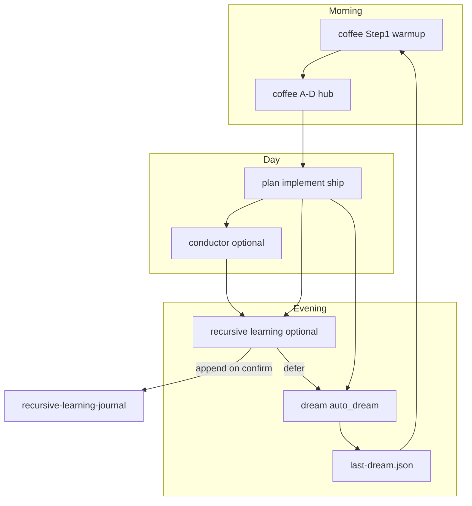

# Recursive Learning

**WORK only; not Record.**

**Activation:** `recursive learn` · `recursive-learn` · `RLJ` · `recursive learning` *(legacy)* · `review this session through recursive learning`

**SSOT (open first — do not repo-grep):** [statecraft/recursive-learning-journal.md](../../statecraft/recursive-learning-journal.md)

Extract **reusable drafting, routing, or architectural law** from a session — not source intake, not speaker shelves, not operator rhythm elicitation.

**Default trigger:** `problem encountered → fix applied → recursive learning`. RLJ runs **after** the fix is in place (code, doctrine, routing, validator), not while debugging.

## When to use

| # | Scenario | When | Mode |
|---|----------|------|------|
| 1 | **Problem → fix** | Fix landed; extract prevention law | Session review |
| 2 | **Elicitation → encode → RLJ** | Operator judgments shipped as doctrine/structure | Session review |
| 3 | **Conductor arc close** | `verdict=held`; stance logged; machine law still implicit | Session review |
| 4 | **Cross-lane proof** | Same pattern family on 2nd/3rd distinct object | Session review or promotion review |
| 5 | **Dense week close** | Multi-lane week ending; law scattered in chat/cadence | Session review |
| 6 | **Promotion review** | Law reused twice; pattern or skill wire may be due | Promotion review |

| Fix depth | RLJ value |
|-----------|-----------|
| One-off typo / obvious mistake | Thin — skip unless a guardrail emerges |
| Repeated misroute, validator fail, sync drift, plan/implementation seam | **High** |
| Architectural ship (multi-file encoding, new pattern) | **High** — full five-section session review |

**Thin invokes (usually skip):** one-off typo, restated plan prose, conductor ritual with no behavior change, productivity praise.

**Not for:** [elicit-knowledge](../../.cursor/skills/elicit-knowledge/SKILL.md) · [skill-elicitation](../../.cursor/skills/skill-elicitation/SKILL.md) · [conductor](../../.cursor/skills/conductor/SKILL.md) execution (outcomes may feed RLJ).

## Elicitation pipeline

```text
skill-elicitation (rank/judgment BEFORE encoding)
  → plan/implement
  → recursive-learn (machine law AFTER encoding)
```

Cross-link [skill-elicitation](../../.cursor/skills/skill-elicitation/SKILL.md) — RLJ does not replace elicitation MCQs.

**Anti-pattern:** Do not invoke RLJ when operator judgment is still unlocked — use elicitation or plan MCQs first. RLJ runs after encoding, not instead of it.

## Promotion ladder

| Stage | Home | Gate |
|-------|------|------|
| Session review | chat only | five sections drafted |
| Journal entry | `recursive-learning-journal.md` | operator confirms append; no duplicate law |
| Pattern promotion | `statecraft/patterns/` | adaptive reuse on a second distinct object ([patterns/README.md](../../statecraft/patterns/README.md) use rule) |
| Skill/validator wire | `.cursor/skills/` or scripts | law reduces misrouting measurably ([skill-refinement-scorecard](../../statecraft/notes/skill-refinement-scorecard.md)) |

**Defer paths:** opportunity-map (rank only), law-extraction checkpoint (carry to close).

**Supersede / cross-link (append gate):** Before append, search full journal for overlapping law (see CURSOR_APPENDIX duplicate grep). If overlap exists: **cross-link** (same law, new reapplication), **narrow** (scope restriction), or **supersede** (dated note + pointer to prior entry) — never silent duplicate.

Promoted pattern examples: [lane-hardening-law.md](../../statecraft/patterns/lane-hardening-law.md), [doctrine-hardening-law.md](../../statecraft/patterns/doctrine-hardening-law.md).

## Known homes

| Artifact | Path |
|----------|------|
| Journal SSOT | [statecraft/recursive-learning-journal.md](../../statecraft/recursive-learning-journal.md) |
| Pattern promotion target | [statecraft/patterns/README.md](../../statecraft/patterns/README.md) |
| Skill-wire gate | [statecraft/notes/skill-refinement-scorecard.md](../../statecraft/notes/skill-refinement-scorecard.md) |
| Conductor arc journal | [conductor-arc-impact-journal.md](../../docs/skill-work/work-strategy/conductor-arc-impact-journal.md) |
| Cadence receipts | [work-cadence-events.md](../../docs/skill-work/work-cadence/work-cadence-events.md) |
| Repair receipt pattern | [archive-truth-floor-audit-receipt-pattern.md](../../docs/archive-truth-floor-audit-receipt-pattern.md) |
| Lineage memo | [interpretive-machine-lineage.md](../../docs/skill-work/work-strategy/interpretive-machine-lineage.md) |

Preflight: read journal entry shape + last 2–3 entries before proposing a new law. Cursor agents: see CURSOR_APPENDIX for preflight commands.

## Entry shape (required)

1. **Trigger** — what taught the lesson
2. **Extracted law** — reusable rule (plain + optional arrow form)
3. **Reapplication** — where it applies next
4. **Structural changes** — files, validators, skills, routing that moved
5. **Guardrail** — prevents template repetition / decorative learning

Optional: **Current lesson** (one line).

### Paste template

```markdown
## YYYY-MM-DD - Short title

### Trigger
…

### Extracted law
…

### Reapplication
…

### Structural changes
…

### Guardrail
…

### Current lesson
…
```

## Modes

### Session review (default)

1. Open journal SSOT; scan recent entries.
2. Run falsification pass (below) before drafting.
3. Draft all five sections in reply — **do not append** without confirmation.
4. Offer: append to journal, promote to `statecraft/patterns/`, or wire into skill/validator.

### Journal entry

On operator confirm (`append RLJ`, `log this`, `add to recursive learning journal`):

1. Complete session review draft.
2. Duplicate grep across full journal; apply supersede/cross-link/narrow if needed.
3. Append `## YYYY-MM-DD - Title` block to journal.
4. Offer pattern promotion — do not auto-promote.

### Law extraction (checkpoint)

Mid-session: state **Extracted law** + **Guardrail** only; full entry at close when fix lands.

### Falsification pass (before append)

Ask: what would prove this law false or decorative? If falsified → soften claim or split authority layers; do not append co-primary claims without cash-out.

### Opportunity map (no append)

Rank 3–7 candidate laws from a corpus/session; **no adoption** until reuse proven. Output rank + guardrail per candidate.

### Promotion review

When law may be ready for pattern or skill wire (canonical #4, #6, or operator request):

- Checklist: two reuses on distinct objects? routing/repair/stopping/priority/architecture change? duplicate of existing journal/pattern law?
- Output: `append` | `defer` | `promote to patterns` | `wire skill/validator`

## Cadence integration

RLJ is **post-encoding consolidation** (conductor is **mid-day pressure**). Standalone activation by name — not coffee hub letter E. Coffee/dream hub seeds and handoff detail: **CURSOR_APPENDIX** (Cursor) or [work-coffee README](../../docs/skill-work/work-coffee/README.md).

| Job | Primary surface | RLJ role |
|-----|-----------------|----------|
| **Continuity** | `dream_coffee_rollup.py`, `last-dream.json` | Handoff only — note deferred law in prose hints |
| **Observability** | `build_conductor_ledger.py`, cadence events | None — do not duplicate `coffee_pick` / `coffee_conductor_outcome` |
| **Durable learning** | `conductor-arc-impact-journal.md`, **`recursive-learning-journal.md`** | **Owns machine-law extraction and journal append** |

| Surface | Owns | Does not own |
|---------|------|--------------|
| **Coffee hub (A–D)** | Confirm / Test / Deepen / Reframe | Journal append, conductor movement |
| **Conductor** | Stance, `coffee_conductor_outcome`, ship discipline | Machine-law checklist, pattern promotion |
| **RLJ skill** | Five-section review, append gate, promotion ladder | Hub letter, auto_dream.py mutations |
| **Dream** | Night maintenance, `tomorrow_inherits` | Full RLJ pass inside scripts |
| **conductor-arc-impact-journal** | Conductor arc scoring windows | Cross-surface encoding law |

**Dual receipt:** conductor close first → optional RLJ. `coffee_conductor_outcome` = stance/verdict/falsify; RLJ session review = extracted machine law, reapplication, guardrails.

## Agent workflow

1. Open [statecraft/recursive-learning-journal.md](../../statecraft/recursive-learning-journal.md) — not repo-wide search.
2. Name one trigger object.
3. Extract falsifiable, reusable law.
4. Show at least one concrete reapplication.
5. List structural changes (or note review-only).
6. State guardrail.
7. Append only on explicit request.

## Related operations

| Operation | Relationship |
|-----------|--------------|
| Conductor | Sequencing may *be* the lesson; cadence logs separately; close before RLJ |
| skill-elicitation | Locks operator judgment **before** encoding |
| recursive-learn | Locks machine law **after** encoding |
| repo-hygiene-pass | Structural changes section after bucketed ship |
| statecraft-source-intake | Closeout / sync-check laws after intake fix |

## Worked example (illustration only — not yet appended)

*Rome v0.1.26 fractured-sovereignty chain encoding.*

**Trigger:** Operator elicitation locked Republic opener, co-primary carriers (papacy, France, HRE), colonial `instrument` tier, and shared rupture primaries; plan executed across six `rome-{term}.md` files + theory links + validator pass.

**Extracted law:** Fractured-sovereignty chains need **memory spine + term segments**: one cross-term index (`rome-memory#chain-spine`) plus per-lens segments; shared ruptures get one primary home + cross-refs elsewhere; colonial empires are instruments, not chain heads.

**Reapplication:** Next civilization with split sovereignty (e.g. Persia dual centers, China tributary layers) — elicit co-primary tiers before encoding; never promote colonial branches to chain-head without operator cash-out.

**Structural changes:** Six `rome-*.md`, theory Volume depth links, `governing-term-first.md`, VERSION v0.1.26, validator strict-theory pass.

**Guardrail:** Do not copy Rome tier labels to other civs without elicitation; `instrument` vs `co-primary` is judgment, not template.

Journal entries for rungs 2–4: [language v0.1.27](../../statecraft/recursive-learning-journal.md#2026-06-18---rome-dual-language-heritage-language-spine-parallel-dimension) · [military v0.1.28](../../statecraft/recursive-learning-journal.md#2026-06-18---rome-military-history-military-spine-parallel-dimension) · [faith v0.1.29](../../statecraft/recursive-learning-journal.md#2026-06-19---rome-faith-history-faith-spine-parallel-dimension).

## Rome parallel-spine ladder (civ-state)

**Use when:** encoding or reviewing a **parallel dimension** on a fractured-sovereignty volume (Rome pilot; Persia/China candidates next). Open the matching RLJ entry before drafting — do not repo-grep the whole tree.

**Core law:** One **political chain head** on `#chain-spine`. Each additional spine tracks a **different load-bearing dimension** on the **same rupture nodes** — fork **extends**, never replaces, prior spines.

| Rung | Memory anchor | Governs | Sub-anchors (Rome) | Ship | RLJ |
|------|---------------|---------|-------------------|------|-----|
| 1 | `#chain-spine` | Political succession | Republic → … → present carrier | v0.1.26 | [fractured-sovereignty chain](../../statecraft/recursive-learning-journal.md#2026-06-17---rome-fractured-sovereignty-chain-encoding-memory-spine--term-segments) |
| 2 | `#language-spine` | Greek/Latin **medium** | co-primary carriers · sacred dual-medium | v0.1.27 | [language-spine](../../statecraft/recursive-learning-journal.md#2026-06-18---rome-dual-language-heritage-language-spine-parallel-dimension) |
| 3 | `#military-spine` | Force structure | formation · eastern · western | v0.1.28 | [military-spine](../../statecraft/recursive-learning-journal.md#2026-06-18---rome-military-history-military-spine-parallel-dimension) |
| 4 | `#faith-spine` | Sacred / truth-order | mythology · formation · eastern · western | v0.1.29 | [faith-spine](../../statecraft/recursive-learning-journal.md#2026-06-19---rome-faith-history-faith-spine-parallel-dimension) |
| 5 | `#science-spine` | Procedural / evidentiary truth-order | inheritance · formation · eastern · western *(planned)* | v0.1.30 | *(append after ship)* |

**Routing:** [`governing-term-first.md`](../../public/civ-state/skills/governing-term-first.md) — chain · language · military · faith placement steps; science placement added at v0.1.30 ship.

**Repeatable encode recipe** (each new rung):

```text
elicitation MCQs → master table + tension pass
→ interpretive essay (optional sub-lens)
→ rome-memory#*-spine (sub-tables + tagged boundary rules)
→ split rosters (empire institutional · civilization ethic)
→ six rome-{term} filtered segments
→ theory Volume depth + volume README / shelf
→ validate_civilizational_statecraft_public.py --strict-theory
→ VERSION bump + release-history + RLJ entry
```

**Cross-spine guardrails (Rome):**

- **Dual encode** when one node owns two dimensions (e.g. 1204 faith wound ║ crusade instrument; Frontinus aqueducts ║ military stratagem planned at science) — one primary row per spine + cross-ref.
- **Eastern trilogy** rows use `civ-state-placement` — parallel legs, not one historical actor (military rivals · faith sacred rivals · science transmission legs).
- **Roster SSOT:** memory = placement index only; empire + civilization own full rosters — do not duplicate on memory.
- **Term files:** sovereignty / dual-language / prior-dimension segments **align, do not duplicate** new spine tables.
- **Present period:** no military present row; faith/science follow same discipline unless operator MCQ locks a comparative footnote only.
- **Next civ:** elicit sub-table count + roster split **before** term segments — do not copy Rome row labels without operator cash-out.

## Quality test

Must change at least one of: routing · repair boundaries · stopping rules · priority · architecture.

**Fail:** productivity praise, restated plan prose, template copy without adaptation, conductor ritual with no behavior change.

## Guardrails

```text
recursive learning ≠ template repetition
```

- Phase/conductor language must cash out in routing, repair, or priority.
- No duplicate journal laws without cross-link/supersede.
- WORK journal ≠ Record truth.
- **Do not repo-grep** for this operation.

## Done when

- **Review:** five sections in reply; append offered.
- **Entry:** dated block in journal; no silent duplicate.
- **Checkpoint:** law + guardrail stated; full entry deferred.
- **Promotion review:** explicit output (`append` | `defer` | `promote` | `wire`).


## Cursor / grace-mar instance

Cursor-only discipline for [recursive-learn/SKILL.md](../../../skills-portable/recursive-learn/SKILL.md). Portable SSOT body stays in `skills-portable/`.

## Preflight read

1. Open [statecraft/recursive-learning-journal.md](../../../statecraft/recursive-learning-journal.md) — **do not repo-grep** the whole repo for "recursive learning".
2. Scan last 3 dated entries:
   - Read file tail (~150 lines), or
   - `rg '^## 20' statecraft/recursive-learning-journal.md | tail -3`
3. Read journal **Entry Shape** header before drafting.

## Duplicate grep before append

Before offering or executing append, search the **full journal** for overlapping law:

```bash
rg -i "key phrase from extracted law" statecraft/recursive-learning-journal.md
```

Apply supersede/cross-link/narrow from skill body — never silent duplicate.

## Append gate

Append only on explicit operator confirm:

- `append RLJ`
- `log this`
- `add to recursive learning journal`

Use **AskQuestion** when append vs promote vs defer is ambiguous.

## Extended invocation scenarios

| Scenario | Typical moment |
|----------|----------------|
| Corpus becomes teacher | Mirror/shelf crossed from routing to pattern source (`ph-civ`) |
| Skill / routing drift | Repo topology moved faster than skill surfaces |
| Validator / migration bulk fix | Many errors fixed; need stopping rules |
| Hygiene / ship receipt gap | Judgment on disk without commit receipt |
| Falsification landed | Assumption tested and revised |
| Opportunity map → adoption | Ranked candidate now proven in production |
| Intake / closeout discipline | Routine close exposed systematic omission |
| Gap-audit × journal cross-read | Audit + journal name same seam |
| Signing-off D Reframe | Coffee offers hub line; operator invokes by name |
| Deferred append pickup | Review drafted; append not yet confirmed |
| Agent misroute twice | Same wrong path twice → skill/validator wire candidate |
| Law extraction checkpoint | Mid-session; full review deferred to close |

## Coffee / dream wiring

**Activation:** standalone by name — `recursive learning`, `RLJ`, `session review` — same pattern as conductor (not hub letter E).

### Hub seeds (offer only, never auto-run)

**D. Reframe** — when Step 1 shows dense ship (multi-file doctrine, validator pass, plan executed):

```text
**D. Reframe** — Run recursive-learn session review on today's {object} ship (machine law not yet in journal).
```

**C. Deepen** (rare) — session ended with understanding but nothing logged:

```text
**C. Deepen** — Read last 2–3 journal entries and compare to today's encoding before deciding append vs defer.
```

[`scripts/assess_session_load.py`](../../../scripts/assess_session_load.py) recommends Confirm/Test/Deepen/Reframe from cadence/git/gate signals only — it has **no unlogged-law signal** today. Use Step 1 context and session judgment for RLJ hub offers.

### Signing-off breadcrumb

After heavy implement/ship day without RLJ, Step 1 closeout prose may add **one line** (not a menu item): operator may say `recursive learning`; chat review default; journal only on `append RLJ`.

### Conductor finale / `bravo`

Order: conductor close first (`coffee_conductor_outcome` or [CONDUCTOR-CLOSE-TEMPLATE.md](../../../codex/CONDUCTOR-CLOSE-TEMPLATE.md)) → optional RLJ offer.

### Dream handoff

- **Do not** run full RLJ inside [`scripts/auto_dream.py`](../../../scripts/auto_dream.py).
- Step 2 closeout may add one line when concrete: `Session law still chat-only — say recursive learning tomorrow before append.`
- **`tomorrow_inherits` fragment** when review ran but append deferred:

```text
Machine law from today's {object} ship is drafted but not appended — confirm append or promote on next Reframe.
```

[`tomorrow_inherits` wins](../../../.cursor/skills/dream/SKILL.md) over coffee learning-action hints when they conflict.

- If RLJ already ran during signing-off coffee D Reframe, dream should not re-offer review — only surface deferred append.

### Daily loop



### Cadence logging (deferred)

Optional future: `log_cadence_event.py --kind rlj_review`. Not required for v0.2.

## Portable plumbing

| Topic | Path |
|--------|------|
| Portable manifest | [skills-portable/manifest.yaml](../../../skills-portable/manifest.yaml) |
| Skill backlog | [skills-portable/skill-candidates.md](../../../skills-portable/skill-candidates.md) |
| Sync | [scripts/sync_portable_skills.py](../../../scripts/sync_portable_skills.py) |
