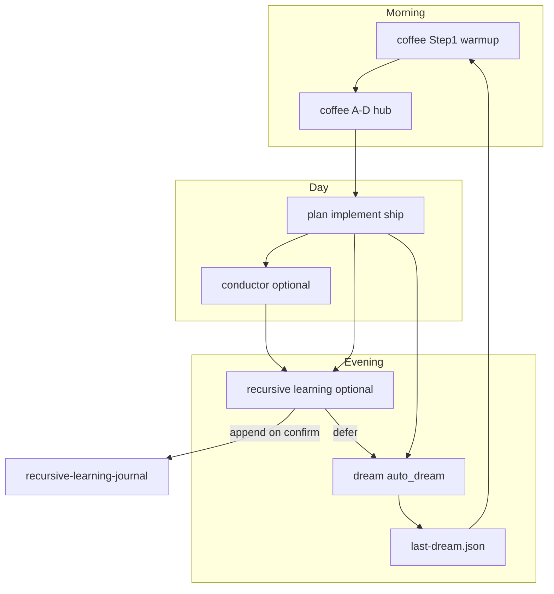

Cursor-only discipline for [recursive-learning/SKILL.md](../../../skills-portable/recursive-learning/SKILL.md). Portable SSOT body stays in `skills-portable/`.

## Preflight read

1. Open [statecraft/recursive-learning-journal.md](../../../statecraft/recursive-learning-journal.md) — **do not repo-grep** the whole repo for "recursive learning".
2. Scan last 3 dated entries:
   - Read file tail (~150 lines), or
   - `rg '^## 20' statecraft/recursive-learning-journal.md | tail -3`
3. Read journal **Entry Shape** header before drafting.

## Duplicate grep before append

Before offering or executing append, search the **full journal** for overlapping law:

```bash
rg -i "key phrase from extracted law" statecraft/recursive-learning-journal.md
```

Apply supersede/cross-link/narrow from skill body — never silent duplicate.

## Append gate

Append only on explicit operator confirm:

- `append RLJ`
- `log this`
- `add to recursive learning journal`

Use **AskQuestion** when append vs promote vs defer is ambiguous.

## Extended invocation scenarios

| Scenario | Typical moment |
|----------|----------------|
| Corpus becomes teacher | Mirror/shelf crossed from routing to pattern source (`ph-civ`) |
| Skill / routing drift | Repo topology moved faster than skill surfaces |
| Validator / migration bulk fix | Many errors fixed; need stopping rules |
| Hygiene / ship receipt gap | Judgment on disk without commit receipt |
| Falsification landed | Assumption tested and revised |
| Opportunity map → adoption | Ranked candidate now proven in production |
| Intake / closeout discipline | Routine close exposed systematic omission |
| Gap-audit × journal cross-read | Audit + journal name same seam |
| Signing-off D Reframe | Coffee offers hub line; operator invokes by name |
| Deferred append pickup | Review drafted; append not yet confirmed |
| Agent misroute twice | Same wrong path twice → skill/validator wire candidate |
| Law extraction checkpoint | Mid-session; full review deferred to close |

## Coffee / dream wiring

**Activation:** standalone by name — `recursive learning`, `RLJ`, `session review` — same pattern as conductor (not hub letter E).

### Hub seeds (offer only, never auto-run)

**D. Reframe** — when Step 1 shows dense ship (multi-file doctrine, validator pass, plan executed):

```text
**D. Reframe** — Run recursive-learning session review on today's {object} ship (machine law not yet in journal).
```

**C. Deepen** (rare) — session ended with understanding but nothing logged:

```text
**C. Deepen** — Read last 2–3 journal entries and compare to today's encoding before deciding append vs defer.
```

[`scripts/assess_session_load.py`](../../../scripts/assess_session_load.py) recommends Confirm/Test/Deepen/Reframe from cadence/git/gate signals only — it has **no unlogged-law signal** today. Use Step 1 context and session judgment for RLJ hub offers.

### Signing-off breadcrumb

After heavy implement/ship day without RLJ, Step 1 closeout prose may add **one line** (not a menu item): operator may say `recursive learning`; chat review default; journal only on `append RLJ`.

### Conductor finale / `bravo`

Order: conductor close first (`coffee_conductor_outcome` or [CONDUCTOR-CLOSE-TEMPLATE.md](../../../codex/CONDUCTOR-CLOSE-TEMPLATE.md)) → optional RLJ offer.

### Dream handoff

- **Do not** run full RLJ inside [`scripts/auto_dream.py`](../../../scripts/auto_dream.py).
- Step 2 closeout may add one line when concrete: `Session law still chat-only — say recursive learning tomorrow before append.`
- **`tomorrow_inherits` fragment** when review ran but append deferred:

```text
Machine law from today's {object} ship is drafted but not appended — confirm append or promote on next Reframe.
```

[`tomorrow_inherits` wins](../../../.cursor/skills/dream/SKILL.md) over coffee learning-action hints when they conflict.

- If RLJ already ran during signing-off coffee D Reframe, dream should not re-offer review — only surface deferred append.

### Daily loop



### Cadence logging (deferred)

Optional future: `log_cadence_event.py --kind rlj_review`. Not required for v0.2.

## Portable plumbing

| Topic | Path |
|--------|------|
| Portable manifest | [skills-portable/manifest.yaml](../../../skills-portable/manifest.yaml) |
| Skill backlog | [skills-portable/skill-candidates.md](../../../skills-portable/skill-candidates.md) |
| Sync | [scripts/sync_portable_skills.py](../../../scripts/sync_portable_skills.py) |
