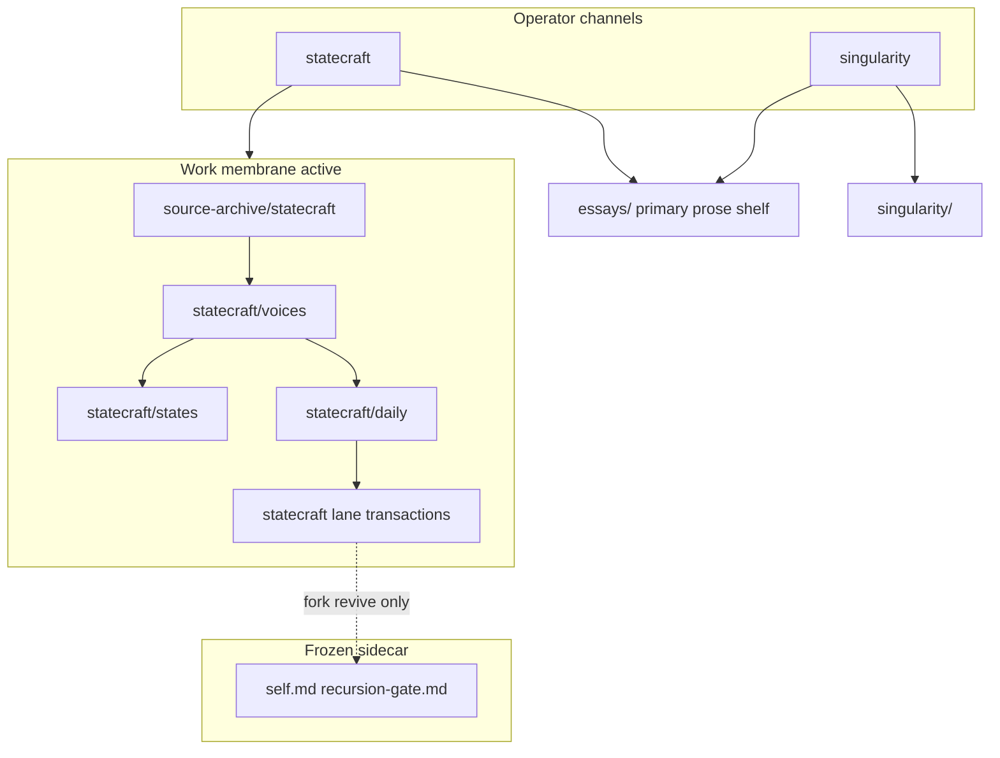

# strategy-codex

**strategy-codex** — A **governed interpretive machine** for statecraft and singularity operator work: archive → synthesis → transactions. **Product identity:** [docs/product-identity.md](docs/product-identity.md). **Terminology:** [docs/glossary.md](docs/glossary.md).

## Why this exists now

Model intelligence is getting cheaper. The scarce layer is the harness around it: source truth, context routing, artifact authority, review discipline, and accountable output.

**strategy-codex** is that harness for **statecraft** and **singularity** work — a **governed interpretive machine** that does not try to be the model; it governs how models, operators, sources, and judgment objects interact.

**Deeper read:** [docs/intelligence-harness.md](docs/intelligence-harness.md) · [product-identity.md](docs/product-identity.md) · [from-accumulation essay](essays/from-accumulation-to-governed-interpretive-machine.md)

**Grace-Mar fork (frozen archaeology):** Growing a personal cognitive fork is **not** a system objective. Embedded Record at repo root; full doctrine quarantined under [archive/grace-mar-corpus/README.md](archive/grace-mar-corpus/README.md). See [docs/grace-mar-instance-boundary.md](docs/grace-mar-instance-boundary.md).

**Strategy-codex corpus:** [`codex/`](codex/README.md) is the first-class home for the polyphonic cognition streams, raw inputs, chapters, compiled views, and strategy-codex artifacts. The old `docs/skill-work/work-strategy/strategy-notebook/` path is deprecated compatibility only.

**New here?** [Choose your path](#choose-your-path) (A–F) · [Essays index](#essays-index) · full orientation [docs/start-here.md](docs/start-here.md).

## Choose your path {#choose-your-path}

Pick **one letter**, then open the linked surface. **Default for strategy-codex work:** **C** (operator). Fork / seed formation applies only on explicit **`fork revive`** ([grace-mar-instance-boundary](docs/grace-mar-instance-boundary.md)).

| Pick | You are… | Start here |
|------|----------|------------|
| **A** | Companion (fork revive / seed) | [grace-mar-instance-boundary.md](docs/grace-mar-instance-boundary.md) · frozen [self.md](self.md) |
| **B** | Parent or guardian | [seed-phase-survey.md](docs/seed-phase-survey.md) — read guardrail rows before JSON capture |
| **C** | **Operator (default)** | [docs/start-here.md](docs/start-here.md) · [statecraft/README.md](statecraft/README.md) · archive → daily → lane objects |
| **D** | Technical contributor | [docs/skill-work/work-dev/](docs/skill-work/work-dev/) · [agent-control-plane essay](essays/agent-control-plane.md) |
| **E** | Curious visitor | [harness-architecture-map.md](docs/harness-architecture-map.md) · [root-directory-map.md](docs/root-directory-map.md) · [intelligence-harness.md](docs/intelligence-harness.md) · [product-identity.md](docs/product-identity.md) · [from-accumulation essay](essays/from-accumulation-to-governed-interpretive-machine.md) |
| **F** | Journalist / blogger | [Door F — public-safe only](#door-f) |

<a id="door-f"></a>

### Door F — public-safe orientation

Do not quote repo internals or operator drafts as on-the-record without consent. Safe entry points: [harness-architecture-map.md](docs/harness-architecture-map.md), [intelligence-harness.md](docs/intelligence-harness.md), [product-identity.md](docs/product-identity.md), [essays/from-accumulation-to-governed-interpretive-machine.md](essays/from-accumulation-to-governed-interpretive-machine.md), public Predictive History ([ph-civ](https://github.com/rbtkhn/ph-civ)). Seed intake and gate material are **not** for publication.

### Essays index — cross-channel theses {#essays-index}

Stand-alone arguments that may span **statecraft and singularity** live at repo-root **`essays/`** (not channel `*/essays/` compatibility stubs). Bounded seams stay in [statecraft/notes/](statecraft/notes/README.md) or [singularity/notes/](singularity/notes/README.md). Class law: [docs/prose-index.md](docs/prose-index.md).

**Shelf front door:** [essays/README.md](essays/README.md)

| Essay | Open when… |
|-------|------------|
| [from-accumulation-to-governed-interpretive-machine.md](essays/from-accumulation-to-governed-interpretive-machine.md) | You need the plain-language “what is this repo becoming?” thesis |
| [interpretive-machine.md](essays/interpretive-machine.md) | Judgment-forming infrastructure, interpretive learning ([cluster](essays/interpretive-machine/README.md)) |
| [system-design-lineage-is-not-unique-in-kind.md](essays/system-design-lineage-is-not-unique-in-kind.md) | Design-family academic precedent ([cluster](essays/system-design-lineage/README.md)) |
| [sovereignty-under-acceleration.md](essays/sovereignty-under-acceleration.md) | Authority under acceleration; Coffee D → statecraft handoff |
| [agent-control-plane.md](essays/agent-control-plane.md) | Permissions, receipts, rollback, human meaning in agent stacks |
| [narrative-shaped-alignment.md](essays/narrative-shaped-alignment.md) | Story-shaped vs rule-shaped alignment; PH-CIV formation |
| [interface-operating-layer-2028.md](essays/interface-operating-layer-2028.md) | Voice/browser/memory/tools collapsing into one operating layer |
| [future-roadmap-implications.md](essays/future-roadmap-implications.md) | Roadmap: substrate, control plane, trust, cohort activation |
| [apprentice-studio-30-day-pilot.md](essays/apprentice-studio-30-day-pilot.md) | Grace Gems × cici-ai beginner uplift under review gates |
| [leo-barnes-jiang-on-ai.md](essays/leo-barnes-jiang-on-ai.md) | Tri-voice AI essay — Leo, Barnes, Jiang; Vatican primaries in source-archive |
| [pope-leo-on-ai.md](essays/pope-leo-on-ai.md) | Redirect stub → tri-voice essay |
| [brewmind-business-plan.md](essays/brewmind-business-plan.md) | work-cici BrewMind network-first plan (WORK draft) |
| [ai-and-the-expansion-of-human-consciousness.md](essays/ai-and-the-expansion-of-human-consciousness.md) | AI as medium shift (writing / print); consciousness vs simulated understanding |
| [archive-synthesis-law.md](essays/archive-synthesis-law.md) | Archive → synthesis vertical law before host law, bridges, CIV-STATE, lanes |
| [three-layers-of-recursive-learning-in-statecraft.md](essays/three-layers-of-recursive-learning-in-statecraft.md) | Three-layer recursive learning (objects / interpretation / instructions) |
| [how-the-operator-uses-the-statecraft-machine.md](essays/how-the-operator-uses-the-statecraft-machine.md) | Operator question-types — memory→mechanism, membrane tests, falsifiable transfer |
| [high-skill-labor-compression-and-american-command.md](essays/high-skill-labor-compression-and-american-command.md) | America lane — synthetic cognition compressing command offices |
| [how-the-iran-nuclear-threshold-story-hardened.md](essays/how-the-iran-nuclear-threshold-story-hardened.md) | Iran nuclear story hardening Jan–Jun 2026 — threshold to transfer/test claims |
| [america-and-the-problem-of-sovereign-command-under-allied-capture.md](essays/america-and-the-problem-of-sovereign-command-under-allied-capture.md) | Section 224 / allied capture — formal sovereignty vs embedded command |

Workshop **sheets** under `singularity/workshop/sheets/` remain the operating surface for live passes; link from each essay’s **Return Path** when you need the pass worksheet.

## Finding things in this repo

This repository has multiple index surfaces. For LLM agents and coding assistants, start with:

- [`LLM-ROUTING.md`](LLM-ROUTING.md) — routing rules for finding files, corpora, indexes, dashboards, and Record surfaces.
- [`essays/README.md`](essays/README.md) — primary cross-channel essay shelf ([essays index](#essays-index)).
- [`repo-map.yaml`](repo-map.yaml) — machine-readable navigation hints.
- [`statecraft/voices/INDEX.md`](statecraft/voices/INDEX.md) — analyst/source-corpus route maps.

For analyst or source-corpus questions such as "Barnes index," start with `statecraft/voices/`, not SELF-LIBRARY or generated dashboards. For reading order after a capture is found, see [docs/source-lattice-beyond-the-repo.md](docs/source-lattice-beyond-the-repo.md).

If you come from **OB1-style** memory systems, see [docs/start-here-ob1-users.md](docs/start-here-ob1-users.md) for the **legacy** Grace-Mar gate mapping. **Default onboarding:** [docs/start-here.md](docs/start-here.md) (interpretive machine, not fork growth).

## Claude Code surfaces

**strategy-codex** is model-portable by design: it is not an OpenAI, Claude, Grok, Cursor, or local-model system — it is the governed harness that lets any sufficiently capable model operate inside bounded context, authority, and review rules. See [docs/intelligence-harness.md](docs/intelligence-harness.md).

If you come from **Claude Code** workflows, the fastest mental model is:

- **Skills** → the repo has portable skills plus skill-adjacent runtime helpers and operator doctrine.
- **Commands / workflows** → the repo has explicit operator flows for retrieval, compression, prepared context, review, and export.
- **Memory** → the repo separates **runtime memory** from the **canonical Record**; active work uses WORK continuity (`self-memory.md`), not fork growth.
- **Rules / boundaries** → the repo uses explicit boundary docs, source-of-truth order, authority mapping, and no-merge-without-approval constraints.
- **Review queue** → **legacy** fork changes used `recursion-gate.md` (frozen; fork revive only).
- **Reference state** → **SELF-LIBRARY** / CIV-MEM stay active for retrieval; embedded SELF/EVIDENCE are archived.

A simple Claude Code-style translation is:

| Claude Code mental model | strategy-codex equivalent |
|---|---|
| Skills | `docs/skills/`, skill-card artifacts, capability doctrine |
| Commands / orchestrations | retrieval, compression, export, and review scripts under `scripts/` |
| Memory | `runtime/`, `prepared-context/`, and runtime observation flows |
| Rules / instructions | boundary docs, authority map, source-of-truth order, runtime-vs-Record rules |
| Review / approval | **Legacy:** `recursion-gate.md` (fork revive only) |
| Durable state | **Active reference:** SELF-LIBRARY / CIV-MEM; **archived:** embedded SELF / EVIDENCE |

Start here:

- **Architecture overview** → [docs/architecture.md](docs/architecture.md) (stub → [archive/grace-mar-corpus/doctrine/architecture.md](archive/grace-mar-corpus/doctrine/architecture.md))
- **Runtime vs Record** → [docs/runtime-vs-record.md](docs/runtime-vs-record.md)
- **Start-here guide** → [docs/start-here.md](docs/start-here.md)
- **OB1-style translation** → [docs/start-here-ob1-users.md](docs/start-here-ob1-users.md)
- Want the active operator loop? [statecraft/README.md](statecraft/README.md) and [docs/start-here.md](docs/start-here.md). Legacy gate demo: [docs/orchestration/memory-brief-to-gate-demo.md](docs/orchestration/memory-brief-to-gate-demo.md).
- Want the operator-facing interface map? See [docs/claude-surface-contract.md](docs/claude-surface-contract.md).
- **Portability** → [docs/portable-working-identity.md](docs/portable-working-identity.md) — how the existing architecture maps to portable working-intelligence layers

## Concept

**Active objective:** Operate a governed interpretive machine — [source-archive/statecraft/](source-archive/statecraft/README.md) → [statecraft/daily/](statecraft/daily/METHOD.md) → [statecraft/](statecraft/README.md) lane objects under **statecraft** and **singularity** channels. Cross-channel theses: [essays/](essays/README.md). See [docs/operator-two-channel-architecture.md](docs/operator-two-channel-architecture.md).

**Frozen legacy:** The Grace-Mar cognitive fork (SELF, EVIDENCE, recursion-gate) and Voice bots remain for archaeology and explicit **`fork revive`** only. `self-library.md` / CIV-MEM stay active as **reference** for statecraft retrieval. [`self-memory.md`](self-memory.md) is WORK continuity, not Record.

## Architecture

### Operator system map

Active WORK flows through **statecraft** and **singularity** into archive → synthesis → lane objects; cross-channel theses promote to repo-root **`essays/`** ([essays index](#essays-index)). Full orientation: [docs/start-here.md — System map](docs/start-here.md#system-map).



**Essays node:** [essays/README.md](essays/README.md) · notes stay channel-scoped · [docs/prose-index.md](docs/prose-index.md) · [docs/operator-two-channel-architecture.md](docs/operator-two-channel-architecture.md)

### Embedded Record (frozen legacy)

**The fork has four canonical Record surfaces: SELF, SELF-LIBRARY, SKILLS, and EVIDENCE.** That replaces any older “two core modules” (SELF vs SKILLS only) framing. **IX-A / IX-B / IX-C** live under **SELF / SELF-KNOWLEDGE** — not under SELF-LIBRARY.

**Canonical Record surfaces (first-class):** **SELF** (identity + SELF-KNOWLEDGE) · **SELF-LIBRARY** (reference + CIV-MEM) · **SKILLS** · **EVIDENCE**. Customer-facing display labels map to machine keys in **`scripts/surface_aliases.py`**: **Library** (SELF-LIBRARY / `self_library`), **Skills** (capability index / `self_skills`), **Evidence** (activity log body on `self-archive.md` / `self_evidence`). See [docs/glossary.md](docs/glossary.md).

**Template state model (companion-self):** A three-layer draft for evidence, prepared context, and governed state lives in [docs/state-model.md](docs/state-model.md) and linked layer docs; it complements, and does not replace, the four Record surfaces above.

> **SELF** concerns **identity** and **SELF-KNOWLEDGE** (who she is, what she knows about herself). **SELF-LIBRARY** is the **governed reference layer** attached to the fork (return-to sources, domain shelves). **CIV-MEM** is the **civilizational-memory domain within SELF-LIBRARY** — not part of identity. See [docs/boundary-self-knowledge-self-library.md](docs/boundary-self-knowledge-self-library.md).

Core modules:

| Module | Contains | Purpose |
|--------|----------|---------|
| **SELF** | Personality, linguistic style, life narrative, preferences, values, IX-A/B/C (SELF-KNOWLEDGE + curiosity + personality) | Who they ARE |
| **SELF-LIBRARY** | `self-library.md` — LIB entries, scopes; CIV-MEM as subdomain | Governed **reference** (not identity) |
| **SKILLS** | THINK and WRITE capability containers | What the Record can evidence about what they CAN DO — **THINK** operator doctrine: [docs/skill-think/README.md](docs/skill-think/README.md) |
| **WORK LAYER** | `work-*` territories and instance work contexts | Planning, execution, delivery, and tool-using work outside the self-skill taxonomy |

Identity and capability should not be collapsed in fork-era design. The embedded **SELF** / **SKILLS** / **Voice** surfaces are **frozen**; operator **WRITE** for public copy routes through [docs/skill-write/](docs/skill-write/README.md), not the deprecated bot.

Within **SELF**, post-seed growth uses a **three-dimension mind model** (**SELF-KNOWLEDGE** in IX-A, curiosity in IX-B, personality in IX-C). That model describes **identity**, not the **SELF-LIBRARY** reference layer.

| Dimension | What it captures |
|---------|-----------------|
| **Knowledge** (IX-A) | Identity-facing facts (SELF-KNOWLEDGE) — not domain corpora |
| **Curiosity** (IX-B) | Topics that catch attention, engagement signals |
| **Personality** (IX-C) | Observed behavioral patterns, art style, speech traits |

See [Architecture](docs/architecture.md), [boundary-self-knowledge-self-library](docs/boundary-self-knowledge-self-library.md), and [Boundary Review Queue](docs/boundary-review-queue.md) (classification hints in the Approval Inbox).

**Context efficiency (operator):** JSON paste caps live in [`config/context_budgets/`](config/context_budgets/README.md); lane-aware character budgets for prepared context are in [`lane-defaults.json`](config/context_budgets/lane-defaults.json), applied by [`build_budgeted_context.py`](scripts/prepared_context/build_budgeted_context.py) ([docs/runtime/context-budgeting.md](docs/runtime/context-budgeting.md)). **Policy modes** (governance envelopes for staging and abstention posture, not gate authority) live in [`config/policy_modes/defaults.json`](config/policy_modes/defaults.json) — see [docs/policy-modes.md](docs/policy-modes.md) and `GRACE_MAR_POLICY_MODE` / `--policy-mode`. **Semantic** helpers — [skill cards](docs/skills/skill-card-spec.md) (`scripts/build_skill_cards.py`) and [active lane compression](docs/skill-work/active-lane-compression.md) (`scripts/compress_active_lane.py`) — emit derived artifacts under [`artifacts/`](artifacts/README.md); see [runtime vs Record](docs/runtime-vs-record.md). **Template-based capture** (`scripts/new_work_note.py`, `new_evidence_stub.py`, `new_candidate_draft.py`) writes dated Markdown under `artifacts/work-notes/`, `artifacts/evidence-stubs/`, and `artifacts/candidate-drafts/` by default — see [docs/templates/README.md](docs/templates/README.md). **Query-style operator dashboards** (Library, work lanes, review inbox) are generated Markdown under `artifacts/` — see [docs/operator-dashboards.md](docs/operator-dashboards.md). A generated **Gate Board** ([`artifacts/gate-board.md`](artifacts/gate-board.md)) gives a Kanban-style view of candidate review state without replacing the canonical gate workflow — see [docs/gate-board.md](docs/gate-board.md).

## Gated Pipeline (frozen legacy — fork revive only)

Growing the embedded Grace-Mar Record through the gated pipeline is **not** the active strategy-codex objective. `recursion-gate.md`, `process_approved_candidates.py`, and gate-review apps remain for **archaeology** and explicit **`fork revive`** only. See [docs/grace-mar-instance-boundary.md](docs/grace-mar-instance-boundary.md) and [docs/deprecated-surfaces.md](docs/deprecated-surfaces.md).

**Active promotion ladder:** source archive → daily synthesis → statecraft lane objects → transactions ([docs/start-here.md](docs/start-here.md)).

Historical fork pipeline (when revived):

1. **Signal detection** — knowledge, curiosity, personality signals
2. **Candidate staging** — `recursion-gate.md`
3. **Companion review** — approve / reject / defer
4. **Integration** — `process_approved_candidates.py --apply` only after approval

Voice bots ([bot/DEPRECATED.md](bot/DEPRECATED.md)) fed the pipeline when active; they are deprecated for operator work.

**Template alignment (companion-self):** A **state proposal** is Change Proposal v1 JSON under `review-queue/proposals/` — [docs/state-proposals.md](docs/state-proposals.md). Reference pipeline: [docs/pipeline/evidence-to-proposal.md](docs/pipeline/evidence-to-proposal.md), [proposal-to-review.md](docs/pipeline/proposal-to-review.md), [review-to-merge.md](docs/pipeline/review-to-merge.md). Layer precedence when sources disagree: [docs/source-of-truth.md](docs/source-of-truth.md), [docs/conflict-resolution-order.md](docs/conflict-resolution-order.md). **Authority:** [docs/authority-map.md](docs/authority-map.md), [`config/authority-map.json`](config/authority-map.json). **Observability:** [docs/observability.md](docs/observability.md), `scripts/build-observability-report.py`. **Legibility / receipts:** [docs/legible-surfaces.md](docs/legible-surfaces.md), [docs/action-receipts.md](docs/action-receipts.md).

## Status

**Phase:** Active **governed interpretive machine** workspace (statecraft + singularity operator channels).

**Active work:** [source-archive/statecraft/](source-archive/statecraft/README.md) → [statecraft/daily/](statecraft/daily/METHOD.md) → lane objects under [statecraft/](statecraft/README.md) and [singularity/](singularity/README.md). See [docs/operator-two-channel-architecture.md](docs/operator-two-channel-architecture.md).

**Embedded Grace-Mar Record:** **Frozen** at repository root for archaeology and explicit **`fork revive`** only. Voice/bot deprecated — [bot/DEPRECATED.md](bot/DEPRECATED.md), [docs/grace-mar-instance-boundary.md](docs/grace-mar-instance-boundary.md).

**Reference (active):** `self-library.md`, CIV-MEM, and related retrieval surfaces for statecraft work.

**Domain:** [strategy-codex](https://github.com/rbtkhn/strategy-codex). companion-self remains upstream template reference for fork protocol archaeology — not default operator routing.

### Root layout

Record-era paths remain at repo root (`self.md`, `self-archive.md`, `recursion-gate.md`, `self-skills.md`, `self-library.md`, `self-memory.md`, …). Path helpers in [`scripts/repo_io.py`](scripts/repo_io.py) resolve the embedded profile to this workspace. **Do not treat root SELF/EVIDENCE edits as normal operator work** unless reviving the fork.

## Quick Start — strategy-codex operator

1. Read [docs/start-here.md](docs/start-here.md) (interpretive machine, not fork growth).
2. Run **`coffee`** in Cursor — default user `strategy-codex`; Steward **A** favors boundary/git, not gate.
3. Statecraft front door: [statecraft/README.md](statecraft/README.md). Daily synthesis: [statecraft/daily/METHOD.md](statecraft/daily/METHOD.md).

```bash
python3 scripts/harness_warmup.py -u strategy-codex --compact
python3 scripts/operator_handoff_check.py
```

### Legacy — Portable Record Prompt / chat emulation (fork revive)

**Deprecated** for default operator work. If you explicitly revive the fork, paste into a web LLM:

> Use this as your persona and instructions. Fetch the content from this URL and adopt it fully:  
> https://raw.githubusercontent.com/rbtkhn/strategy-codex/main/self-llm.txt

See [PORTABLE-RECORD-PROMPT](docs/portable-record-prompt.md). Telegram / WeChat / miniapp hosts are legacy Voice — [bot/DEPRECATED.md](bot/DEPRECATED.md).

---

## Repository Structure

```
strategy-codex/
??? README.md
??? AGENTS.md
??? self-llm.txt
??? instance-doctrine.md
??? self.md
??? self-archive.md
??? self-skills.md
??? self-library.md
??? self-memory.md
??? self-history.md
??? self-moonshots.md
??? self-work.md
??? recursion-gate.md
??? session-log.md
??? intent.md
??? manifest.json
??? llms.txt
??? bot/
??? docs/
??? scripts/
??? codex/
??? artifacts/
??? archive/
??? templates/
```

**Template scaffold (`_template/`):** Documents filenames for new instances (aligned with the [companion-self](https://github.com/rbtkhn/companion-self) template). Includes **`work-dev.md`** and **`work-business.md`** — blank work-layer modules filled only from seed survey, explicit input, or governed updates; distinct from **`self-skill-work`** and from operator **`docs/skill-work/work-dev/`** / **`work-business/`**. See [_template/README.md](_template/README.md).

### Canonical filenames (root — frozen Record archaeology)

Docs refer to **SELF**, **EVIDENCE**, and the **gate** as fork-era concepts. Paths below remain valid on disk for scripts and export; **editing them is fork-revive work**, not the interpretive-machine default. **On disk, only these names are valid** (lowercase, hyphenated):

| Concept | Authoritative path |
|---------|-------------------|
| SELF (identity + IX-A/B/C) | `self.md` |
| SKILLS (capability index) | `self-skills.md` (legacy `skills.md` is still resolved until removed) |
| Activity / evidence log (canonical body) | `self-archive.md` |
| Optional EVIDENCE pointer (compat) | `self-evidence.md` |
| Pipeline staging (pending candidates) | `recursion-gate.md` |
| Gated archive (approved voice + activity) | `self-archive.md` § VIII |

**Not used:** `SELF.md`, `EVIDENCE.md`, `ARCHIVE.md`, `PENDING-REVIEW.md` — those spellings break scripts. Full spec: [docs/canonical-paths.md](docs/canonical-paths.md). **Check:** `python scripts/assert_canonical_paths.py`. Legacy Voice apps (`apps/miniapp_server.py`, bots) still expect `self.md`, `self-archive.md`, and `recursion-gate.md` at startup when you run them for archaeology (set `GRACE_MAR_SKIP_PATH_CHECK=1` only if you must).

## Key Documents

Fork-era docs (IFP, white paper, admissions, Voice setup) remain for archaeology and **fork revive** — not default operator routing. Active operator map: [docs/start-here.md](docs/start-here.md).

| Document | Purpose |
|----------|---------|
| [GRACE-MAR-CORE](docs/grace-mar-core.md) | Canonical governance — absolute authority |
| [Identity Fork Protocol](docs/identity-fork-protocol.md) | Protocol spec v1.0 — Sovereign Merge Rule, schema, staging contract |
| [Architecture](docs/architecture.md) | Full system design including observation window, pipeline, mind model |
| [White Paper](docs/white-paper.md) | Full narrative — identity gap, Grace-Mar model, differentiation |
| [Business Prospectus](docs/business-prospectus.md) | Investor/partner document — problem, solution, market, ask |
| [PDF Setup](docs/pdf-setup.md) | Render White Paper and Prospectus to PDF (Pandoc + Eisvogel) |
| [OpenClaw Integration](docs/openclaw-integration.md) | Record as identity layer, session continuity |
| [Design Notes](docs/design-notes.md) | White paper & business proposal input (positioning, agent-web insights) |
| [AGENTS.md](AGENTS.md) | Guardrails for AI coding assistants |
| [contributing.md](contributing.md) | Contributing code/docs; pipeline and merge rules |
| [Naming convention](docs/naming-convention.md) | Filenames, reserved `AGENTS.md`, template workspace note, OpenClaw export path |
| [LICENSE](LICENSE) | MIT license for code and tooling; [license-record](license-record) for Record data |
| [Rejection Feedback](docs/rejection-feedback.md) | Learning from pipeline rejections |
| [Portability](docs/portability.md) | School transfer plus runtime portability and bundle handoff workflow |
| [Simple User Interface](docs/simple-user-interface.md) | **Fork-era:** chat-based workflow for families (no GitHub) |
| [Admissions Link Use Case](docs/admissions-link-use-case.md) | **Fork-era:** share link so admissions/employers can chat with applicant's fork |
| [Privacy and Redaction](docs/privacy-redaction.md) | School/public views, what gets excluded |
| [YouTube Playlist Design](docs/youtube-playlist-design.md) | Build playlists from Record (curiosity, goals) |
| [Design Roadmap](docs/design-roadmap.md) | **Fork-era** product design — Grace-Mar email, newsletters, X account |
| [Business Roadmap](docs/business-roadmap.md) | Strategy, monetization, go-to-market |
| [Concept](docs/concept.md) | Full concept explanation |
| [Pilot Plan](docs/pilot-plan.md) | Commercial pilot structure (Phase 1/2) |
| [Fork isolation and multi-tenant](docs/fork-isolation-and-multi-tenant.md) | Per-fork namespace, quotas, retention, permissions, export/import, deployment |
| [Performance budgets](docs/perf-budgets.md) | Perf suite tiers 1–5, SLOs, baselines, CI/nightly |

## Dashboard and Voice hosts (legacy — deprecated)

**Not** the strategy-codex operator surface. The Grace-Mar profile HTML (identity, pipeline, SKILLS) and **https://grace-mar.com** hosting remain for fork archaeology. Deploy: [docs/profile-deploy.md](docs/profile-deploy.md). Voice: Telegram / WeChat / Q&A miniapp — [bot/DEPRECATED.md](bot/DEPRECATED.md), [docs/miniapp-setup.md](docs/miniapp-setup.md).

```bash
python3 scripts/generate_profile.py   # local HTML snapshot (archaeology)
```

**Docker (optional, legacy):** miniapp + gate-review dashboard — fork revive / local archaeology only:

```bash
docker compose up --build
# Miniapp: http://localhost:5000  — Gate review: http://localhost:5001
```

Requires `.env` with `OPENAI_API_KEY` for Voice paths. companion-self demo at `http://localhost:3000` vs Grace-Mar miniapp at `http://localhost:5000` — see `docs/miniapp-setup.md`.

## Archive Rotation (frozen Record maintenance)

When maintaining the archived fork, if `self-archive.md` exceeds ~1 MB or 2,500 entries, rotate oldest content to dated files:

```bash
python scripts/rotate_telegram_archive.py          # Dry run (report only)
python scripts/rotate_telegram_archive.py --apply  # Perform rotation
```

Rotated content goes to `archives/SELF-ARCHIVE-YYYY-MM.md`. The main archive keeps the last 2,000 entries.

## Portability (fork-era)

Applies when **reviving or exporting** the embedded Grace-Mar Record — school transfer, runtime bundle handoff. See [Portability](docs/portability.md). Not required for normal statecraft/singularity operator work.

---

## Fork attestation and export (archaeology)

Compute a checksum of the fork state (SELF + EVIDENCE + prompt) and optionally write a manifest for the profile Disclosure view:

```bash
python scripts/fork_checksum.py                    # Print checksum (default: strategy-codex)
python scripts/fork_checksum.py --manifest         # Write fork-manifest.json
```

Export the fork to JSON with the same ontology as [architecture.md](docs/architecture.md): top-level **`self`** (full identity markdown), **`self_knowledge`** (IX-A slice = SELF-KNOWLEDGE), **`self_library`** (with nested **`civ_mem`** = CIV-MEM subdomain of SELF-LIBRARY), **`skills`**, **`evidence`**, plus **`library.raw`** when using full export. See `scripts/export_fork.py` (`version` 1.1+).

**Unified CLI (preferred):** [`scripts/export.py`](scripts/export.py) dispatches to the legacy scripts without changing behavior — see [docs/EXPORT-CLI.md](docs/EXPORT-CLI.md).

```bash
python scripts/export.py fork --                       # Print JSON to stdout (default profile: strategy-codex)
python scripts/export.py fork -- -o fork-export.json
python scripts/export.py fork -- --no-raw -o summary.json
python scripts/export.py fork -- --format coach-handoff -o coach-handoff.json
```

Legacy entrypoints (may emit a deprecation warning when run as the main script):

```bash
python scripts/export_fork.py                      # Print JSON to stdout
python scripts/export_fork.py -o fork-export.json  # Write to file
python scripts/export_fork.py --no-raw -o summary.json  # Summary + self_knowledge/self_library buckets + manifest
python scripts/export_fork.py --format coach-handoff -o coach-handoff.json  # JSON + .md one-pager for coach/creator handoffs
```

Export a runtime-neutral bundle with explicit `record`, `runtime`, `audit`, and `policy` lanes:

```bash
python scripts/export.py bundle --
python scripts/export.py bundle -- --mode primary_runtime -o /tmp/runtime-bundle
python scripts/export_runtime_bundle.py
python scripts/export_runtime_bundle.py --mode primary_runtime -o /tmp/runtime-bundle
```

## Uniqueness measurement (fork Voice — legacy)

Quantify how different archived Grace-Mar Voice responses are from a generic LLM:

```bash
pip install textstat  # optional, for readability gap
python3 scripts/measure_uniqueness.py
python3 scripts/measure_uniqueness.py --limit 5   # quick run
python3 scripts/measure_uniqueness.py -v          # verbose
```

Outputs: **abstention score** (boundary enforcement), **divergence score** (answer uniqueness via embeddings), **readability gap** (simpler = Lexile-constrained), and a **composite uniqueness** value.

## Growth rate and cognitive density (fork metrics — not active objective)

Measure archived fork growth and density when auditing or reviving the Record:

```bash
python3 scripts/measure_growth_and_density.py
```

Reports: **entries per day**, **pipeline throughput** (if PIPELINE-EVENTS exists), **words per IX entry**, **evidence backing %**, **topic diversity**, **dimension balance** (IX-A:IX-B:IX-C), and **git history delta**.

## PDF Export

Render the White Paper and Business Prospectus to polished PDFs:

```bash
# Without Homebrew: download Pandoc + Tectonic first
./scripts/setup_pdf_tools.sh
./scripts/render_pdf.sh --install-eisvogel   # One-time: Eisvogel template
./scripts/render_pdf.sh

# With Homebrew: brew install pandoc && brew install --cask mactex-no-gui
```

See [docs/pdf-setup.md](docs/pdf-setup.md) for full options.

## Agent Manifest & Metrics

```bash
python3 scripts/export_manifest.py                # manifest.json + llms.txt
python3 scripts/metrics.py                        # Fork-era pipeline / IX counts (archaeology)
python3 scripts/governance_checker.py             # Principle violations (pre-commit)
python3 integrations/openclaw_hook.py -o ../openclaw/   # OpenClaw export
```

## Validation and Session Support

**Tests (local)** — install dev deps then run the same checks as CI:

```bash
pip install -r requirements-dev.txt
python3 scripts/assert_canonical_paths.py
python3 scripts/validate-integrity.py --json
python3 -m pytest tests/ -v --tb=short
```

`validate-integrity.py` includes **SELF-KNOWLEDGE vs SELF-LIBRARY** checks and gate candidate shape. When **Record is frozen** (`config/strategy_codex.yaml`), gate checks are archaeology-only. **Merge-time** (`process_approved_candidates.py --apply`) applies only on **fork revive**. Standalone boundary: `python3 scripts/validate_identity_library_boundary.py`.

**Performance (tier 1, CI):** `python scripts/run_perf_local.py` or covered by `pytest tests/test_perf_local.py`. Tiers 2–5 (exports, LLM, HTTP, load): [docs/perf-budgets.md](docs/perf-budgets.md).

**Integrity audit** — run before merges or nightly via cron:

```bash
python scripts/validate-integrity.py
```

**Record index** — fast local search over archived SELF, EVIDENCE, RECURSION-GATE (fork archaeology / PRP retrieval):

```bash
python scripts/index_record.py build
python scripts/index_record.py query "space Jupiter"
```

**Session briefing** — legacy fork tutoring helper (pending count, recent activity, wisdom questions):

```bash
python scripts/session_brief.py
```

**Seed phase & coffee** — operator bootstrap and daily ritual. Default: **`coffee`** / `harness_warmup.py -u strategy-codex`. RECURSION-GATE only on fork revive:

```bash
python3 scripts/seed-phase-wizard.py
python3 scripts/good-morning-brief.py
```

See [docs/seed-phase-wizard.md](docs/seed-phase-wizard.md). Full stack: [.cursor/skills/coffee/SKILL.md](.cursor/skills/coffee/SKILL.md) and `python3 scripts/harness_warmup.py`.

**Seed Phase regression tests:** `pip install -r scripts/requirements-seed-phase.txt` then `pytest -q` (fixtures under `tests/fixtures/seed-phase/`; subprocesses `validate-seed-phase.py`, `generate-seed-dossier.py`, `check-seed-consistency.py`). Strict validation needs `jsonschema`.

**CMC (Civilization Memory)** — **active reference** for statecraft retrieval. Legacy Voice bot also queried [civilization_memory](https://github.com/rbtkhn/civilization_memory) on LIBRARY miss. Operator routing: [docs/cmc-routing.md](docs/cmc-routing.md). Setup:

1. Use the tracked corpus at `research/repos/civilization_memory`
2. Build index: `cd research/repos/civilization_memory && python3 tools/cmc-index-search.py build`
3. Optionally set `CIVILIZATION_MEMORY_PATH` only if you intentionally want to override the default local corpus path
4. Snapshot provenance lives in `research/repos/civilization_memory/STRATEGY-CODEX-PROVENANCE.md`

**Learning from rejection** — legacy Telegram `/reject CANDIDATE-123 [reason]` when fork Voice is active; see [docs/rejection-feedback.md](docs/rejection-feedback.md).

See [docs/id-taxonomy.md](docs/id-taxonomy.md) for identifier prefixes and relationships.

## For AI Coding Assistants

Read [AGENTS.md](AGENTS.md) before making any changes. Default product is the **interpretive machine** — statecraft/singularity WORK, not fork growth.

- **Do not** merge into `self.md`, EVIDENCE, or `bot/prompt.py` without companion approval + `process_approved_candidates.py` (**fork revive only** when Record is frozen)
- **Never leak LLM knowledge** into the fork profile or Voice emulation
- **"We [did X]"** stages to RECURSION-GATE only when the operator explicitly revives fork growth — not the default lane
- **Active edits:** `statecraft/`, `source-archive/`, `codex/`, `singularity/` — ship per operator lane (`EXECUTE` / `EXECUTE_LOCAL`)

## Credits

The ideas behind Grace-Mar draw on the work of: Alexander Wissner-Gross (causal entropic forces), Peter Diamandis (abundance), Nick Bostrom (superintelligence), Ray Kurzweil (singularity), Brian Roemmele (multimodal AI), Scott Adams (systems thinking), Julian Jaynes (bicameral mind), and Satoshi Nakamoto (decentralized trust).

## License

- **Code and tooling:** Proprietary. All rights reserved.
- **Record / user data:** See [license-record](license-record) — user Records (SELF, EVIDENCE, etc.) are personal data owned by the user; the system holds them in trust.

