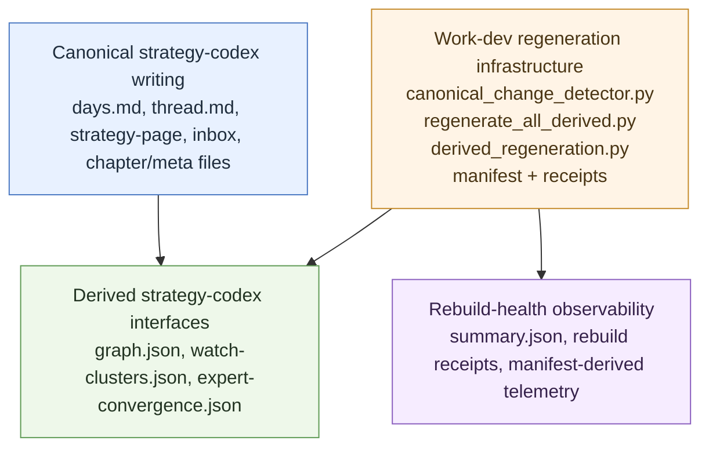

# strategy-codex
<!-- word_count: 1347 -->

**Discoverability:** The same tree is linked from the legacy **`SELF-LIBRARY/strategy-codex`** symlink for agents and tools that still prioritize the older companion-tree vocabulary. In strategy-codex doctrine, this tree is part of the notebook's **library** surface rather than an identity-facing layer. **Legacy LIB reference:** [LIB-0153](../self-library.md#operator-analytical-books) in [`self-library.md`](../self-library.md) (Operator analytical books).


## Primary 2026 Volume

The active corpus home is now [`2026/`](2026/): a year-volume with first-class cognition-stream shelves for Alkorshid, Diesen, Mercouris, Davis, Pape, Parsi, Ritter, and Crooke. Durable channel profiles live in [`profiles/`](profiles/). Shared raw input lives under [`2026/raw-input/`](2026/raw-input/), and civ-mem appears as a compact analytical spine rather than a duplicate corpus.

Use the old `experts/` path only as a deprecated compatibility pointer.

## Naming compatibility policy

Phase 2 doctrine for the rename is:

- **Public name:** use **strategy-codex** for the notebook/workspace as a whole.
- **Compatibility name:** **strategy-notebook** remains the legacy path and filename contract until a later coordinated migration changes code, tests, and generated artifacts together.
- **Public role name:** use **strategy-author** for the human analytical lane or voice being tracked.
- **Compatibility role name:** **strategy-expert** remains the current parser, marker, and filename contract until a later coordinated migration updates those machinery surfaces.

Practical rule:

- In **prose, menus, rules, and operator guidance**, prefer **strategy-codex** and **strategy-author**.
- In **paths, filenames, parser regexes, HTML markers, fixtures, and generated artifacts**, keep the legacy forms until the dedicated migration phase.

When a file needs to mention both, use the pattern:

- `strategy-codex (legacy path: strategy-notebook)`
- `strategy-author (legacy filename contract: strategy-expert-*)`

This policy is meant to stop ambiguity during the middle phase of the rename: one public vocabulary, one compatibility vocabulary, and no casual mixing of the two in code-moving edits.

## Word counts (script-maintained)

Many strategy-codex markdown files carry a **`word_count: <integer>`** field in YAML front matter, or **`<!-- word_count: <integer> -->`** as an HTML comment after the first heading when the file has no front matter. This is **approximate, deterministic, and maintained by** `python3 scripts/strategy/update_strategy_notebook_word_counts.py` — for operator navigation and size awareness only; it is **not** editorial or analytical authority. **Do not hand-edit** the value. After large notebook edits, run the script from repo root; **`--check`** verifies counts (CI-friendly); **`--dry-run`** lists would-be updates. Large captures under **`raw-input/YYYY-MM-DD/`** are intentionally skipped.

**Optional session wrapper (derived, does not auto-edit this tree):** [STRATEGY-RUN-OPERATOR.md](../docs/skill-work/work-strategy/STRATEGY-RUN-OPERATOR.md) — `run_id` + `state.json` under `artifacts/`; see also [STRATEGY-NOTEBOOK-TRACE-CONTRACT.md](STRATEGY-NOTEBOOK-TRACE-CONTRACT.md) (per-script JSONL).

## Workbench visualizer pilot

**Workbench (WORK-only):** static structure map + fixture (no build, no Record authority) for operator inspection: [demo-runs/workbench-visualizer/README.md](demo-runs/workbench-visualizer/README.md) — part of the [work-dev Workbench](../docs/skill-work/work-dev/workbench/README.md) loop.

## Derived interface artifacts

`strategy-codex is markdown-canonical, with a growing family of derived interface artifacts for orientation, inspection, and navigation; those artifacts are WORK-only and non-canonical unless separately promoted through existing governed paths.`

Use this framing for strategy-codex-facing visualizers, console views, graph-derived maps, or other operator-facing surfaces that help with orientation before judgment. Workbench remains the inspection layer for those artifacts; canonical strategy-codex judgment remains in `strategy-page` blocks and `days.md`.

## Boundary map

The strategy-codex sits inside a three-layer, one-way authority model:



- **Canonical strategy-codex writing** is the source of truth.
- **Derived strategy-codex interfaces** are rebuilt views for orientation and inspection.
- **Work-dev regeneration infrastructure** is the rebuild engine that refreshes those views.
- **Rebuild-health** is observability about that engine, not a strategy-writing surface.

This means canonical notebook content can produce derived interfaces, and the regeneration layer can rebuild those interfaces, but neither derived artifacts nor rebuild-health telemetry write back into notebook truth.

See [../docs/skill-work/work-dev/interface-artifacts/README.md](../docs/skill-work/work-dev/interface-artifacts/README.md).

## Search tooling note

When a strategy-codex session needs file search, prefer `rg` for speed. In this workspace, the WindowsApps `rg.exe` path can be blocked even when it resolves on PATH, so use the workspace-local copy at [`.codex-tmp/rg.exe`](../.codex-tmp/rg.exe) if needed. Treat that local binary as the default search path for future strategy-codex sessions in this repo.

## Python runtime note

When a strategy-codex session needs Python, use the bundled runtime at `C:\Users\rober\.cache\codex-runtimes\codex-primary-runtime\dependencies\python\python.exe` rather than assuming `python` or `python3` is on PATH. That runtime is the preferred default for future strategy-codex sessions when you need local validation or script execution.

See also: [tools.md](tools.md) for the compact strategy-codex tool pointer.

- **Polyphonic cognition streams:** [COGNITION-STREAMS-POINTER.md](COGNITION-STREAMS-POINTER.md) is the quick eight-stream roster; [speaker-lattice.md](speaker-lattice.md) is the alphabetical recurring-speakers index; [COGNITION-STREAMS.md](COGNITION-STREAMS.md) is the longer scaffold. The current lattice uses `Alkorshid` / `Diesen` / `Davis` / `Mercouris` / `Crooke` / `Parsi` / `Pape` / `Ritter`, with count-neutral graph exports at [artifacts/skill-work/work-strategy/interview-graph/README.md](../artifacts/skill-work/work-strategy/interview-graph/README.md).

## Volume / book / chapter / page scaffold

For the separate book-like scaffold, the strategy-codex is organized like this:

```text
codex/
  2026/
    README.md
    book-2026-01.md
    chapters/
      chapter-2026-01-01.md
    pages/
      page-2026-01-01-source.md
```

**Doctrine:** the volume is the year folder directly under `codex/`; books are month files at the volume root; chapters are daily composition files in `chapters/`; pages are raw-source files in `pages/`. The daily chapter files are the core scaffold; the book files provide month-level synthesis and index; the page files preserve the source layer.

---

**Current canonical model (one line):** **cognition streams** = interpretive voices; **thread handles** = routing/provenance joins; **watches** = what (evolving situation); **days** = when (chronology and continuity in `chapters/YYYY-MM/days.md`); **pages** = primary analytical unit (`strategy-page` in thread files). **Page-in-thread contract (links):** [NOTEBOOK-CONTRACT.md](NOTEBOOK-CONTRACT.md) / [THREAD-CONTRACT.md](THREAD-CONTRACT.md). Full spec: [STRATEGY-NOTEBOOK-ARCHITECTURE.md](STRATEGY-NOTEBOOK-ARCHITECTURE.md#current-canonical-model).

**State model (short):** **knowledge** = owned judgment; **library** = governed reference world; **memory** = resumable continuity; **archive** = governed evidence and provenance. In practice, `raw-input/` is archive-adjacent capture, codex-pages bridge archive toward knowledge, `strategy-page` blocks produce knowledge, and `days.md` is primarily memory.

**Contract ownership:** [NOTEBOOK-CONTRACT.md](NOTEBOOK-CONTRACT.md) is the short routing hub. It points to the narrower owners for template shape, thread mechanics, traces, page updates, raw-input capture, and backfill families. Prefer adding pointers there before adding another broad contract document.

**Start here (EOD — default day):** Capture in [daily-strategy-inbox.md](daily-strategy-inbox.md) and [`raw-input/`](raw-input/README.md) as needed → choose **one** thesis (or an explicit “carry”) → in the **end-of-day strategy session**, compose **one** `chapters/YYYY-MM/days.md` day block (minimum sections per [NOTEBOOK-PREFERENCES](NOTEBOOK-PREFERENCES.md)) → add **zero or one** new or revised `strategy-page` in the time-scoped thread files under `codex/years/2026/<channel>/` → **stop**. **Full** `strategy` pass (read frontier → inbox → menu): [DEFAULT-PATH.md](../docs/skill-work/work-strategy/DEFAULT-PATH.md). **L0–L4 stack:** [SYNTHESIS-OPERATING-MODEL.md §1](SYNTHESIS-OPERATING-MODEL.md#1-synthesis-stack-five-levels). **Session types A–D:** [SYNTHESIS-OPERATING-MODEL.md §2](SYNTHESIS-OPERATING-MODEL.md#2-ergonomic-session-types-pick-one). **Minimum “done” sketches:** [SYNTHESIS-OPERATING-MODEL.md §2.1](SYNTHESIS-OPERATING-MODEL.md#acceptable-finish-shapes). **EOD mechanics** (compose window, `strategy page` phrasing): [STRATEGY-NOTEBOOK-ARCHITECTURE.md § End-of-day strategy session](STRATEGY-NOTEBOOK-ARCHITECTURE.md#end-of-day-strategy-session-terminology). **Optional** decision-first stack: [EOD-MCQ-PROTOCOL.md](EOD-MCQ-PROTOCOL.md).

The **primary written unit** of [work-strategy](../docs/skill-work/work-strategy/README.md) is a **`strategy-page`** — marker-fenced analysis inside **time-scoped author thread files under `codex/years/2026/<channel>/`** (see [watches/README.md](watches/README.md)). The durable lane profile lives separately at **`codex/profiles/<channel>-profile.md`**. `chapters/YYYY-MM/days.md` holds **time and continuity**; author threads hold **substance**. Empty legacy index files on disk are **not** used for inventory; **`### Page references`** in machine layers and `validate_strategy_pages.py` are authoritative. Parallel in spirit to [Predictive History book architecture](../codex/predictive-history/BOOK-ARCHITECTURE.md), lighter tooling. **Operator gloss:** **Symphony of Civilization** — [STRATEGY-NOTEBOOK-ARCHITECTURE.md](STRATEGY-NOTEBOOK-ARCHITECTURE.md) § *Symphony of Civilization (operator gloss)*. **Skill stack:** This tree (architecture, prefs, inbox) is **`skill-strategy` by reference** — one contract with [`.cursor/skills/skill-strategy/SKILL.md`](../.cursor/skills/skill-strategy/SKILL.md), not a separate lane; see architecture § *Relation to skill-strategy*.

**Normal use:** capture in [daily-strategy-inbox.md](daily-strategy-inbox.md) and [`raw-input/`](raw-input/README.md) through the day; **once per day (default)** say **`strategy page`** or **`strategy page compose`** to run the session that composes **`strategy-page`** block(s) + `days.md` — see [STRATEGY-NOTEBOOK-ARCHITECTURE.md](STRATEGY-NOTEBOOK-ARCHITECTURE.md) § *End-of-day strategy session* (operator **`weave`** token deprecated). **Read-only orient:** **`strategy page read`** — frontier summary in chat, **no** `days.md` / **`strategy-page`** edits (same §, *Read-only variant*). **Strategy Console:** [`strategy-console/`](strategy-console/README.md) — derived, refresh-only orientation surface for EOD / morning / crisis review. Run `python3 scripts/strategy_console.py --mode eod` before MCQ when the operator wants a front-door view of what changed, which lanes moved, what tensions are tightening, and what should be reviewed next. It does **not** edit `days.md`, author threads, or `strategy-page` blocks. **Date hygiene:** `Accumulator for:` / inbox batch labels **do not** mandate new `days.md` `## YYYY-MM-DD` headings — see [STRATEGY-NOTEBOOK-ARCHITECTURE.md § `days.md` date keys — semantics and anti-split](STRATEGY-NOTEBOOK-ARCHITECTURE.md#days-md-date-semantics) and [.cursor/rules/strategy-notebook-days-date-semantics.mdc](../.cursor/rules/strategy-notebook-days-date-semantics.mdc). **Optional escalation cues** (`[watch]`, `[decision]`, `[promote]`) — definitions: [NOTEBOOK-PREFERENCES.md#escalation-marker-preference](NOTEBOOK-PREFERENCES.md#escalation-marker-preference). **Numbered lane SSOT:** [STRATEGY-NOTEBOOK-ARCHITECTURE.md#default-operating-path-ssot](STRATEGY-NOTEBOOK-ARCHITECTURE.md#default-operating-path-ssot).

- **Operator preferences:** [NOTEBOOK-PREFERENCES.md](NOTEBOOK-PREFERENCES.md) — daily structure, inbox vs page, weave rhythm, lens offers, promotion — **narrows** practice vs architecture defaults
- **Daily inbox (accumulator):** [daily-strategy-inbox.md](daily-strategy-inbox.md) — **SSOT** for ingest cadence + **paste-ready one-liner** format; weave/prune, per-author mirror, **`batch-analysis`** joint line → [STRATEGY-NOTEBOOK-ARCHITECTURE.md#daily-strategy-inbox-accumulator](STRATEGY-NOTEBOOK-ARCHITECTURE.md#daily-strategy-inbox-accumulator)
- **Raw input (full text, rolling window):** [raw-input/README.md](raw-input/README.md) — unabridged transcripts and bundled inputs; **manual** prune only (`python3 scripts/prune_strategy_raw_input.py`; while [`.pruning-suspended`](raw-input/.pruning-suspended) exists, use `--apply --override` to delete) — policy table in [STRATEGY-NOTEBOOK-ARCHITECTURE.md § Split ingest model](STRATEGY-NOTEBOOK-ARCHITECTURE.md#split-ingest-model)
- **Weave learning (optional):** [FOLD-LEARNING.md](FOLD-LEARNING.md) — append-only `strategy-fold-events.jsonl`, `log_strategy_fold.py`, `report_strategy_fold_learning.py` (`fold_kind` is a legacy field name; the current command is `weave`)
- **Pages (primary analysis):** [strategy-codex-template-page.md](strategy-codex-template-page.md) - **`strategy-page`** fences in **time-scoped thread files under `codex/years/2026/<channel>/`**; `python3 scripts/validate_strategy_pages.py`. Optional [strategy-notebook-page-template.md](strategy-notebook-page-template.md) is a **superseded** placeholder (on-disk name unchanged for path compatibility; prefer `strategy-codex-template-page.md`).
- **Canonical templates:** [strategy-codex-template-page.md](strategy-codex-template-page.md), [strategy-codex-template-chapter.md](strategy-codex-template-chapter.md), and [strategy-codex-template-book.md](strategy-codex-template-book.md) now own the primary page/chapter/book scaffolds. Legacy template filenames remain as compatibility pointers while links migrate.
- **codex-pages (standalone in `codex/<year>/<channel>/`):** [strategy-codex-template-page.md](strategy-codex-template-page.md) - shared scaffold (**`{expert_id}`** token); **~70-80%** verbatim by readable body weight; `python3 scripts/strategy/refined_page_word_budget.py check|condense` · `extract_transcript_speaker_lanes.py`; each author keeps a thin **`*-page-template.md`** stub linking here. Durable profiles stay year-independent at **`codex/profiles/<channel>-profile.md`**.
- **Weave inbox stub:** `python3 scripts/strategy_weave_inbox_stub.py --help` — prints a **Weave registry** block (`notebook-weave` + `batch-analysis` lines) to paste under **Accumulator for:** in [daily-strategy-inbox.md](daily-strategy-inbox.md)
- **Connections (optional edges):** [page-relations surface](page-relations surface) — optional page-to-page tension edges (often empty; on-disk filename unchanged); validate with `python3 scripts/page relation validator`
- **Glossary — page `id`:** stable kebab-case slug on **`<!-- strategy-page:start id="…"`** — disambiguates multiple pages per month; multi-author weaves reuse the **same** **`id`** in each time-scoped thread file under `codex/years/2026/<channel>/`
- **strategy-state-iran** (institutional lane): [strategy-state-iran/README.md](strategy-state-iran/README.md) — **institution-centric** [**channels/**](strategy-state-iran/channels/README.md) + [**weave/**](strategy-state-iran/weave/) (month ledger / weave) + [**clusters/**](strategy-state-iran/clusters/); [translation-provenance](strategy-state-iran/translation-provenance/) when needed; legacy **[`iri-institutional/thread.md`](strategy-state-iran/voices/iri-institutional/thread.md)** (tri-voice + **`strategy-page`**) + **`voices/<voice_id>/profile.md`** shims; **`strategy-state-iran/chapters/YYYY-MM/days.md`** + **`daily/`**; cross-weave with main **`chapters/YYYY-MM/days.md`**
- **strategy-state-russia** (institutional lane): [strategy-state-russia/README.md](strategy-state-russia/README.md) — **institution-centric** [**channels/**](strategy-state-russia/channels/README.md) + [**weave/**](strategy-state-russia/weave/) + [**clusters/**](strategy-state-russia/clusters/); [translation-provenance](strategy-state-russia/translation-provenance/) when needed; legacy **[`russia-institutional/thread.md`](strategy-state-russia/voices/russia-institutional/thread.md)** + **`voices/<voice_id>/profile.md`** shims; **`strategy-state-russia/chapters/YYYY-MM/days.md`** + **`daily/`**; cross-weave with main **`chapters/YYYY-MM/days.md`**
- **Cognition streams / routing handles:** [COGNITION-STREAMS.md](COGNITION-STREAMS.md) gives the public scaffold; [strategy-commentator-threads.md](strategy-commentator-threads.md) keeps **`expert_id`** / **`thread:<expert_id>`** routing handles, grep tags, and typical **`batch-analysis`** pairings for compatibility and provenance.
- **Operator gloss — Department of Strategy (DOS):** Unofficial nickname for the indexed **`expert_id`** / **`thread:`** roster under **`experts/`** (standing analytic bench — **not** a government agency, **not** [`strategy-state-iran`](strategy-state-iran/README.md) **official** voices). **DOS** can read as tech jargon elsewhere; use the long form when context is thin.
- **Author files (channel model):** Each main lane has a durable profile at **`codex/profiles/<channel>-profile.md`**. Time-scoped companion files such as transcripts, thread files, books, chapters, and `codex-page` files stay under active volume folders like **`codex/years/2026/<channel>/`**. Run **`bin/thread`** or **`python3 scripts/strategy_thread.py`** (operator **`thread`**) from repo root to auto-triage + extract. Crossing rules and optional **`verify:`** tails stay in [strategy-commentator-threads.md](strategy-commentator-threads.md). **Starter:** [strategy-expert-template.md](strategy-expert-template.md).
- **Analogue apps → deltas (post-audit):** [notes/ANALOGUES-SKILL-STRATEGY-DELTAS.md](notes/ANALOGUES-SKILL-STRATEGY-DELTAS.md) — filtered brainstorm vs existing rules; shipped items noted in-file
- **EOD MCQ protocol (v1):** [EOD-MCQ-PROTOCOL.md](EOD-MCQ-PROTOCOL.md) — optional **decision-first** menu stack (session → lanes → promotion → page shape → page action → `days.md` mode) before drafting; **coexists** with the minimal **page-shape-only** fork in architecture
- **Spec:** [STRATEGY-NOTEBOOK-ARCHITECTURE.md](STRATEGY-NOTEBOOK-ARCHITECTURE.md) — includes **Primary output**, **page-first** model, **Condense-to-target** (**Fast** = tiers A→D; **Full** = summarize-and-condense + tiers), **condense checklist**, **Daily synthesis**, and **Accumulation and evolution** (persistent frontier / checkpointed loop)
- **Synthesis (systematic entry):** [SYNTHESIS-OPERATING-MODEL.md](SYNTHESIS-OPERATING-MODEL.md) — five-level stack (L0–L4), session types A–D, section router, minds defaults (tacet / solo / duet / tutti), pre/post checklists; points to architecture for mechanics
- **Conductor improvement loop (optional but optimal for recursive stance):** [CONDUCTOR-IMPROVEMENT-LOOP.md](CONDUCTOR-IMPROVEMENT-LOOP.md) — map `coffee_pick` + Conductor to `days.md` / `strategy-page`, falsify line, promotion ladder; [CONDUCTOR-CLOSE-TEMPLATE.md](CONDUCTOR-CLOSE-TEMPLATE.md) for paste
- **Ensemble metaphor:** [STRATEGY-NOTEBOOK-ARCHITECTURE.md § Ensemble metaphor](STRATEGY-NOTEBOOK-ARCHITECTURE.md#ensemble-metaphor-chamber-group-gloss) — score, parts, conductor, dissonance (chamber-group gloss under month **Polyphony**)
- **Cursor:** Say **`strategy`** to run the strategy pass — [`.cursor/skills/skill-strategy/SKILL.md`](../.cursor/skills/skill-strategy/SKILL.md)
- **Dashboard:** [STATUS.md](STATUS.md)
- **Chapters:** `chapters/YYYY-MM/` — `meta.md` (month) + `days.md` (chronology / continuity — names page **`id`s** and weaves). **Substance** lives in **time-scoped author thread files under `codex/years/2026/<channel>/`** (`strategy-page` blocks), not under `chapters/…/knots/` (removed; see git history). **Terminology:** [STRATEGY-NOTEBOOK-ARCHITECTURE.md § Terminology (chapter / day block / page)](STRATEGY-NOTEBOOK-ARCHITECTURE.md#terminology-chapter-day-page) — one month = one chapter, one committed `days.md` day = one **day block** (vs **`strategy-page`** in author threads). **Sparse-capture months** may be **meta-led retro syntheses** (single episodic `days.md` block; long arc in `meta.md`) — exemplar: [chapters/2026-01/meta.md](chapters/2026-01/meta.md). **Book-style scaffold:** see the `Volume / book / chapter / page scaffold` doctrine above.
- **Minds:** [`minds/`](minds/) — trimmed CIV-MIND files (Barnes, Mearsheimer, Mercouris) for analytical lens work; see [MINDS-SKILL-STRATEGY-PATTERNS.md](../minds/MINDS-SKILL-STRATEGY-PATTERNS.md) for recipes
- **History notebook (parallel, LIB-0156):** [../docs/skill-work/work-strategy/history-notebook/README.md](../docs/skill-work/work-strategy/history-notebook/README.md) — operator mechanism chapters; [STATUS — distillation queue](../docs/skill-work/work-strategy/history-notebook/STATUS.md) (single SSOT for next `hn-*`); per-arc **Reusable Resonance Lines** in [../docs/skill-work/work-strategy/history-notebook/threads/history-civ-*.md](../docs/skill-work/work-strategy/history-notebook/threads/); optional [cross-arc pattern lines](../docs/skill-work/work-strategy/history-notebook/threads/cross-arc-resonance-lines.md) (analogy-audit when load-bearing); **`### History resonance`** tiers + optional **`HN gap:`** (see [STRATEGY-NOTEBOOK-ARCHITECTURE.md](STRATEGY-NOTEBOOK-ARCHITECTURE.md) § *Parallel to History notebook*); `python3 scripts/validate_strategy_hn_citations.py` warns on unknown `hn-*` tokens
- **Demo / calibration:** [notes/DEMO-SKILL-STRATEGY-TRANSCRIPTS.md](notes/DEMO-SKILL-STRATEGY-TRANSCRIPTS.md) — step-by-step `skill-strategy` exercise using three ingested transcripts + explicit tri-frame; run `bash scripts/demo_skill_strategy_transcripts_check.sh` from repo root first · [Executive report (implementation & readiness)](notes/DEMO-SKILL-STRATEGY-EXECUTIVE-REPORT.md) · [notes/README.md](notes/README.md)

WORK only; not Record unless promoted through RECURSION-GATE.
