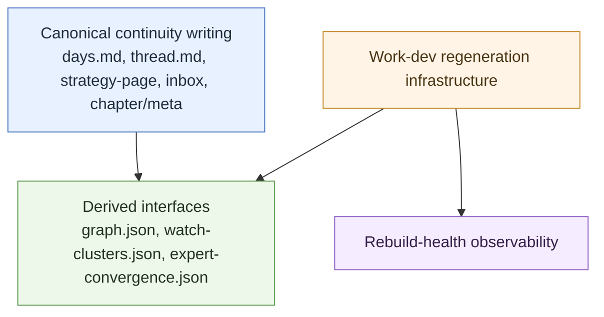

# continuity/ — boundary
<!-- word_count: 279 -->

**Purpose:** Canonical vs derived vs archive vs statecraft — where notebook continuity ends and live judgment begins.

## Authority stack

| Layer | Path | Role |
|-------|------|------|
| Evidence | `source-archive/` | Verbatim source truth |
| Continuity | `continuity/` | Dated chronology, inbox, chapters, thread accumulation |
| Judgment | `statecraft/` | Live voices, notes, synthesis, prediction registry |
| Session buffer | `memory.md` | Rotatable session continuity (not this tree) |
| Frozen | `archive/` | Non-live holdings |

## Canonical vs derived (continuity layer)

- **Canonical continuity writing** is notebook source of truth.
- **Derived interfaces** are rebuilt views for orientation only.
- **Regeneration infrastructure** refreshes derived views; it does not write notebook truth.
- **Rebuild-health** is observability, not a writing surface.

See [interface-artifacts README](../docs/skill-work/work-dev/interface-artifacts/README.md).

## Continuity vs statecraft handoff

| Work type | Use `continuity/` | Use `statecraft/` |
|-----------|-------------------|-------------------|
| Dated continuity | Yes | Link only |
| Daily memory / chronology | Yes | Optional downstream synthesis |
| Raw full-source capture | No — `source-archive/` | No |
| Voice / speaker shelf | No | Yes |
| First-class geopolitical note | No | Yes |
| Durable public argument | No | `statecraft/notes` or `essays/` |
| Prediction registry event | No | Yes |
| Compiled browsing snapshot | Derived only | No |
| Notebook continuity | Yes | No |

## What does not belong here

- Full verbatim captures (use `source-archive/statecraft/`)
- First-class voice profiles and live notes (use `statecraft/voices/`, `statecraft/notes/`)
- Museum Record (`archive/grace-mar-instance/`)

## Related

- [COMPATIBILITY.md](COMPATIBILITY.md) — naming tokens
- [NOTEBOOK-CONTRACT.md](NOTEBOOK-CONTRACT.md) — routing hub
- [STRATEGY-NOTEBOOK-ARCHITECTURE.md](STRATEGY-NOTEBOOK-ARCHITECTURE.md) — full architecture
