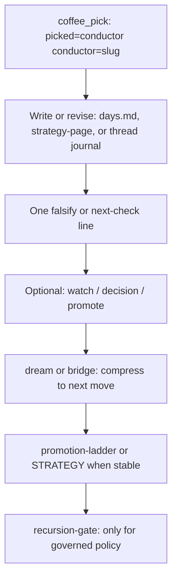

# Conductor - operator improvement loop (SSOT)
<!-- word_count: 1180 -->

**Successor operator path:** [CONDUCTOR-COMPRESSION-SPEC.md](../continuity/_deprecated/conductor/CONDUCTOR-COMPRESSION-SPEC.md) — compress standalone conductor into coffee + object closes (Phase 2 redirect).

**Status:** WORK (operator discipline). **Not** Record. **Not** a merge or gate substitute. **Not** a second strategy pipeline beside the strategy-notebook architecture.

**Purpose:** Name the **closed loop** from a standalone **Conductor** stance (`coffee_pick` with **`picked=conductor` `conductor=<slug>`**; older `picked=D` / `picked=E` rows are read-only compatibility) to **durable, testable** notebook output and optional promotion. Append-only [cadence lines](../continuity/cadence/cadence-events.md) record *that* a pick happened; they do **not** by themselves store **what changed** in the work.

**Related:** [CONDUCTOR-CLOSE-TEMPLATE.md](CONDUCTOR-CLOSE-TEMPLATE.md) (paste block) | [COFFEE-CADENCE-CONDUCTOR-PROTOCOL.md](COFFEE-CADENCE-CONDUCTOR-PROTOCOL.md) (ritual) | [CONDUCTOR-PASS.md](../continuity/_deprecated/conductor/CONDUCTOR-PASS.md) (menu) | [NOTEBOOK-PREFERENCES.md](NOTEBOOK-PREFERENCES.md#escalation-marker-preference) | [AGENTS.md](../AGENTS.md) (governance boundary) | [review-orchestrator.md](../docs/orchestration/review-orchestrator.md) (meta-review packets) | [harness-architecture-map.md](../docs/harness-architecture-map.md) (topology hub) | [`.cursor/skills/coffee/SKILL.md`](../.cursor/skills/coffee/SKILL.md) (Cursor ritual).

---

## 1. Layer Map

| Layer | What it is | Where in this repo |
|-------|------------|--------------------|
| **Signal / stance** | Which conductor; continuity | [cadence-events.md](../continuity/cadence/cadence-events.md) - new `coffee_pick` rows use `picked=conductor` `conductor=<slug>`; optional `focus=` / `arc=`; legacy `picked=D` / `picked=E` is read-only compatibility |
| **Machine / extraction** | Ingest, transcript echoes, page refs | Expert `thread.md` machine layer; `raw-input/`; strategy-notebook architecture |
| **Journal / judgment** | Synthesis, stakes, open seams | `strategy-page` in `experts/<id>/thread.md`, `chapters/YYYY-MM/days.md`, journal layer prose |
| **Test / falsify** | What would change your mind next | `days.md` Judgment or a line on the page; optional expert prediction / falsifier rows where you already run that discipline |
| **Escalation** | Intake only until you act | `[watch]`, `[decision]`, `[promote]` per [NOTEBOOK-PREFERENCES.md](NOTEBOOK-PREFERENCES.md#escalation-marker-preference) |
| **Structure / promotion** | Reusable, staged objects | `promotion-ladder` / STRATEGY when stable |
| **Governance** | Durable companion or merge policy | [AGENTS.md](../AGENTS.md) / `recursion-gate.md` - only when the lesson is policy, not a notebook preference |
| **Compression** | Turn many moves into one next motion | `dream` / `bridge`; optional `coffee_conductor_outcome` (see section 3) |

**Rule:** A conductor run without a same-day or same-session anchor in the notebook or an outcome line is **orientation-only** for chat - fine for a sip, but **not** a complete loop for recursive improvement.

**`bravo` distinction:** The operator may still close a conductor pass with **`bravo`**. Treat that as a meaningful behavioral end-of-arc signal: the A-D movement sequence landed and should not be reopened by default. But `bravo` alone does not upgrade an orientation-only or chat-only pass into a durable improvement-loop close. Notebook anchors and `coffee_conductor_outcome` lines remain the concrete receipts.

**`weak` distinction:** The operator may also mark a conductor pass as **`weak`**. Treat that as lightweight dissatisfaction feedback for recursive improvement: the pass did not land, but the response should stay light. A short acknowledgment is enough unless the operator requests diagnosis. `weak` does not create a durable negative receipt by itself; it simply prevents the pass from being treated as behaviorally successful.

**Coffee / dream contract:** `coffee` owns stance selection and action-menu execution; `dream` owns compression. A `coffee_pick` with `picked=conductor conductor=<slug>` is enough for tomorrow's coffee to remember the latest stance, but it is not enough for dream to call the pass complete. Dream may carry the stance forward as `orientation_only`; only a notebook/page close or `coffee_conductor_outcome` with `conductor=<slug>`, `verdict=`, and `notebook_ref=` or `falsify=` counts as a closed conductor pass in `conductor_rollup_24h`.

**Repair receipt - 2026-05-14:** A Toscanini/Furtwangler conductor sequence failed by treating conductor names as a **style overlay** instead of executing the established protocol. Exact failure: the assistant produced generic, interchangeable A-D options and let persona color outrun the required score: resolve one `conductor=<slug>`, give the slug's short orientation, then emit a concrete, repo-grounded **Conductor Action Menu** with exactly **A. Allegro**, **B. Andante**, **C. Scherzo**, and **D. Finale**. Restored protocol: [AGENTS.md](../AGENTS.md) is the Layer-1 contract; [CONDUCTOR-PASS.md](../continuity/_deprecated/conductor/CONDUCTOR-PASS.md) is the shared cross-lane shape; [`.cursor/skills/conductor/SKILL.md`](../.cursor/skills/conductor/SKILL.md) is subordinate mode routing and voice. Falsifier: any future conductor-name turn that emits a lettered master chooser, omits the movement-labeled action menu, or offers options without exact file/command/artifact targets has regressed.

**Bernstein close receipt - 2026-05-14:** The conductor repair moved from orientation into enforceable practice: `CONDUCTOR-PASS.md` now explains why conductor names are name-only, `.cursor/skills/conductor/SKILL.md` defines "durable close" as a real notebook/outcome anchor, and `tests/test_conductor_docs_links.py` fails if conductor-facing docs drift back to the removed strategy-notebook improvement-loop or close-template paths. Falsifier: if a future pass can reintroduce `docs/skill-work/work-strategy/strategy-notebook/CONDUCTOR-IMPROVEMENT-LOOP.md` without a focused test failure, this close did not actually harden the loop.

---

## 2. The Loop



**Minimum closed pass:** **pick** plus at least one of:

- A **Conductor close** in `chapters/YYYY-MM/days.md` for that day, or in a `strategy-page` Reflection, using [CONDUCTOR-CLOSE-TEMPLATE.md](CONDUCTOR-CLOSE-TEMPLATE.md).
- A `coffee_conductor_outcome` line with `conductor=<slug>`, `verdict=`, and `notebook_ref=` or `falsify=`.

**Behavioral close:** If the operator says **`bravo`**, the arc may be socially complete even when no notebook or cadence receipt was written. Treat that as a real ritual close, but distinguish it from a durable close.

**Full pass:** the same, plus an explicit test line and, when the arc deserves it, ladder / STRATEGY; gate only when the update is governed behavior.

**Writing-practice closes:** If a conductor pass exposes repeated public-writing friction, use the close to name a **Friction / rule candidate** before changing doctrine. The first durable home is usually [write-operator-preferences.md](../docs/skill-write/write-operator-preferences.md) or [write-shipping-checklist.md](../docs/skill-write/write-shipping-checklist.md), not Record surfaces. The future check should be concrete: would this proposed rule have prevented the session drag without adding needless process?

**Doctrine-hardening closes:** If a conductor pass starts hardening doctrine,
the close should name:

- the authority layer being changed
- the strongest claim worth falsifying
- whether any coherent work was discovered on the wrong surface

This is a bounded recursive-improvement discipline for doctrine-forming passes,
not a universal requirement for every conductor close.

---

## 3. Cadence Closure

After the conductor orientation and notebook touch, or explicit choice to shelf with no file edit that day, you may append a single line:

```bash
python3 scripts/log_cadence_event.py --kind coffee_conductor_outcome -u grace-mar --ok \
  --kv verdict=watch conductor=kleiber notebook_ref=chapters/2026-04/days.md
```

`verdict=` examples: `watch`, `promote`, `shelf`, `no_action`. For new logs, include `conductor=<slug>` every time, plus `notebook_ref=` or `falsify=` so the close stays attributable from the ledger alone. If the session ended without that shape, add a repair outcome on the next turn instead of leaving the close implicit.

For writing-friction outcomes, interpret verdicts narrowly:

- `verdict=watch` - the friction is visible but needs another recurrence before becoming a rule.
- `verdict=promote` - propose a WORK-layer docs-rule patch; this does **not** mutate the Record.
- `verdict=shelf` - the friction was contextual and should not become doctrine.

Documented optional keys:

| Key | Use |
|-----|-----|
| `notebook_ref` | Path or fragment pointer, e.g. `chapters/2026-04/days.md` or a `strategy-page` `id=` |
| `falsify` | One line: what observation would contradict the pass |
| `conductor` | Slug if not obvious from the immediately preceding `coffee_pick` |

Example:

```bash
python3 scripts/log_cadence_event.py --kind coffee_conductor_outcome -u grace-mar --ok \
  --kv verdict=watch conductor=kleiber \
  --kv "notebook_ref=chapters/2026-04/days.md" \
  --kv "falsify=If Hormuz commercial traffic returns without commensurate IRI comms, revisit narrow thread choice."
```

Use quoting if `falsify` contains spaces; [log_cadence_event.py](../scripts/log_cadence_event.py) parses `--kv key=value` pairs.

---

## 4. What This Is Not

- Not automatic promotion from cadence; not a substitute for EOD `strategy page` when the day's substance needs a full compose.
- Not the BrewMind / Cici governed-state pipeline; keep boundaries unless you explicitly bridge.
- Not Record truth; companion-facing authority stays on-disk per AGENTS and the gate.

---

## 5. See Also

- [COFFEE-CADENCE-CONDUCTOR-PROTOCOL.md](COFFEE-CADENCE-CONDUCTOR-PROTOCOL.md) - five movements, seeds only.
- [FOLD-LEARNING.md](FOLD-LEARNING.md) - optional weave learning stream, separate from this loop.
