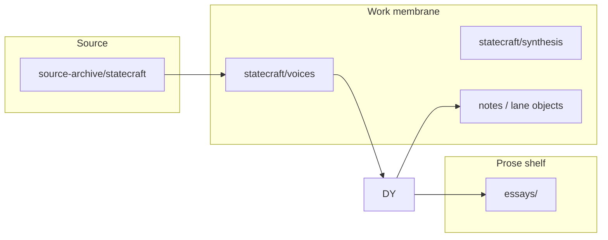

# Architecture — strategy-codex (active)

**Work only; not Record.**

This document describes the **active** system design for **strategy-codex**. Legacy Grace-Mar instance architecture is archived — [`archive/grace-mar-corpus/doctrine/architecture.md`](../archive/grace-mar-corpus/doctrine/architecture.md) · fork pointer [`docs/archive/grace-mar.md`](archive/grace-mar.md).

## What the system is

**strategy-codex** is a **governed interpretive machine**: verbatim sources land in archive; bounded synthesis and judgment objects carry operator work under **statecraft** and **singularity**. It is an **intelligence harness** around frontier models — not a substitute for them. See [`product-identity.md`](product-identity.md) and [`essays/from-accumulation-to-governed-interpretive-machine.md`](../essays/from-accumulation-to-governed-interpretive-machine.md).

Growing a personal cognitive fork (Grace-Mar Record) is **not** a system objective. The Record bundle under [`archive/grace-mar-instance/`](../archive/grace-mar-instance/) is a **frozen sidecar** for archaeology and explicit **`fork revive`** only.

## Operator channels

Normal routing uses **two primary channels** ([`operator-two-channel-architecture.md`](operator-two-channel-architecture.md)):

| Channel | Owns |
|---|---|
| **statecraft** | Legitimacy, power, command, settlement, geopolitical and civilizational judgment |
| **singularity** | Acceleration, agency, substrate, control planes, recursive tooling, compounding experiments |

**work-dev**, **work-cici**, **work-business**, and other named territories are usually **overlays** under one of those channels — not equal sovereign categories.

**Default session lane:** **statecraft** unless the operator names another territory. Technical hands-only work may run without statecraft framing when asked.

## Product kernel (do not simplify away)

```text
source-archive → generated indexes → daily synthesis → judgment / transaction objects
```



**Preserve as first-class:** `source-archive/`, `statecraft/`, `singularity/`, `essays/`, `runtime/artifacts/`, `scripts/`, [`repo-map.yaml`](../repo-map.yaml), [`docs/start-here.md`](start-here.md).

## Authority categories

Four categories govern where truth lives ([`complexity-budget.md`](complexity-budget.md)):

| Category | Meaning |
|---|---|
| **source** | Primary or canonical source material (archive captures) |
| **work** | Active human/operator-authored working surfaces |
| **generated** | Derived, rebuildable, non-authoritative outputs |
| **archive** | Frozen historical or compatibility material |

[`repo-map.yaml`](../repo-map.yaml) routes add optional `category`; [`LLM-ROUTING.md`](../LLM-ROUTING.md) is hybrid-generated from repo-map + curated prose.

## Work execution layer

**Mind** (operator) + **work execution layer** (assistant, scripts, lane trees). Assistants:

- **Read** canonical and work surfaces
- **Route** intake, synthesis, integrity, ship
- **Stage** fork-gate candidates only on explicit revive
- **Never** auto-merge Record identity

Agent contract: [`AGENTS.md`](../AGENTS.md) (slim) · extended rules [`agent-rules/deep-rules.md`](agent-rules/deep-rules.md).

## Layer stack

Later layers narrow but never contradict earlier ones ([`layer-architecture.md`](layer-architecture.md)):

1. **Core** — `AGENTS.md`
2. **Instance** — `instance-doctrine.md`
3. **Lane** — `docs/skill-work/work-*/`
4. **Mode** — `.cursor/skills/` · `.cursor/rules/`

## Harness topology

For **model vs harness**, membranes, queues, AFK, and channel routing, read [`harness-architecture-map.md`](harness-architecture-map.md) before broad repo search.

**Warmup / handoff:** `python3 scripts/harness_warmup.py -u strategy-codex` · `python3 scripts/operator_handoff_check.py --fast`

**Health preflight:** `python3 scripts/check_repo_health.py --quick`

## Frozen sidecar (Grace-Mar)

| Surface | Location | Default |
|---|---|---|
| Record identity / evidence / gate | `archive/grace-mar-instance/` | Frozen |
| Voice bots | `archive/grace-mar-instance/bot/` | Deprecated |
| SELF-LIBRARY reference | `archive/grace-mar-instance/self-library.md` | Active **reference** routing |
| Session continuity | `self-memory.md` | WORK only — not Record |

Full fork doctrine: [`docs/archive/grace-mar.md`](archive/grace-mar.md).

## External boundaries

- **Predictive History public corpus:** [`public/ph-civ/`](../public/ph-civ/) only; ship via `scripts/publish_public_ph_civ.py` — see [`predictive-history-external-boundary.md`](predictive-history-external-boundary.md).
- **Legacy strategy-notebook path:** compatibility only — [`skill-work/work-strategy/DEFAULT-PATH.md`](skill-work/work-strategy/DEFAULT-PATH.md).

## Related

- [`start-here.md`](start-here.md) — operator loop
- [`routing-reference.md`](routing-reference.md) — routing hierarchy
- [`runtime-vs-record.md`](runtime-vs-record.md) — derived artifacts policy
- [`governance-unbundling.md`](governance-unbundling.md) — routing vs sensemaking
