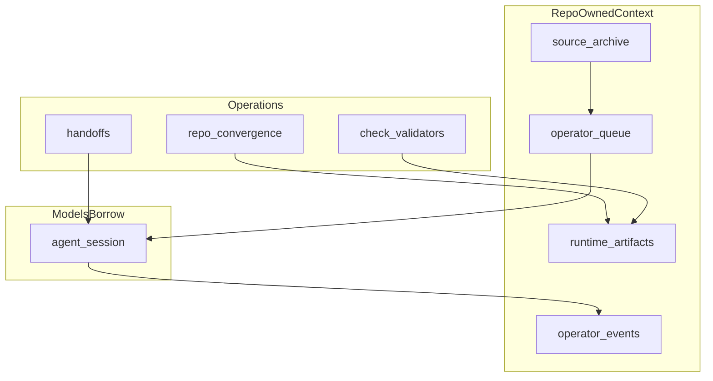

# Context Layer

**Status:** Phase 1 — doctrine for repo-owned context, model-agnostic work, and portable agent execution.

## Purpose

This document defines the **context layer** for `strategy-codex`.

The context layer is the set of repo surfaces, runtime surfaces, queues, receipts, and gates that preserve what work means:

```text
which source matters
which file is current
what changed
what the operator decided
what an agent is allowed to see
what an agent is allowed to do
where work stopped
what counts as done
what proof exists
```

The core rule:

```text
The repo owns context.
Models borrow context.
```

Models may reason over context. They may transform context. They may generate outputs from context. But durable context should not live primarily inside a vendor chat history, Slack thread, private model memory, or external agent workspace.

The context layer exists so `strategy-codex` can use many models and agents without letting any one provider become the system of record.

## Continuity surfaces (distinct roles)

| Surface | Role |
|---------|------|
| [`memory.md`](../memory.md) | Rotatable **session** continuity buffer |
| [`continuity/`](../continuity/README.md) | Durable chronology, accumulation, and notebook continuity (formerly `continuity/`) |
| [`source-archive/`](../source-archive/README.md) | Evidence and source truth |
| [`statecraft/`](../statecraft/README.md) | Live judgment |

Path migration decision: [`codex-to-continuity-rename.md`](codex-to-continuity-rename.md).

## Not the same as Prepared Context Layer

| Doc | Scope |
|-----|--------|
| **Context Layer** (this doc) | Work-system context ownership: queues, receipts, convergence, export/import rules, model agnosticism |
| **[Prepared Context Layer](prepared-context-layer.md)** | Evidence-derived bundles for model reasoning ([state model](state-model.md) Layer 2) |

See also: [prepared-context-doctrine.md](prepared-context-doctrine.md).

---

## Why this matters

As model intelligence gets cheaper and more widely available, the main bottleneck shifts from raw model capability to context application.

A model can be smart and still not know what is going on.

Before an AI can do useful work, the operator often has to supply:

```text
the current files
the relevant source
the latest decision
the permission boundary
the definition of done
the prior work
the reason an earlier agent stopped
```

If this context lives only in private chats, the human becomes the context carrier.

If this context lives in a governed repo layer, agents can work against portable, inspectable, permissioned context packets.

The strategic problem is not only:

```text
Which model is smartest?
```

It is:

```text
Which system owns the context that makes any model useful?
```

---

## Core distinction

| Layer             | Question                                                                |
| ----------------- | ----------------------------------------------------------------------- |
| **Model**         | Can it reason, write, code, summarize, or judge?                        |
| **Harness**       | Can work be assigned, contextualized, checked, handed off, and audited? |
| **Context layer** | Where does durable work context live, and who controls it?              |
| **Queue**         | What work moves next, who owns it, and where should it stop?            |
| **Receipt**       | What happened, what changed, and what remains?                          |
| **Gate**          | Does this require human authority before promotion?                     |

The model is not the whole work system.

A capable model without context is a brain in a jar. A context layer makes intelligence operational.

---

## Context ownership rule

`strategy-codex` should preserve durable context in repo-governed surfaces.

### Allowed

```text
export bounded context to a model for a task
route a queue item to a model or agent
use model-specific strengths
summarize context into runtime artifacts
produce receipts from agent work
stage promotion candidates for review
```

### Not allowed by default

```text
treat vendor chat history as the system of record
treat Slack memory as durable repo context
let external model memory silently replace repo memory
let generated summaries promote authority automatically
let private agent sessions become the only proof of work
let external tools own source truth
```

A model provider may be useful. A model provider should not become the default owner of repo context.

---

## Context surfaces

| Context type          | Primary repo surface                              | Class                                    |
| --------------------- | ------------------------------------------------- | ---------------------------------------- |
| Source truth          | `source-archive/`                                 | source / evidence                        |
| Durable judgment      | `statecraft/notes/`, `singularity/notes/`, essays | governed adjacent                        |
| Work movement         | [`runtime/operator-queue/`](../runtime/operator-queue/README.md) | instrumental work                        |
| Session continuity    | [`runtime/artifacts/handoffs/`](../runtime/artifacts/handoffs/README.md) | runtime / derived                        |
| Patch/proposal intake | [`runtime/artifacts/patch-intake/`](../runtime/artifacts/patch-intake/README.md) | runtime / derived or external complement |
| Generated freshness   | `runtime/artifacts/*`                             | runtime / derived                        |
| Operational audit     | `runtime/operator-events/*.jsonl`                 | runtime / derived receipt                |
| Authority boundary    | membrane docs, gates, Record doctrine             | governed / gated                         |
| Repo routing          | `repo-map.yaml`, `LLM-ROUTING.md`, front doors    | routing infrastructure                   |
| Validation state      | `check_repo_health.py`, `run_repo_convergence.py` | validator / convergence                  |

When in doubt, classify the context before deciding what it may feed next.

### Repo-owned context flow (Phase 1)



---

## Relationship to work membrane

The context layer does not replace the membrane model. See [work-membrane-v2.md](work-membrane-v2.md).

The membrane answers:

```text
What class of surface is this?
What may it contain?
What may it mutate?
What may it promote?
```

The context layer answers:

```text
Where does the usable work context live?
How does it move?
How is it refreshed?
How is it exported?
How is it audited?
```

The two are complementary.

A context packet may contain source pointers, notes, queue status, and receipts, but it does not gain authority merely because it is complete, useful, or model-readable.

---

## Relationship to repo convergence

Repo convergence preserves **context freshness**. See [repo-convergence.md](repo-convergence.md).

[`run_repo_convergence.py`](../scripts/run_repo_convergence.py) answers:

```text
Which derived artifacts are stale?
Which validators need to run?
Which loop changed?
Did the repo return to a known coherent state?
```

Context freshness rule:

```text
If a derived surface is used as context, it should be fresh or explicitly marked stale.
```

Repo convergence should remain the tool for checking and rebuilding derived repo context.

The context layer should treat convergence reports as advisory runtime context, not authority.

---

## Relationship to Agent Handoff Queue

Agent Handoff Queue preserves **context movement**. See [agent-handoff-queue.md](agent-handoff-queue.md).

A queue item should make work portable across humans, agents, and model providers by specifying:

```text
owner
status
context paths
definition of done
allowed actions
forbidden actions
stop conditions
blocking question, if any
gate, if any
receipt, if done
```

Queue items are context packets for work.

The normal arc is:

```text
queue item
  → agent claims work
  → agent uses bounded context
  → agent edits / drafts / validates
  → repo convergence checks freshness
  → agent leaves receipt
  → human reviews or gates
```

The queue does not replace repo convergence. It tells the work where to go. Repo convergence tells the repo whether generated state is coherent.

---

## Relationship to handoffs

[`runtime/artifacts/handoffs/`](../runtime/artifacts/handoffs/README.md) preserves **session continuity**.

Use handoff artifacts when the operator or agent needs re-entry context:

```text
what happened last session
where to resume
what state matters
what should be read first
```

Do not use handoff artifacts as active work ownership. Use [`runtime/operator-queue/`](../runtime/operator-queue/README.md) for active work items with owner, status, definition of done, and receipt requirements.

---

## Relationship to patch intake

[`runtime/artifacts/patch-intake/`](../runtime/artifacts/patch-intake/README.md) preserves **candidate proposal context**.

Use patch intake for:

```text
proposed changes
incoming patch ideas
review packets
candidate implementation notes
```

Do not use patch intake as an agent work queue. If a proposal becomes active work, create or link an Agent Handoff Queue item.

---

## Context permissioning

The context layer should make permission boundaries explicit.

Future queue items and context packets may include fields like:

```yaml
context_policy:
  scope: repo_local
  external_model_ok: true
  source_archive_ok: read_only
  private_context: false
  sensitive_context: low
```

Possible values:

```yaml
scope: repo_local | external_allowed | private_only
source_archive_ok: none | read_only | excerpt_only
external_model_ok: true | false
private_context: true | false
sensitive_context: low | medium | high
```

Phase 1 does not require these fields. But the doctrine should point toward explicit context permissioning.

The long-term goal is:

```text
Before context leaves the repo, the work item should say what may travel with it.
```

---

## Model routing and task distribution

Cheap or open models may be excellent for common, inspectable, center-of-distribution tasks. Frontier models may remain preferable for ambiguous, edge-of-distribution, high-stakes, or hard-to-inspect tasks.

The context layer should eventually support manual or automated task profiling.

Possible future queue metadata:

```yaml
task_profile:
  distribution: center
  inspection_ease: high
  ambiguity: low
  model_sensitivity: low
  recommended_route: cheap_model_ok
```

Allowed values:

```yaml
distribution: center | edge | unknown
inspection_ease: high | medium | low
ambiguity: low | medium | high
model_sensitivity: low | medium | high
recommended_route: local_ok | cheap_model_ok | frontier_preferred | human_gate
```

This allows `strategy-codex` to route work based on task shape instead of brand loyalty to any one model.

Model routing should come after context ownership. Do not build routing before the repo can package and govern context.

---

## Context export rule

A context export should be treated as a bounded work act.

When exporting context to an external model or tool, prefer explicit packets:

```text
task
context paths or excerpts
permission boundary
definition of done
stop condition
receipt requirement
```

Avoid vague exports:

```text
Here is everything. Figure it out.
```

A good context export should answer:

```text
What may the model see?
What should it do?
What must it not do?
Where should it stop?
What proof must it return?
```

---

## Context import rule

Imported context does not gain authority automatically.

External model output, Slack summaries, Linear issues, GitHub comments, or chat transcripts may enter the repo as:

```text
runtime context
patch intake
queue item evidence
draft material
candidate note
```

But imported context must pass through the appropriate membrane before becoming durable doctrine, source truth, or Record.

Import path:

```text
external output
  → import / intake / queue
  → normalization
  → validation
  → candidate
  → human gate, if authority increases
```

---

## Vendor lock-in risk

The context layer exists partly to reduce vendor lock-in.

If a model provider owns:

```text
chat history
team memory
Slack context
tool permissions
task status
work receipts
source summaries
```

then the organization may end up renting its own context back from that provider.

The repo-native alternative:

```text
repo owns durable context
runtime owns operational context
queues own work movement
receipts own proof
models execute bounded tasks
```

This allows the operator to switch or mix models without losing the work system.

---

## Context freshness labels

Use explicit freshness language when needed.

| Label              | Meaning                                                |
| ------------------ | ------------------------------------------------------ |
| `fresh`            | Recently regenerated or checked against current inputs |
| `stale`            | Known to be behind current inputs                      |
| `unknown`          | Freshness not established                              |
| `stale_tolerant`   | Still useful despite age                               |
| `rebuild_required` | Must regenerate before use                             |

Examples:

```text
repo-convergence-report.json → fresh only after latest run
handoff packet → stale_tolerant unless superseded
queue item → current if status and receipt are valid
generated index → rebuild_required when source changed
```

---

## Practical rules

### 1. Put durable context in repo surfaces

If future work depends on it, do not leave it only in chat.

### 2. Use queue items for active handoff context

If work crosses agents, sessions, humans, or authority boundaries, create a queue item.

### 3. Use receipts for completed work

If an agent says work is done, the repo should be able to inspect what happened.

### 4. Use convergence for derived context

If generated artifacts are used as context, run convergence or clearly mark freshness.

### 5. Use gates for authority changes

A summary, receipt, or model output does not promote itself.

### 6. Export bounded context, not everything

The context layer should make external model use precise and auditable.

---

## Anti-confusion law

Do not collapse these concepts:

| Do not confuse   | With                        |
| ---------------- | --------------------------- |
| Context          | Authority                   |
| Model memory     | Repo memory                 |
| Chat history     | Durable work context        |
| Queue item       | Source truth                |
| Receipt          | Promotion                   |
| Handoff          | Active work queue           |
| Patch intake     | Task ownership              |
| Repo convergence | Agent assignment            |
| Slack context    | Governed repository context |
| Context layer    | Prepared context layer      |

The context layer is stronger when these differences are explicit.

---

## Development path

### Phase 1 — Doctrine (current)

This document and cross-links from:

- [agent-handoff-queue.md](agent-handoff-queue.md)
- [repo-convergence.md](repo-convergence.md)
- [work-membrane-v2.md](work-membrane-v2.md)
- [AGENTS.md](../AGENTS.md)

### Phase 2 — Context metadata in queue items

Add optional `context_policy` and `task_profile` fields to Agent Handoff Queue docs and validator (warn-only first).

### Phase 3 — Context report

Add:

```text
runtime/artifacts/context-layer-report.json
scripts/build_context_layer_report.py
```

Possible report fields:

```text
open queue items
stale handoffs
freshness status of generated context
external export candidates
context packets needing gate review
```

### Phase 4 — Model routing

Use task profiles and context policies to recommend:

```text
local model
cheap model
frontier model
human gate
```

Do not automate routing until the queue, receipts, and context policies are stable.

---

## Final doctrine

```text
The repo owns context.
Models borrow context.
Queues move context.
Receipts prove context.
Convergence refreshes context.
Membranes classify context.
Gates authorize context.
```

The strategic goal is not to avoid external models.

The goal is to make external models replaceable because the work system, context layer, and authority boundaries remain owned by `strategy-codex`.
