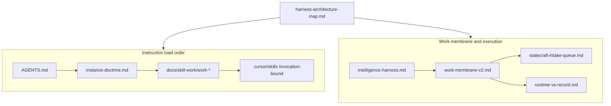
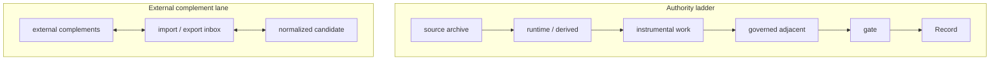

# Harness architecture map — strategy-codex

**Work only; not Record.**

**Purpose:** Single routing hub for harness topology — model vs harness, membrane, queues, channels, runtime, and meta-review. **Link SSOT below;** this page does not replace canonical doctrine.

**Bridge docs:** [intelligence-harness.md](intelligence-harness.md) (external legibility) · [product-identity.md](product-identity.md) (internal product name)

**Membrane** = an authority boundary that defines what a surface may contain, cite, mutate, promote, export, or regenerate. Full SSOT: [work-membrane-v2.md](work-membrane-v2.md). Engineering translation: [work-membrane-v2.md § Engineering translation](work-membrane-v2.md#engineering-translation).

---

## Two names, one system

| Phrase | Meaning |
|--------|---------|
| **Governed interpretive machine** | Internal / precise product identity |
| **Intelligence harness** | External bridge name for the same system |

Full argument: [from-accumulation-to-governed-interpretive-machine.md](../essays/from-accumulation-to-governed-interpretive-machine.md)

Do not rebrand to “queue-driven production harness only” — judgment objects and membrane classes are load-bearing.

---

## How to read this repo (two orthogonal models)

### Instruction layers

Skills in `.cursor/skills/` are **invocation-bound** overlays, not always-on tools. Full spec: [layer-architecture.md](layer-architecture.md). **Living files** — durable governed markdown agents and humans reuse as context; living ≠ authoritative: [living-files.md](living-files.md).

### Membrane classes

One-line reading rules — full table: [work-membrane-v2.md](work-membrane-v2.md). Live examples: [work-membrane-live-examples.md](work-membrane-live-examples.md).

| Class | Public gloss | Question it answers |
|-------|--------------|---------------------|
| `Record` | Canonical truth | What is canonically true? (gated only) |
| `governed adjacent` | Durable non-canonical doctrine | What durable non-Record object should exist? |
| `instrumental work` | Active workspace | What are we actively doing? |
| `runtime / derived` | Generated helper artifacts | What can be regenerated to help? |
| `external complements` | Boundary-crossing interop artifacts | What may cross the repo boundary without collapsing authority? |

### Model / harness / operator / transaction

See [intelligence-harness.md — Model / harness / operator / transaction](intelligence-harness.md#model--harness--operator--transaction). **Model** is replaceable; **harness** (context, authority, routing, review) is durable.

---

## Queue vs loop

**Promotion is governed, not ambient.** No artifact becomes more authoritative merely because it was summarized, reused, exported, or generated.

**Promotion is a queue problem, not a summarization problem.** Intake sidecars classify and route before daily synthesis — [statecraft-intake-queue.md](statecraft-intake-queue.md).

**Bounded cycles** (intentional, not unbounded recursion): conductor improvement loop ([CONDUCTOR-IMPROVEMENT-LOOP.md](../codex/CONDUCTOR-IMPROVEMENT-LOOP.md)), `dream` compression, workflow-depth halting ([runtime/workflow-depth.md](runtime/workflow-depth.md)).

---

## Two channels

| Channel | Harness function | Entry |
|---------|------------------|-------|
| **Statecraft** | Bounded analytical judgment from source streams | Promotion ladder in [intelligence-harness.md — Default operator loop](intelligence-harness.md#default-operator-loop); [statecraft/README.md](../statecraft/README.md) |
| **Singularity** | Bounded architectural doctrine from AI-system observations | [operator-two-channel-architecture.md](operator-two-channel-architecture.md); [singularity/workshop/README.md](../singularity/workshop/README.md); example: [work-membrane-live-examples.md](work-membrane-live-examples.md) |

Routing law: *what system is emerging* (singularity) vs *what object must be judged* (statecraft).

---

## Runtime floor and AFK

**Authority vs weather:** [runtime-vs-record.md](runtime-vs-record.md) — Record is gated; runtime is derived or disposable.

**Runtime surfaces:** [docs/runtime/](runtime/) (worker, observations, tacit, complements, chunks, context budgeting). **Root layout:** [root-directory-map.md](root-directory-map.md).

**AFK vs operator:** [runtime/afk-operator-boundary.md](runtime/afk-operator-boundary.md) — scoped automation produces artifacts; operator owns promotion, ship, and merge.

---

## Crossing boundaries

**Portability:** PRP export, runtime bundles, emulation-ready packages — [portable-working-identity.md](portable-working-identity.md). Exports grant **no** merge authority.

**External runtimes:** import/export/inbox only via [runtime/runtime-complements.md](runtime/runtime-complements.md) — not by walking Record trees.

### Membrane crossing

Full SSOT: [work-membrane-v2.md § What can cross](work-membrane-v2.md#what-can-cross).

---

## Legacy overlays

**Strategy-notebook / work-strategy** remain **compatibility** namespaces — not the primary public strategy surface. Architecture: [STRATEGY-NOTEBOOK-ARCHITECTURE.md](../codex/STRATEGY-NOTEBOOK-ARCHITECTURE.md). Active routing: [DEFAULT-PATH.md](skill-work/work-strategy/DEFAULT-PATH.md).

---

## Record frozen (default)

Growing the Grace-Mar interpretive machine is **not** a system objective. Embedded Record under `archive/grace-mar-instance/` is archaeology; gate promotion applies only on explicit **`fork revive`**. [docs/archive/grace-mar.md](archive/grace-mar.md) · [grace-mar-instance-boundary.md](grace-mar-instance-boundary.md)

---

## Meta-review

Review **outputs** and **the system that produced them**. Surfaces: [orchestration/review-orchestrator.md](orchestration/review-orchestrator.md), [CONDUCTOR-IMPROVEMENT-LOOP.md](../codex/CONDUCTOR-IMPROVEMENT-LOOP.md) (protocol repair receipts), [CONDUCTOR-CLOSE-TEMPLATE.md](../codex/CONDUCTOR-CLOSE-TEMPLATE.md).

---

## Do not duplicate

- No parallel `constitution.md` or top-level `intelligence/` tree
- No generic “agent-ops” vocabulary replacing membrane classes
- [`docs/governance/`](governance/README.md) = **fork gate / comprehension envelope** notes — **not** harness topology (this map)
- Do not copy tables from intelligence-harness or layer-architecture into new docs — **link SSOT**

---

## Future work (deferred)

- `harness_warmup.py --receipt` one-liner pointing here
- Prose-only unified task vocabulary across intake sidecars and execution receipts
- LangGraph / Agents SDK mapping as external complement runbooks

---

## Operator habit (routing falsifier)

For **structural architecture** questions (harness vs model, membrane, queue, AFK, channels), read **this map first**, then one SSOT deep dive — not six parallel doctrine greps.

---

## Return path

- [root-directory-map.md](root-directory-map.md)
- [intelligence-harness.md](intelligence-harness.md)
- [start-here.md](start-here.md)
- [LLM-ROUTING.md](../LLM-ROUTING.md)
- [layer-architecture.md](layer-architecture.md)
- [work-membrane-v2.md](work-membrane-v2.md)
