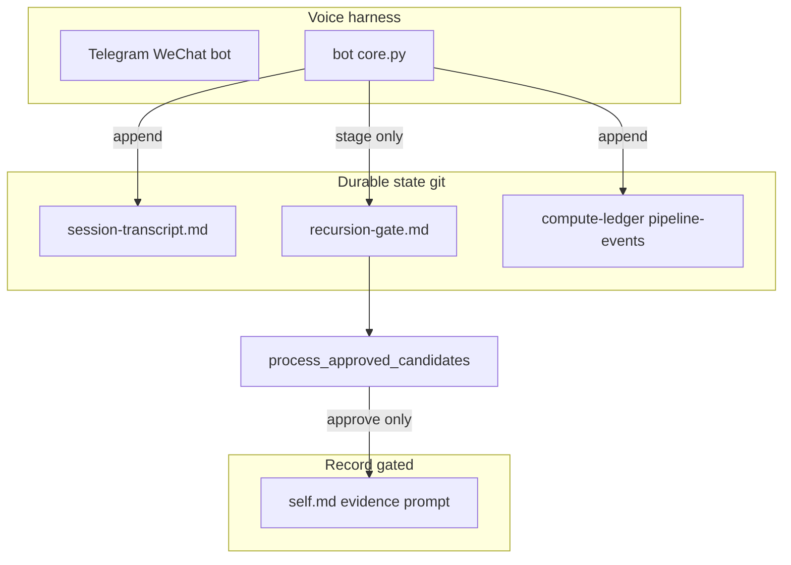

# Harness inventory (Grace-Mar fork — legacy)

**Default strategy-codex operators:** product harness orientation lives in [intelligence-harness.md](intelligence-harness.md) and [start-here.md](start-here.md). This file is the **Grace-Mar fork** component inventory (gate-centric); use on explicit **`fork revive`** only.

Single place for **what each component owns**, **where state lives**, and **what may write** — aligned with industry "harness > model" practice (orchestration, verification, minimal tool surface). See [architecture § System boundaries](architecture.md#system-boundaries-and-harness), [harness-handoff](harness-handoff.md).

---

## Two doors, one book

**Book** = canonical files in git: `recursion-gate.md` (queue), then after merge `self.md`, **`self-archive.md`** (EVIDENCE), `bot/prompt.py`, PRP. Chat threads are **not** the ledger — they are a **keyhole**. Anything that matters must land in a file the companion approves.

| Door | Who | How |
|------|-----|-----|
| **Agent door** | Voice, Cursor, OpenClaw | Read book; **stage** to the gate (or suggest). No silent merge into SELF. |
| **Human door** | Companion + operator | Edit gate (approve/reject), run merge, diff git. Optional **visual scan**: [pending dashboard](#pending-candidates-dashboard-human-door) |

Same rows, same truth: the gate markdown is the single source for “what’s waiting.” No sync layer between chat and queue — if it isn’t in `recursion-gate.md`, it isn’t staged.

### Exportable lanes

Grace-Mar now names four portable harness lanes:

| Lane | Role | Canonical status | Primary surfaces |
|------|------|------------------|------------------|
| **record** | Companion-owned truth | Canonical | `self.md` (identity + SELF-KNOWLEDGE), `self-skills.md`, **`self-archive.md`** (EVIDENCE body), optional `self-evidence.md` pointer, `self-library.md` (SELF-LIBRARY; CIV-MEM subdomain), PRP — see [boundary-self-knowledge-self-library.md](boundary-self-knowledge-self-library.md); library domains indexed in [self-library-domains.md](self-library-domains.md) |
| **runtime** | Live-session continuity | Non-canonical | `self-memory.md`, `session-transcript.md`, warmup output, session-log tail |
| **audit** | Replay, integrity, provenance | Append-only operational history | `pipeline-events.jsonl`, `merge-receipts.jsonl`, `compute-ledger.jsonl`, `harness-events.jsonl`, `fork-manifest.json` |
| **policy** | Intent and constitutional constraints | Canonical policy, not identity | `intent.md`, `intent_snapshot.json`, manifest-declared rules |

This naming matters for portability: a runtime can carry `runtime` and `audit` lanes with it, but only the `record` lane defines identity.

### Status microcopy and harness lanes

Status/process language should follow the same lane distinctions rather than hiding them behind generic "thinking" copy.

| UI/process lane | Best matching harness lane | What the wording should imply |
|------|------|------|
| **Record check / grounded answer** | `record` | Read-only use of documented truth; not a merge or new memory |
| **Lookup / outside search** | `runtime` or external retrieval path | Temporary retrieval; not Record truth by itself |
| **Gate / review / approval** | `record` + `audit` | Explicit staged vs approved vs applied state |
| **Work drafting / synthesis** | adjacent WORK execution | Instrumental output; not canonical identity truth |
| **Warmup / maintenance / closeout** | `runtime` + `audit` | Continuity or validation help; not identity rewrite |
| **Policy / constraints check** | `policy` | Constitutional or intent boundary, not personality |

The practical rule is simple: status language should make lane and authority visible. `Checking the Record`, `Looking it up`, `Staging for review`, and `Checking integrity` are stronger than one undifferentiated `Thinking...`.

---

## Pending candidates dashboard (human door)

Read-only HTML generated from `recursion-gate.md` so you can **scan** pending IDs, work-politics vs companion, age, and channel — without scrolling infinite chat.

```bash
python scripts/generate_gate_dashboard.py -u grace-mar
open gate-dashboard.html   # or double-click in Finder
```

Regenerate after any gate change. Does not write the gate; does not merge. Safe to host statically (no secrets in file — only gate excerpts you already have locally).

**Interactive gate review (`apps/gate-review-app.py`):** A Flask app under `apps/` that serves a live list of pending candidates with Approve/Reject buttons. Actions update `recursion-gate.md` and, for low-risk approvals, run quick-merge via `process_approved_candidates`. Protect with `OPERATOR_SECRET` (or `OPERATOR_FETCH_SECRET`). Run from repo root: `python apps/gate-review-app.py` (port 5001). Can be deployed alongside `apps/miniapp_server.py` on Render. See [approval-inbox-spec.md](approval-inbox-spec.md).

---

## Diagram



---

## Component table

| Component | Trust boundary | Primary state (paths) | Allowed writes | Must NOT write |
|-----------|----------------|------------------------|----------------|----------------|
| **Telegram / WeChat bot** (`bot/core.py`) | Network + OpenAI API | Per-channel chat RAM | See **bot write audit** below | SELF, EVIDENCE, prompt.py |
| **Analyst (async)** | OpenAI | — | RECURSION-GATE (insert before `## Processed`) | Approved blocks without human |
| **Operator Cursor / agents** | Operator machine | Working tree | Any file per git | Should not bypass gate for Record |
| **process_approved_candidates** | CLI + receipt | — | SELF, EVIDENCE, prompt, gate Processed, SELF-ARCHIVE, PRP, merge-receipts | Only after receipt / quick |
| **OpenClaw export** | Local / hook | USER.md copy | External dir only | Not SELF directly |
| **OpenClaw stage** | HTTP to bot | — | RECURSION-GATE (append) | Merge |
| **Runtime memory plugin** | Local runtime memory store | Runtime lane only | Runtime continuity state, runtime-memory audit | SELF, EVIDENCE, prompt.py, gate approvals |
| **governance_checker / validate-integrity** | CI local | — | None (read-only) | — |
| **counterfactual harness** | CI local | — | None | — |

---

## bot/core.py write audit (Voice harness)

| Path | Operation | Purpose |
|------|-----------|---------|
| `compute-ledger.jsonl` | append | Token usage |
| `pipeline-events.jsonl` | append | staged, rejected, applied, etc. |
| `session-transcript.md` | create + append | Raw chat log (not Record) |
| `recursion-gate.md` | read + replace | Stage candidates; debate packets; approve/reject status |
| `homework-ledger.jsonl` | append | Homework probe ledger |
| Temp file | write + delete | Whisper transcription only |

**Read-only from bot for Record context:** `self.md`, **`self-archive.md`** (EVIDENCE; optional `self-evidence.md` pointer), `self-library.md`, `self-memory.md` (lookup / library / conflict checks). **No direct write** to SELF, EVIDENCE, or `bot/prompt.py` from core.py.

---

## Scripts that write Record (whitelist mindset)

| Script | Writes |
|--------|--------|
| `process_approved_candidates.py` | SELF, EVIDENCE (incl. § VIII gated log), prompt, recursion-gate, PRP, merge-receipts |
| `export_prp.py` | PRP file |
| Operator scripts staging | RECURSION-GATE only (parse_we_did, calibrate_from_miss) |

Anything else writing SELF/EVIDENCE/prompt should be treated as **policy violation** unless explicitly added to AGENTS.

---

## Harness events (audit stream)

Optional append-only **`harness-events.jsonl`**: merge applied, OpenClaw export, etc. — Cursor-style replay without chat. See `scripts/harness_events.py`; emitted by merge hook and OpenClaw hook when configured.

**Correlate audit + gate for a candidate:** [harness-replay.md](harness-replay.md) — `python scripts/replay_harness_event.py -u grace-mar --candidate CANDIDATE-nnnn` pulls `pipeline-events.jsonl`, `harness-events.jsonl`, `merge-receipts.jsonl`, and the matching YAML block from `recursion-gate.md` (pending or **Processed**). Does not reconstruct full LLM prompts unless logged elsewhere. **Vision** (answer / proposal / merge replay, event envelope): [harness-replay-spec.md](harness-replay-spec.md).

Recommended generic action vocabulary:
- `runtime_bundle_export`
- `runtime_compat_export`
- `runtime_handback_stage`
- `runtime_memory_retain`
- `runtime_memory_recall`
- `merge_applied`
- `validation_failed`
- `review_feedback`

### Runtime memory placement

If Grace-Mar adopts a Hindsight-style memory engine in a downstream harness, that engine belongs to the `runtime` lane only:

- it may improve continuity
- it may be audited
- it may not become identity truth

Any Record-relevant lesson still has to be staged through RECURSION-GATE. See [hindsight-adoption.md](hindsight-adoption.md).

### Repo hygiene for generated runtime state

To keep the working tree readable, treat the following as **local operational artifacts**, not routine committed surfaces:

- `harness-events.jsonl`
- `runtime-bundle/runtime/*`
- `runtime-bundle/audit/*.jsonl`
- `openclaw-user.md` when generated as the OpenClaw identity export (grace-mar: `openclaw-user.md`)

Canonical truth still lives in the source files those artifacts come from. Commit these generated runtime files only when you intentionally want to refresh an example or compatibility snapshot.

---

## Handoff + fresh judge

- **Cross-harness:** [harness-handoff.md](harness-handoff.md) + `harness_warmup.py`
- **Clean context:** `harness_warmup.py --fresh-judge` — tells the new thread canonical state is on disk, not prior chat

---

## References

- [design-notes §11.11](design-notes.md#1111-harness-convergence--decompose-parallelize-verify-iterate) — decompose / verify / iterate
- [implementable-insights §11](implementable-insights.md#11-harness-lock-in-and-compound-workflows)
- [AutoHarness](https://arxiv.org/abs/2603.03329) — synthesized guards around agents (analogy: governance + gate)
- [Cursor scaling agents](https://cursor.com/blog/scaling-agents) — planner / worker / judge

