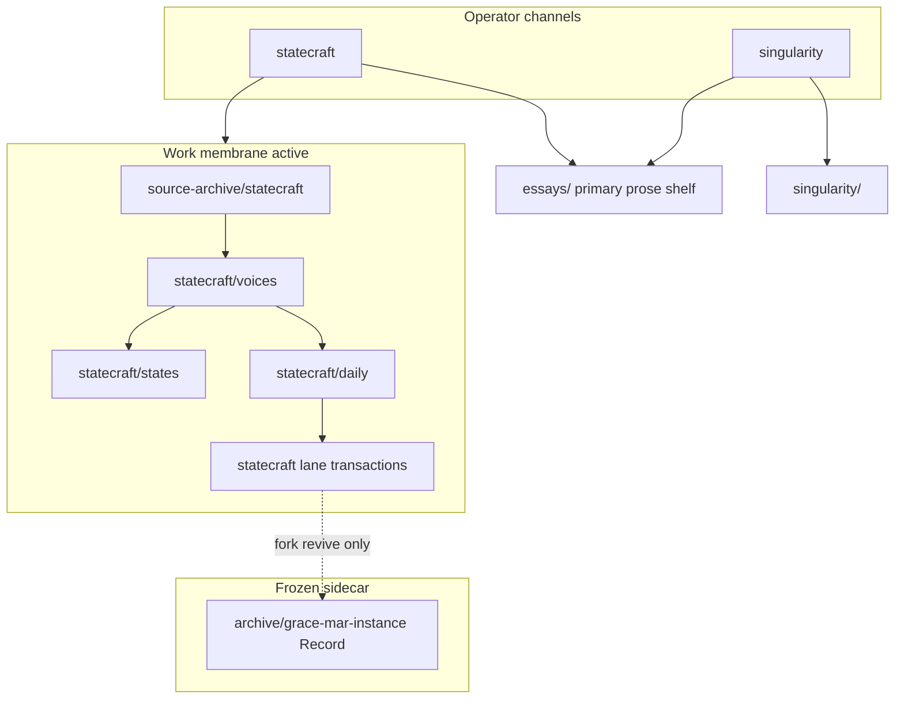

# Product identity — strategy-codex

**Work only; not Record.**

## What this repo is

**strategy-codex** is a **governed interpretive machine**: sources land verbatim in archive; bounded synthesis and transaction objects carry judgment; operator work routes through **statecraft** and **singularity**.

**External name:** an **intelligence harness** for the same system — [intelligence-harness.md](intelligence-harness.md).

It is **not** primarily a system for growing a personal cognitive fork. The embedded Grace-Mar Record is a **frozen legacy sidecar**. See [`docs/archive/grace-mar.md`](archive/grace-mar.md) · [`grace-mar-instance-boundary.md`](grace-mar-instance-boundary.md).

## System map

Cross-channel theses at [`essays/README.md`](../essays/README.md); bounded notes stay in channel `notes/` only ([`prose-index.md`](prose-index.md)). Full operator map: [`start-here.md — System map`](start-here.md#system-map).

## Canonical essay

Full argument and success metrics: [`essays/from-accumulation-to-governed-interpretive-machine.md`](../essays/from-accumulation-to-governed-interpretive-machine.md)

**Essay shelf (primary):** [`essays/README.md`](../essays/README.md) — cross-channel stand-alone theses. Channel `notes/` remain scoped to statecraft or singularity only.

## Operator entry

**Curious visitor (path E):** [harness-architecture-map.md](harness-architecture-map.md) · [intelligence-harness.md](intelligence-harness.md) · this page · [from-accumulation essay](../essays/from-accumulation-to-governed-interpretive-machine.md) — full path table in [start-here.md](start-here.md#choose-your-path).

- [`harness-architecture-map.md`](harness-architecture-map.md) — topology routing hub (membrane, queue, AFK, channels)
- [`start-here.md`](start-here.md)
- [`essays/README.md`](../essays/README.md) — primary essay shelf (cross-channel theses)
- [`operator-two-channel-architecture.md`](operator-two-channel-architecture.md)
- [`AGENTS.md`](../AGENTS.md)
