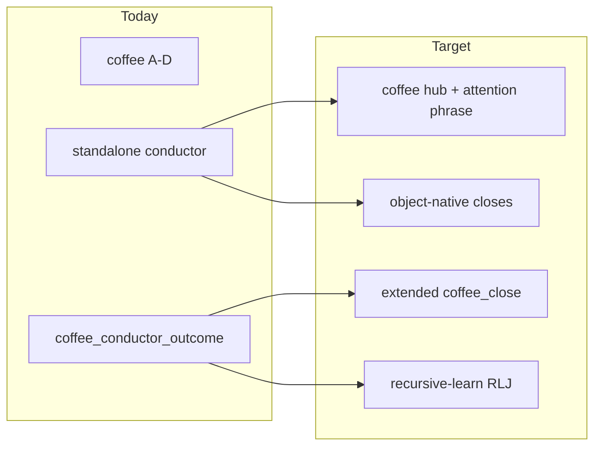

# Conductor compression spec

**Status:** WORK / operator doctrine — **not** Record, **not** gate.

**Successor path:** Compress standalone conductor ritual into **coffee hub + attention phrases + extended `coffee_close` + object-native rituals + RLJ**. Do not delete conductor history; redirect operator entry after Phase 2.

**SSOT links:** [CONDUCTOR-LAYER-MAP.md](CONDUCTOR-LAYER-MAP.md) · [CONDUCTOR-IMPROVEMENT-LOOP.md](../../../codex/CONDUCTOR-IMPROVEMENT-LOOP.md) · [recursive-learn SKILL](../../../skills/recursive-learn/SKILL.md) · [coffee SKILL](../../../.cursor/skills/coffee/SKILL.md)

**Evidence base (strategy-codex, Jun 5–19 2026):** 15 conductor picks, 30 outcomes, 0 open arcs; Kleiber outcome inflation (13 outcomes / 4 picks) = main ceremony drag. Positive but uneven ROI (~B+): keep falsifier discipline; compress menus.

---

## Operator summary (~1 page)

**What stops being invoked (Phase 2+):** Standalone `conductor <slug>`, Conductor Action Menu (Allegro/Andante/Scherzo/Finale), five-master tours, required `coffee_conductor_outcome` closes.

**What replaces falsifier closes:** Extended **`coffee_close`** with `object_ref`, `falsify`, optional `verdict` and `attention`; **recursive-learn RLJ** for stopping rules and `verdict=promote|shaped`; object rituals (§5) instead of four-movement scaffold.

**Attention model:** Default-from-hub (§4) — no extra “which attention?” step. Override with plain phrase in same message (`C stakes pass`, `D long arc pass`).

**Phase that fixes broken close script:** **Phase 1** (shipped in this repo) — `log_coffee_close.py` + `operator_handoff_check.py` bugfixes + extended kv fields.

**Compression falsifiers (§9):** Hub-only weeks match closure rate without attention overhead; style-overlay regressions within 7 days of Phase 2 → rollback; dream/bootstrap loses object continuity → Phase 1b/3 incomplete; `promote|shaped` without RLJ within 7 days → discipline leak.

---

## 1. Header and status fence

See top of this file. **Redirects** from standalone conductor after Phase 2; does not supersede cadence history.

---

## 2. Problem statement (why compress)

- **Duplicate menu axis:** Coffee sorts by learning action (Confirm / Test / Deepen / Reframe); conductor adds a second A–D attention layer → collision and tours.
- **Ceremony > concept:** Five-master tours and Kleiber micro-outcome sprawl — precision without efficiency.
- **Ship decoupling:** `coffee_close` ship_ready receipts outpace conductor-linked commits — conductor structures; Confirm ships.

---

## 3. Design principle: compress, not delete

**Invariant to preserve:** Every substantive pass ends with **object ref + falsifier** (same minimum as [CONDUCTOR-IMPROVEMENT-LOOP.md](../../../codex/CONDUCTOR-IMPROVEMENT-LOOP.md) §2).



---

## 4. Attention model — default-from-hub (primary)

Replace five master slugs with **plain phrases** (legacy mapping in §10):

| Phrase | Legacy slug | Use when |
|--------|-------------|----------|
| `precision pass` | Toscanini | seams, tiers, wire-verify |
| `hold tension` | Furtwängler | conflicting pulls; no forced verdict |
| `stakes pass` | Bernstein | live daily / public heat |
| `long arc pass` | Karajan | weekly/monthly stack, shelf |
| `one object only` | Kleiber | depth budget, anti-sprawl |

### Default-from-hub matrix

| Hub pick | Default attention | Rationale |
|----------|-------------------|-----------|
| **A Confirm** | *(none)* | Ship/boundary; falsifier optional when push blocked |
| **B Test** | `precision pass` | Validators, wire receipts |
| **C Deepen** | `hold tension` | Clarify without verdict; override → `stakes pass` on live daily |
| **D Reframe** | `one object only` | Narrow scope; override → `long arc pass` on stack/shelf |

**Assistant behavior:**

1. Apply default silently unless operator named a phrase.
2. Step 2 may echo default on recommended line (Phase 2: `assess_session_load.py` suffix).
3. Log `attention=` on `coffee_pick` only on override; extended `coffee_close` may infer at close time.
4. **Deprecated after Phase 2:** bare `karajan`, `conductor kleiber`, Conductor Action Menu, prompts for attention choice.

---

## 5. Migration table and object rituals

| Retiring affordance | New home | Notes |
|---------------------|----------|-------|
| Falsifier + notebook anchor | Extended `coffee_close` | `--object-ref`, `--falsify`, `--verdict` |
| Machine law from arc | **recursive-learn** | RLJ trigger #3; primary post-close for stopping rules |
| Kleiber benchmark | [kleiber-composition-benchmark.md](../work-dev/kleiber-composition-benchmark.md) | Via `one object only` + work-dev |
| Long arc finish | **C** + `long arc pass`; [**periodic-statecraft-review** runbook](../../../skills/runbooks/periodic-statecraft-review.runbook.md) (`monthly-deepening` deprecated) | Without persona |
| Coding-agent posture | [conductor-proposal-lenses.md](../work-dev/conductor-proposal-lenses.md) | Keep; not conductor ritual |
| Notebook paste close | [CONDUCTOR-CLOSE-TEMPLATE.md](../../../codex/CONDUCTOR-CLOSE-TEMPLATE.md) → Work close template | Attention phrase field |
| Dream handoff | `dream_coffee_rollup.py` | Phase 3: object closes; Phase 1b: warmup echo |

### 5.1 Reference — statecraft intake closeout

| Step | Action | Hub / attention |
|------|--------|-----------------|
| 1 | Refresh day index (if batch land) | — |
| 2 | `check_statecraft_intake_daily_sync.py --day YYYY-MM-DD` | **B** / `precision pass` |
| 3 | `statecraft_intake_queue.py --day YYYY-MM-DD` | **C** / `hold tension` |
| 4 | Promote / digest one target | **D** / `one object only` |
| 5 | Commit + ship receipt | **A Confirm** |
| Close | `coffee_close` + `object_ref` + sync falsifier | — |

See [menu-reference — intake closeout](menu-reference.md#statecraft-intake-closeout). **No conductor wrapper.**

### 5.2 Ritual catalog

| Object ritual | SSOT | Typical hub | Default attention | Close shape |
|---------------|------|-------------|-------------------|-------------|
| **Intake closeout** *(reference)* | menu-reference intake closeout | B→C→D→A | precision → hold → one object | `object_ref` + sync falsifier |
| **Daily compose / 72h watch** | `statecraft/synthesis/day/*`, `*-72h-watch-run.md` | **C** (+ `stakes pass`) | hold / stakes | `verdict=shaped\|promote`; RLJ if stopping rules |
| **Daily synthesis validate** | `validate_statecraft_daily_synthesis.py` | **B Test** | precision pass | falsifier = validator slug |
| **Composition benchmark** | kleiber-composition-benchmark.md | **D** | one object only | benchmark closeout artifact |
| **Confirm / ship slice** | [start-here ship loop](../../../docs/start-here.md#operator-ship-loop) | **A** | *(none)* | optional `falsify` if push blocked |
| **Work close paste** | CONDUCTOR-CLOSE-TEMPLATE | any substantive | from §4 | notebook + matching `coffee_close` |
| **Compact / tension** | `statecraft/compact/` | **C** | hold tension | compact note path |
| **Long arc / shelf** | essay shelf, **`periodic-statecraft-review`** runbook | **C** + `long arc pass` | long arc override | `verdict=shaped` + RLJ |

### 5.3 Ritual selection (assistant rules)

1. Operator names object → run matching ritual; no conductor or four-movement menu.
2. Hub only → §4 default + infer ritual from Step 1 context.
3. Stopping-rule bursts → **one** extended `coffee_close` + **one RLJ entry** (not N cadence lines).
4. Multi-hub rituals (e.g. intake B→C→D→A) = **one ritual**, not a slug tour.
5. **`verdict=promote` or `verdict=shaped`:** append **one RLJ entry** before arc closed — mandatory.

### 5.4 `bravo` / `weak` on object rituals

| Token | Behavior |
|-------|----------|
| `bravo` | Ritual complete → `coffee_close outcome=done`; do not reopen |
| `weak` | Ack failed step; optional RLJ friction; re-offer hub |

---

## 6. What dies (deprecation)

**Phase 2 — operator-facing:** standalone conductor SKILL entry; Conductor Action MCQ; required `coffee_conductor_outcome`; master slugs in AGENTS.md coffee paragraph.

**Phase 3 — archive:** COFFEE-CADENCE-CONDUCTOR-PROTOCOL stub; CONDUCTOR-PASS stub; dream rollup on conductor only.

**Keep:** CONDUCTOR-LAYER-MAP (update to phrases); conductor-proposal-lenses; cadence history (immutable).

---

## 7. Replacement close contract (extended `coffee_close`)

**Substantive** B/C/D (and A when push blocked) should log:

```bash
python scripts/log_coffee_close.py -u strategy-codex \
  --picked D --outcome partial --readiness execution_ready \
  --object-ref statecraft/synthesis/day/2026-06-17.md \
  --falsify "Geneva-19-Jun-pseudo-gate-J16-K1-vs-J16-ME1" \
  --verdict shaped
# --attention only when overriding hub default (e.g. C + stakes pass)
```

| Field | CLI | When |
|-------|-----|------|
| `object_ref` | `--object-ref` | Substantive B/C/D; optional A if push blocked |
| `falsify` | `--falsify` | Same |
| `verdict` | `--verdict` | `held` \| `shaped` \| `promote` \| `watch` \| `shelf` \| `no_action` |
| `attention` | `--attention` | Override only |

**Phase 1 prerequisites (fixed):**

- `log_coffee_close.py`: `args.artifacts` undefined; corrupted `args.runtime/artifacts` token — use `dest=runtime_artifacts`.
- `operator_handoff_check.py` line 488: `_last_activity_oneliner(archive/placeholders/evidence)` → `_last_activity_oneliner(evidence)`.

Confirm-first path: extended close optional on **A** when push blocked; `--fast` handoff must work without NameError.

---

## 8. Phased rollout

| Phase | Scope | Ship gate |
|-------|-------|-----------|
| **0** | This spec + README pointer | Operator approval |
| **1** | Tooling bundle (§7 bugs + extended kv + tests) | pytest green; CLI + full handoff |
| **1b** | `rollup_object_closes_24h` + bootstrap echo | Bootstrap shows last `object_ref` + `falsify` |
| **2** | Conductor redirect; coffee default-from-hub; AGENTS.md; dual-write; open-loop surfacing | **Shipped 2026-06-19** |
| **3** | Dream rollup migration; end dual-write; archive protocol docs | **Shipped 2026-06-19** — `work_pass_rollup_24h` primary |

### Phase 2 — dual-write window

Log extended `coffee_close` (required). **Phase 3 (shipped):** dual-write ended; do not append new `coffee_conductor_outcome` for strategy-codex; dream reads `work_pass_rollup_24h`.

### Phase 2 — open-loop surfacing

Replace `build_conductor_revisit_block` with: Recent rhythm prose; 72h watch when live; optional bootstrap **Open loops** from `coffee_close loops=` — not a second menu.

### Phase 2 — portable skills

After conductor redirect: run [portable-skills-sync](../../../skills/portable-skills-sync/SKILL.md) for `~/.codex/skills/conductor`.

**Kleiber cap:** one outcome line per arc — batch stopping rules into single close + one RLJ entry.

---

## 9. Compression falsifiers and rollback

**Falsifiers:**

- Hub-only weeks match conductor closure without attention inference → default-from-hub was overhead
- Style-overlay regressions within 7 days of Phase 2 → rollback
- Dream/bootstrap loses actionable continuity → object-close rollup incomplete
- `verdict=promote|shaped` without RLJ within 7 days → track in work-pass journal (§11)

**Rollback (Phase 2 falsifier fires):**

1. Restore conductor SKILL standalone entry.
2. Re-enable master slug triggers in AGENTS.md + coffee SKILL until operator confirms.
3. Keep dual-write `coffee_close` rows valid; read legacy outcomes for continuity.
4. Mark this spec **paused** at top with date + reason — do not delete.
5. One dogfood session on old path; re-run falsifiers before retry.

---

## 10. Operator cheat sheet

### 10.1 Master slug → coffee hub + attention

| Instead of (deprecated) | Say / pick | Default attention | Typical object |
|-------------------------|------------|-------------------|----------------|
| `toscanini` / `conductor toscanini` | **coffee → B Test** | `precision pass` | wire-verify, validator |
| `furtwangler` | **coffee → C Deepen** | `hold tension` | tensions, compact |
| `bernstein` | **coffee → C** + **`stakes pass`** | override on C | live daily |
| `karajan` | **coffee → C** + **`long arc pass`** | override on C | weekly stack, shelf |
| `kleiber` | **coffee → D Reframe** | `one object only` | ship slice, benchmark |
| bare `conductor` | **coffee** only | from hub | — |
| five-master tour | one arc per session | one attention max | — |

**Anti-tour:** Multi-step object ritual (B→C→D→A) is allowed; **slug tour** is forbidden.

### 10.2 Four-movement → object ritual

| Old movement | Compressed |
|--------------|------------|
| Allegro | **B Test** or ritual step 1 |
| Andante | **C Deepen** + `hold tension` |
| Scherzo | **D Reframe** + `one object only` |
| Finale | **A Confirm** + extended `coffee_close` |

### 10.3 Behavioral tokens

| Token | After compression |
|-------|-------------------|
| **`bravo`** | `coffee_close --outcome done` + receipt |
| **`weak`** | Ack + optional RLJ; fresh hub |
| **`orientation only`** | Hub without extended close |

### 10.4 Example one-liners

```text
coffee                          # re-entry; pick hub A–D
coffee — B                      # test / falsify (precision pass implied)
coffee — C stakes pass          # deepen live daily with heat
coffee — D                      # reframe one object only
coffee — A                      # confirm / ship when slice clean
```

### 10.5 Logging cheat (Phase 1+)

See §7 example. `--attention` only on override.

---

## 11. Work-pass impact journal (pointer)

Successor to [conductor-arc-impact-journal.md](../work-strategy/conductor-arc-impact-journal.md): log **work-pass waves** (hub + attention + `object_ref`), not conductor slugs. Conductor-arc journal **archive-only** until first compressed wave entry.

---

## 12. EXECUTE appendix — files touched

**Grace-mar note:** `user_id=grace-mar` conductor rows in work-cadence-events.md are **read-only**; compression applies to **strategy-codex** operator path only.

**Platform (Phase 3):** `platform/.../conductor_metrics.py`, conductor-session-metrics schema — archive-only unless repurposed for menu heuristics.

**Phase 3 tests:** test_dream_coffee_rollup, test_build_conductor_ledger, test_conductor_docs_links, voice contracts — rewrite in Phase 3.

### Created (Phase 0)

- `docs/skill-work/work-coffee/CONDUCTOR-COMPRESSION-SPEC.md` (this file)

### Linked (Phase 0)

- [work-coffee/README.md](README.md) — Conductor Stack → Compression path
- [codex/CONDUCTOR-IMPROVEMENT-LOOP.md](../../../codex/CONDUCTOR-IMPROVEMENT-LOOP.md) — successor pointer

### Phase 1 (shipped)

- `scripts/log_coffee_close.py`, `scripts/operator_handoff_check.py`, `scripts/cadence_learning.py`
- `tests/test_log_cadence_event.py`, `tests/test_operator_handoff_check.py`, `tests/test_cadence_learning.py`

### Phase 1b (shipped)

- `scripts/dream_coffee_rollup.py` — `rollup_object_closes_24h`
- `scripts/coffee_bootstrap_brief.py` — object-close echo

### Phase 2 (shipped 2026-06-19)

- `.cursor/skills/conductor/SKILL.md` — redirect stub
- `.cursor/skills/conductor/HARD-PROTOCOL.md` — archived header + legacy body
- `.cursor/skills/coffee/SKILL.md` — default-from-hub, conductor redirect, dual-write close
- `AGENTS.md` — compression paragraph
- `scripts/assess_session_load.py` — default attention on recommended hub line
- `docs/skill-work/work-coffee/menu-reference.md` — intake closeout compression pointer
- `tests/test_conductor_docs_links.py`, `tests/test_coffee_hub_contract.py`

### Phase 3 (shipped 2026-06-19)

- `scripts/dream_coffee_rollup.py` — `rollup_work_pass_24h`; `rollup_conductor_24h` shim
- `scripts/auto_dream.py`, `scripts/operator_daily_warmup.py` — work-pass echo
- `scripts/build_conductor_ledger.py` — extended `coffee_close` closes + legacy read-only outcomes
- `scripts/log_cadence_event.py` — deprecation warning for new `coffee_conductor_outcome` (strategy-codex)
- `CONDUCTOR-PASS.md`, `COFFEE-CADENCE-CONDUCTOR-PROTOCOL.md` — archive stubs
- `tests/test_dream_coffee_rollup.py`, `tests/test_build_conductor_ledger.py`

### Phase 3+ (shipped 2026-06-19)

- `scripts/build_work_pass_ledger.py` — canonical work-pass observability
- `scripts/build_conductor_ledger.py` — deprecated import/CLI shim

### Phase 3+ (future tooling)

- `.cursor/skills/coffee/SKILL.md`, `.cursor/skills/conductor/SKILL.md`
- `scripts/log_cadence_event.py`, `scripts/build_work_pass_ledger.py`, `scripts/cadence_conductor_resolution.py`
- `AGENTS.md` conductor paragraph
- `scripts/operator_coffee.py` (if not covered by bootstrap brief)
