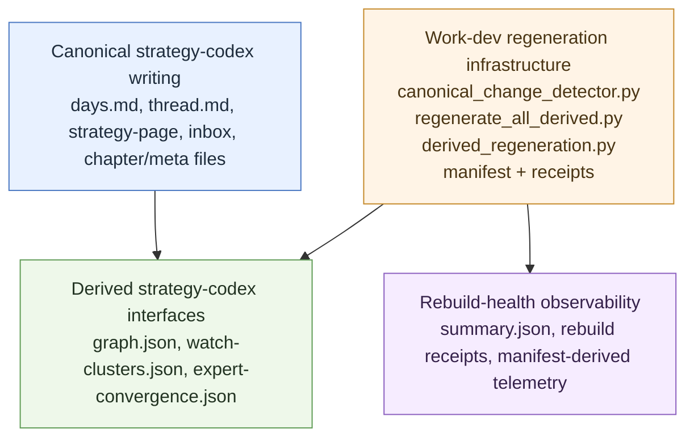
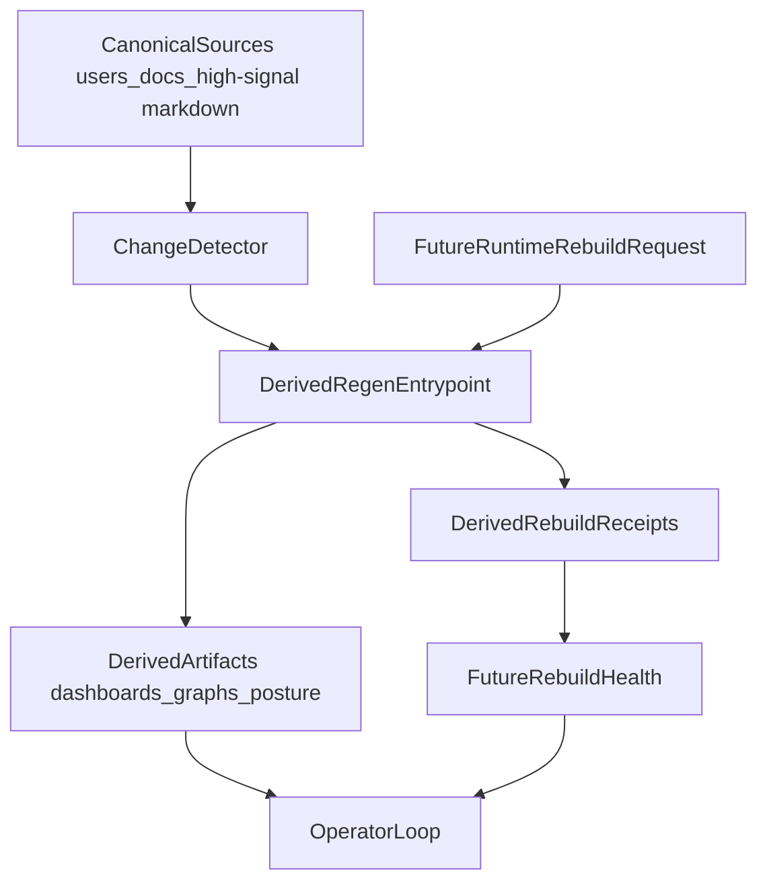

# Derived regeneration (work-dev contract)

**Status:** Phase 1 foundation plus rationale sidecars — still **bounded** and intentionally small.

This doc turns the current rebuildability line into a repo-owned `work-dev` surface:

- **repo-owned change detection**
- **repo-owned derived regeneration entrypoint**
- **derived rebuild receipts**
- **per-artifact rebuild rationale sidecars**

It does **not** change canonical Record authority. All regeneration remains on the **derived** side of the membrane in [../../runtime-vs-record.md](../../runtime-vs-record.md).

It also does **not** rename this layer. Primary repo language stays **derived / rebuildable / non-canonical**. Any `shadow layer` phrasing is optional shorthand only.

## What exists now

### Phase 1 foundation

Current scripts:

- `python3 scripts/canonical_change_detector.py`
- `python3 scripts/regenerate_all_derived.py`
- `python3 scripts/build_derived_regeneration_manifest.py`
- `python3 scripts/report_rebuild_health.py`

Current receipt home:

- `artifacts/work-dev/rebuild-receipts/`

Current manifest:

- `artifacts/work-dev/derived-regeneration-manifest.json`

Current health summary home:

- `artifacts/work-dev/rebuild-health/`

Current derived-artifact rationale schema:

- `schema-registry/derived-artifact-rationale.v1.json`

Current initial target set:

- derived-regeneration manifest
- library index
- work-lanes dashboard JSON
- lane dashboards
- review dashboard
- gate board
- governance posture
- strategy-notebook graph

First target-coverage expansion:

- work-dev compound / Autoresearch operator summaries
- rebuild-health summary from receipt history

This is a **small initial set**, not a claim that all rebuildable surfaces are already orchestrated.

## What the engine now writes

For covered targets, repo-owned regeneration writes four distinct families:

1. **The derived artifact itself** — Markdown or JSON output under `artifacts/`
2. **A sibling rationale sidecar** — `<artifact>.derived-rationale.json`
3. **A rebuild receipt** — one JSON receipt per regeneration run
4. **A target manifest / health summary** — aggregate machine-readable views of the rebuild layer

These are deliberately separate:

- portable-record `artifact-rationale.v1.json` is about **demonstrated capability**
- derived-artifact rationale sidecars are about **rebuild provenance**
- rebuild receipts are about **what happened during a run**
- the manifest is about **declared target coverage**
- the health summary is about **aggregated receipt visibility** across recent runs

## Strategy-codex boundary

The strategy-codex depends on regeneration through a strict downstream boundary:



- **Canonical strategy-codex writing** stays markdown-canonical under `docs/skill-work/work-strategy/strategy-notebook/`.
- **Derived strategy-codex interfaces** are rebuilt orientation surfaces under `artifacts/work-strategy/strategy-notebook/`.
- **Work-dev regeneration infrastructure** owns the rebuild contract and target registry.
- **Rebuild-health** stays strictly downstream of regeneration: it reports on the engine and the receipts, not on canonical notebook truth.

This boundary is the reason rebuild-health changes belong entirely in the regeneration layer. Strategy-codex benefits indirectly through fresher derived artifacts and better observability, but canonical notebook writing rules do not change.

## Canonical commands

Inspect changed paths and impacted rebuild targets:

```bash
python3 scripts/canonical_change_detector.py
```

Preview changed targets with downstream incremental ordering:

```bash
python3 scripts/canonical_change_detector.py --incremental
```

Dry-run the repo-owned regeneration path:

```bash
python3 scripts/regenerate_all_derived.py --changed --dry-run
```

Incremental ordering with downstream expansion:

```bash
python3 scripts/regenerate_all_derived.py --changed --incremental --dry-run
```

Build the current target manifest:

```bash
python3 scripts/build_derived_regeneration_manifest.py
```

Refresh rebuild-health telemetry:

```bash
python3 scripts/report_rebuild_health.py
```

Run all currently-wired targets:

```bash
python3 scripts/regenerate_all_derived.py --all
```

Run a specific target:

```bash
python3 scripts/regenerate_all_derived.py --target governance-posture
```

## Sidecar contract

Sidecars are written next to covered outputs using a literal suffix:

- `artifacts/review-dashboard.md`
- `artifacts/review-dashboard.md.derived-rationale.json`

Schema:

- `schema-registry/derived-artifact-rationale.v1.json`

Required rebuild fields:

- `producer_script`
- `policy_mode`
- `generated_at`
- `artifact_path`
- `canonical_surfaces_touched` = `false`
- `rebuild_command`
- `inputs`
- `rationale`
- `human_review_required`

Policy mode is target-scoped, not Record authority:

- `Surface` for operator-facing dashboards and one-pagers
- `Strategy` for strategy-notebook derived graph views
- `Rebuild` for machine-readable regeneration plumbing

## Ownership and cleanup

This layer does **not** do a blanket wipe of `/artifacts/`.

Rule:

- single-file outputs are rewritten by their producer
- if a target later owns a dynamic directory, cleanup must be restricted to that target's declared owned patterns only
- `.gitkeep` and unrelated artifact families must survive any cleanup pass

That keeps regeneration safe for mixed-use `artifacts/` trees where many families are intentionally outside the current target registry.

## Ranked roadmap

### 1. Rebuildability foundation

Keep this first.

Current tension: the repo still carries two real pressures that should not be flattened into fake agreement. One pressure wants a broader, better-ordered regeneration foundation so derived surfaces stop drifting for structural reasons; the other wants deeper handback-tail reliability slices so the active operator loop earns trust at the edge cases. Hold that conflict open until a concrete scenario gap or rebuild-ordering dependency proves which wedge is actually governing the next commit.

Current decision trigger: keep rebuild-foundation work first unless a payload-level or `/stage`-grade handback scenario demonstrates that `V-04_structured_conflict x manual_but_approves` still escapes the present reasoning-vs-action guardrails in a way the current manifest or incremental-ordering work would not catch.

Next wedges:

- expand target coverage only where source -> artifact mapping is clear
- deepen the generated dependency manifest
- strengthen topological incremental ordering and downstream expansion
- keep the rebuild-health summary target downstream of the manifest so it can report on actual receipt-backed runs
- **Sequence each expansion:** (1) register the new target in the generated manifest (run `build_derived_regeneration_manifest.py` so the artifact is declared); (2) confirm `canonical_change_detector.py` lists the canonical sources for that target; (3) run `regenerate_all_derived.py --changed --incremental --dry-run` and only then treat the target as live for non-dry runs.
- keep optional git hooks as wrappers later, not the primary contract

### 2. Reliability completion immediately after the foundation

Once the foundation is stable, keep the next `work-dev` reliability order explicit:

1. **BUILD-AI-GAP-005** — deeper factorial tail packs
2. **BUILD-AI-GAP-006** — staged-risk alignment and narrative/risk coherence
3. **BUILD-AI-GAP-007** — operator-facing autonomy habit friction

Why this order:

- rebuildability reduces drift in derived surfaces
- GAP-005/006/007 reduce trust debt in the active operator loop
- together they compound rather than compete

See [known-gaps.md](known-gaps.md) and [workspace.md](workspace.md).

### 3. Rebuild health after telemetry exists

Do **not** build a rebuild-health dashboard first.

Only add it after the foundation produces real telemetry:

- rebuild duration
- changed-input count
- rebuilt target count
- skips / failures
- cache hit rate if incremental rebuild lands

Current artifact home:

- `artifacts/work-dev/rebuild-health/`

### 4. Runtime rebuild requests later

Runtime-triggered rebuild requests are a **later phase**.

Rule:

- a runtime may request a **derived rebuild** only
- it must never imply a canonical edit, policy judgment, or merge path

Only add this after rebuild targets and receipts are stable enough that the runtime is calling into a clear, inspectable contract.

This is exactly where the revised shadow proposal stops for now: no runtime-triggered rebuild mechanics until the local derived-regeneration contract is mature.

### 5. Rebuild kits and environment pinning last

Fork-portable rebuild kits belong after the local stack is proven.

Do not freeze packaging too early. First prove the local abstraction, then package it.

### 6. OB1 chunking stays conditional

OB1 chunking remains a demand-triggered spike for bridge/exporter work, not the default next move for `work-dev`.

## Guardrails

- Do not let rebuildability become a second orchestration platform with implicit authority.
- Do not collapse receipt families unless their fields and authority model really align.
- Do not treat regenerated files as canonical truth because they are fresh.
- Do not repurpose portable-record `artifact-rationale.v1.json` for `/artifacts/` rebuild metadata.
- Keep `workspace.md`, `known-gaps.md`, and related status docs honest as the rebuild layer grows.

## Relationship model



## Why this exists

`work-dev` already depends on rebuildable, non-canonical outputs across dashboards, posture reports, workbench surfaces, and notebook views. The point of this doc is to make the next phase explicit:

**canonical change should deterministically regenerate the derived surfaces that depend on it, with minimal human friction and zero expansion of authority.**
