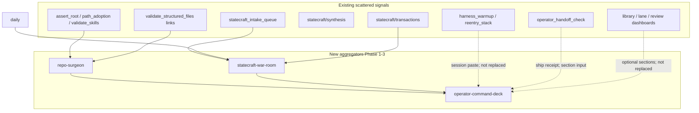

# Operator dashboard consolidation — Phase 0 alignment

**Work only; not Record.**

**Purpose:** Lock paths, anti-sprawl justification, gitignore/commit policy, and registry entries for three **derived operator aggregators** before Phase 1 implementation. This doc is governance alignment — not a new doctrine surface.

**Related:** [operator-dashboards.md](../../operator-dashboards.md) · [operator-surface-registry.md](../../operator-surface-registry.md) · [runtime/artifacts/README.md](../../../runtime/artifacts/README.md) · [runtime-vs-record.md](../../runtime-vs-record.md)

---

## 1. Executive summary

`strategy-codex` already has strong architecture (harness, membrane, intake queue, runtime boundaries, portable skills). The next improvement is **operational condensation**, not another doctrine layer.

Three thin **runtime / derived** surfaces answer:

| Question | Surface | Phase |
|----------|---------|-------|
| What is structurally broken or drifting? | **Repo Surgeon** | 1 |
| What strategic objects are live? | **Statecraft War Room** | 2 |
| What should I do next? | **Operator Command Deck** | 3 |

Optional Phase 4: **`operator_dashboard.py`** umbrella → `runtime/artifacts/operator-dashboard/latest.md`.

---

## 2. Anti-sprawl justification

These surfaces are **aggregators**, not parallel SSOTs. They consolidate scattered signals; they do **not** replace canonical doctrine or Record paths.



| Surface | Consolidates (does not replace) | Operator decision |
|---------|----------------------------------|-------------------|
| **Repo Surgeon** | `assert_root_folder_layout.py`, `check_repo_path_adoption.py`, `validate_skills.py`, `sync_portable_skills.py --verify`, scoped link logic from `validate_structured_files.py` | Structural maintenance priority |
| **Statecraft War Room** | Intake sidecars + `check_statecraft_intake_daily_sync.py` + daily + transaction router | Which statecraft objects are live |
| **Operator Command Deck** | Surgeon + War Room + optional existing dashboard builders + handoff/git summary | On-disk “what next” cockpit |

### Explicit non-replacement list

Generated reports must **link** to these SSOTs; they must **not** restate or supersede them:

- Not [`recursion-gate.md`](../../../recursion-gate.md), not SELF / EVIDENCE
- Not [`statecraft/README.md`](../../../statecraft/README.md)
- Not [`docs/harness-architecture-map.md`](../../harness-architecture-map.md)
- Not a substitute for chat paste: [`harness_warmup.py`](../../../scripts/harness_warmup.py) / [`operator_reentry_stack.py`](../../../scripts/operator_reentry_stack.py) remain the **thread-start** path

---

## 3. Locked paths

**No new top-level repo folders.**

| Artifact | Path |
|----------|------|
| Repo Surgeon MD / JSON | `runtime/artifacts/repo-surgeon/latest.md`, `latest.json` |
| War Room MD / JSON | `runtime/artifacts/statecraft-war-room/latest.md`, `latest.json` |
| Command Deck MD / JSON | `runtime/artifacts/operator-command-deck/latest.md`, `latest.json` |
| Umbrella (Phase 4) | `runtime/artifacts/operator-dashboard/latest.md` |
| Optional dated snapshots | `<bucket>/YYYY-MM-DD.md` |

Optional thin guides (`docs/operator-command-deck.md`, `statecraft/war-room.md`) are **deferred to Phase 3**. If added: run command + interpret header + SSOT links only — **no heuristics duplicated in prose**.

---

## 4. Gitignore and commit policy

Follow the **statecraft-intake-queue bucket pattern**: committed README + `.gitkeep`; generated bodies local by default.

| Path pattern | Git posture |
|--------------|-------------|
| `runtime/artifacts/<bucket>/README.md` | Commit |
| `runtime/artifacts/<bucket>/.gitkeep` | Commit |
| `runtime/artifacts/<bucket>/latest.*` | Gitignore |
| `runtime/artifacts/<bucket>/20*.md` (dated snapshots) | Gitignore |

Buckets: `repo-surgeon/`, `statecraft-war-room/`, `operator-command-deck/`, `operator-dashboard/`.

**Rationale:** Rebuildable local snapshots per [runtime/artifacts/README.md](../../../runtime/artifacts/README.md) commit-worthiness table. Promote to CI-tracked committed surface (like `library-index.md`) only if the operator explicitly wants PR diff review.

---

## 5. Authority header and advisory language

Every generated file must begin with:

```markdown
Generated: YYYY-MM-DD HH:MM UTC
Mode: runtime / derived
Authority: advisory only
Canonical source: none
```

Plus **SSOT return paths** (link-only list) — never copy doctrine body.

Recommended phrasing in report bodies:

- “Recommended next action” / “Candidate” / “Review needed” / “Potential drift” / “Operator decision required”

Prohibited implications: auto-approve, auto-merge, auto-publish, or promotion without operator action.

---

## 6. Relationship to existing operator tools

| Tool | Medium | When to use |
|------|--------|-------------|
| `harness_warmup.py` / `operator_reentry_stack.py` | Chat paste | **New thread** — minimal gate + activity + git receipt |
| `operator_handoff_check.py` | Chat paste / ship receipt | End of session — dirty paths, branch, uncommitted slices |
| **Operator Command Deck** (Phase 3) | On-disk `latest.md` | Anytime — persistent cockpit aggregating Surgeon + War Room + queues |
| Existing dashboards (`library-index`, `lane-dashboards`, `review-dashboard`) | On-disk | Lane-specific; Deck may **link** or optional-call, not replace |

---

## 7. Record-frozen default (Command Deck heuristics)

Default workspace user: **`strategy-codex`**. Record is frozen ([grace-mar-instance-boundary.md](../../grace-mar-instance-boundary.md)).

**Recommended next-action priority** (Phase 3 implementation):

1. Repo Surgeon **blocking** findings
2. Intake queued without daily link / daily stale vs latest archive day
3. Context budget stale (`runtime/prepared-context/last-budget-builds.json`)
4. Review packets without receipt
5. Skill candidates without draft movement
6. War Room scan when no urgent issues remain

Gate / review-dashboard sections: **optional** — `--include-gate` only (fork-revive / companion territory).

---

## 8. Phase boundaries

### Phase 0 (this doc)

- Alignment doc, registry rows, artifact bucket READMEs, `.gitignore`
- **No** producer scripts, **no** `derived_regeneration.py` targets, **no** stable guide docs with heuristics

### Phase 1 — Repo Surgeon

**Shipped:** `scripts/repo_surgeon.py`, `tests/test_repo_surgeon.py`, `RebuildTarget` `repo-surgeon` in `derived_regeneration.py`

**V0 scope (narrow):**

- Orchestrate: `assert_root_folder_layout.py`, `check_repo_path_adoption.py`, `validate_skills.py`, optional `sync_portable_skills.py --verify`
- Local path leak scan (`/C:/dev/`, `C:\dev\`, `file://`, etc.)
- Broken links: extend/share `validate_structured_files` link logic; default `--scope docs`; cap with `--max-link-errors`
- JSON + MD + authority header + return paths

**Defer:** full-repo SSOT keyword conflict grep, context-bloat scan, git dirty checks (optional flags later)

**Then add:** `RebuildTarget` in `derived_regeneration.py`

### Phase 2 — Statecraft War Room

**Ship:** `scripts/statecraft_war_room.py`, tests

**Status:** Phase 2 shipped — `scripts/statecraft_war_room.py` writes `runtime/artifacts/statecraft-war-room/latest.*`.

**V0:** intake sidecars + daily headings + transaction router index; explicit / inferred / weak confidence labels

**Defer:** full falsifier board, RLJ promotion, optional LLM hints

### Phase 3 — Operator Command Deck

**Ship:** `scripts/operator_command_deck.py`, tests

**Status:** Phase 3 shipped — `scripts/operator_command_deck.py` writes `runtime/artifacts/operator-command-deck/latest.*`.

Aggregates Surgeon + War Room; optional git summary; Record-frozen heuristic priority above

**Optional thin guides** only if needed (no duplicated heuristics)

### Phase 4 — Umbrella

**Ship:** `scripts/operator_dashboard.py` → runs Surgeon → War Room → Deck in-process; writes `operator-dashboard/latest.md` + `latest.json`

**Status:** Phase 4 shipped — `scripts/operator_dashboard.py` writes `runtime/artifacts/operator-dashboard/latest.*`.

---

## 9. Registry row drafts

Registered in [operator-surface-registry.md](../../operator-surface-registry.md) §5 and [runtime/artifacts/README.md](../../../runtime/artifacts/README.md).

| Surface ID | Class | Owner | Authority | Producer (planned) |
|------------|-------|-------|-----------|-------------------|
| `repo-surgeon` | report | work-dev / operator | advisory | `scripts/repo_surgeon.py` |
| `statecraft-war-room` | dashboard | statecraft | derived_non_authoritative | `scripts/statecraft_war_room.py` |
| `operator-command-deck` | dashboard | operator / multi | derived_non_authoritative | `scripts/operator_command_deck.py` |
| `operator-dashboard` | dashboard | operator / multi | derived_non_authoritative | `scripts/operator_dashboard.py` |

Rebuild commands (when scripts land):

```bash
python3 scripts/operator_dashboard.py

python3 scripts/repo_surgeon.py \
  --out runtime/artifacts/repo-surgeon/latest.md \
  --json-out runtime/artifacts/repo-surgeon/latest.json

python3 scripts/statecraft_war_room.py \
  --out runtime/artifacts/statecraft-war-room/latest.md \
  --json-out runtime/artifacts/statecraft-war-room/latest.json

python3 scripts/operator_command_deck.py \
  --out runtime/artifacts/operator-command-deck/latest.md \
  --json-out runtime/artifacts/operator-command-deck/latest.json
```

---

## 10. Phase 0 acceptance criteria

- [x] Alignment doc at this path
- [x] Three registry rows in `operator-surface-registry.md` §5
- [x] Three artifact bucket READMEs + `.gitkeep`
- [x] `.gitignore` entries for three buckets
- [x] Pointer in `operator-dashboards.md`
- [x] No producer scripts or `derived_regeneration.py` targets in Phase 0

---

## 11. Original proposal

Operator-thread technical proposal: **Operator Command Deck**, **Statecraft War Room**, **Repo Surgeon** — condensed into this alignment doc per dashboard anti-sprawl policy (§6 of [operator-surface-registry.md](../../operator-surface-registry.md)).
