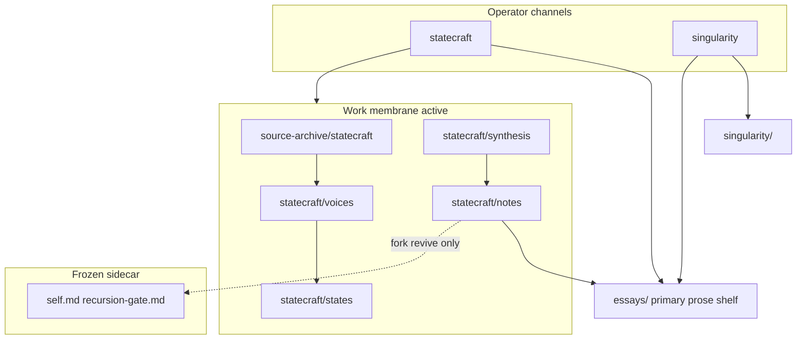

---
audience: operator
authority: doctrine
record_status: frozen
---

# START-HERE — strategy-codex

**Work only; not Record.** Governance law: [AGENTS.md](../AGENTS.md). Route discovery: [LLM-ROUTING.md](../LLM-ROUTING.md) → [statecraft/voices/voice-index.md](../statecraft/voices/voice-index.md). Grace-Mar archive doctrine: [docs/archive/grace-mar.md](archive/grace-mar.md).

---

## What this repo is

Canonical definition: [product-identity.md](product-identity.md). **Default path:** **C** (operator). Record under [`archive/grace-mar-instance/`](../archive/grace-mar-instance/) is **frozen** ([docs/archive/grace-mar.md](archive/grace-mar.md)); [museum `self-library.md`](../archive/grace-mar-instance/self-library.md) stays active for reference; [`memory.md`](../memory.md) is session continuity — not Record.

**Namespace (voices / states / hosts):** [routing-reference.md](routing-reference.md) · `statecraft/voices/` · `statecraft/states/` · `statecraft/channels/`

---

## Choose your path {#choose-your-path}

Pick **one letter**. **Default:** **C**. Seed calibration: [seed-phase-survey § Calibrate](seed-phase-survey.md#calibrate-from-your-start-here-path).

| Pick | You are… | Start here |
|------|----------|------------|
| **A** | Companion (fork revive / seed) | [grace-mar-instance-boundary.md](grace-mar-instance-boundary.md) |
| **B** | Parent or guardian | [seed-phase-survey.md](seed-phase-survey.md) |
| **C** | **Operator (default)** | Promotion ladder below · [statecraft/README.md](../statecraft/README.md) |
| **D** | Technical contributor | [skill-work/work-dev/](skill-work/work-dev/) |
| **E** | Curious visitor | [harness-architecture-map.md](harness-architecture-map.md) · [product-identity.md](product-identity.md) · [from-accumulation essay](../essays/from-accumulation-to-governed-interpretive-machine.md) |
| **F** | Journalist / blogger | [public-orientation.md](public-orientation.md) · [Door F](#door-f) |

<a id="door-f"></a>

### Door F — public-safe orientation {#door-f}

No seed intake or private operator material. **Start:** [public-orientation.md](public-orientation.md) · [harness-architecture-map.md](harness-architecture-map.md) · [intelligence-harness.md](intelligence-harness.md) · [essays/README.md](../essays/README.md) · [predictive-history](https://github.com/rbtkhn/predictive-history).

---

## System map {#system-map}



Essays: [essays/README.md](../essays/README.md) · membrane: [work-membrane-v2.md](work-membrane-v2.md) · channels: [operator-two-channel-architecture.md](operator-two-channel-architecture.md)

---

## Promotion ladder (statecraft)

```
operator source
  → source-archive/statecraft/<pub_date>/<slug>.md   [verbatim SSOT]
  → generated day/month/year/thread indices
  → statecraft/synthesis/day/<YYYY-MM-DD>.md                 [daily synthesis]
  → statecraft/notes/<object>.md                   [durable analytical note]
  → essays/<slug>.md                               [polished cross-channel argument]
```

Before promoting or searching notes, open [`statecraft/notes/INDEX.md`](../statecraft/notes/INDEX.md) and the generated registry at `runtime/artifacts/statecraft-notes-registry.md` (Tier A health, essay queue, route integrity).

Not every note becomes an essay.

**Note contract:** promoted analytical notes declare typed metadata (`note_type`, `authority_level`, `source_basis`) — see [statecraft/notes/README.md](../statecraft/notes/README.md) · validate with `python3 scripts/check_statecraft_notes.py --warn` · registry: `python3 scripts/reindex_notes.py --check`.

Fork revive only: `recursion-gate.md` → `process_approved_candidates.py --apply` · map: [strategy-codex-redesign-brief.md](strategy-codex-redesign-brief.md)

---

## Operator loop & commands

```text
intake → sync check → intake queue → synthesis → commit → ship receipt → push
```

| Step | Command / surface |
|------|-------------------|
| Land + indices | `python3 scripts/refresh_statecraft_archive_indices.py` (`--check` for CI) |
| Archive ↔ daily sync | `python3 scripts/check_statecraft_intake_daily_sync.py --day YYYY-MM-DD` or `--latest` |
| Intake queue | `python3 scripts/statecraft_intake_queue.py --day YYYY-MM-DD` — [spec](statecraft-intake-queue.md) |
| Daily synthesis | `statecraft/synthesis/day/YYYY-MM-DD.md` or `state synthesis`; validate: `validate_statecraft_daily_synthesis.py` |
| Session warmup | `python3 scripts/harness_warmup.py -u strategy-codex --compact` |
| Ship receipt / push | `operator_handoff_check.py` → commit lane slices → `git push` when clean |
| Gate review | **Fork revive only** — [archive/grace-mar.md](archive/grace-mar.md) |

Conventions: [work-menu-conventions — Ship receipt](skill-work/work-menu-conventions.md#6a-ship-receipt) · script index: [contributing.md](../contributing.md)

---

## Index surfaces

**Operator default:** [statecraft/README.md](../statecraft/README.md) · archive SSOT: [source-archive/statecraft/README.md](../source-archive/statecraft/README.md) · daily method: [statecraft/synthesis/METHOD.md](../statecraft/synthesis/METHOD.md). Full map: [LLM-ROUTING.md](../LLM-ROUTING.md) · [architecture.md](architecture.md) · [deprecated-surfaces.md](deprecated-surfaces.md)
