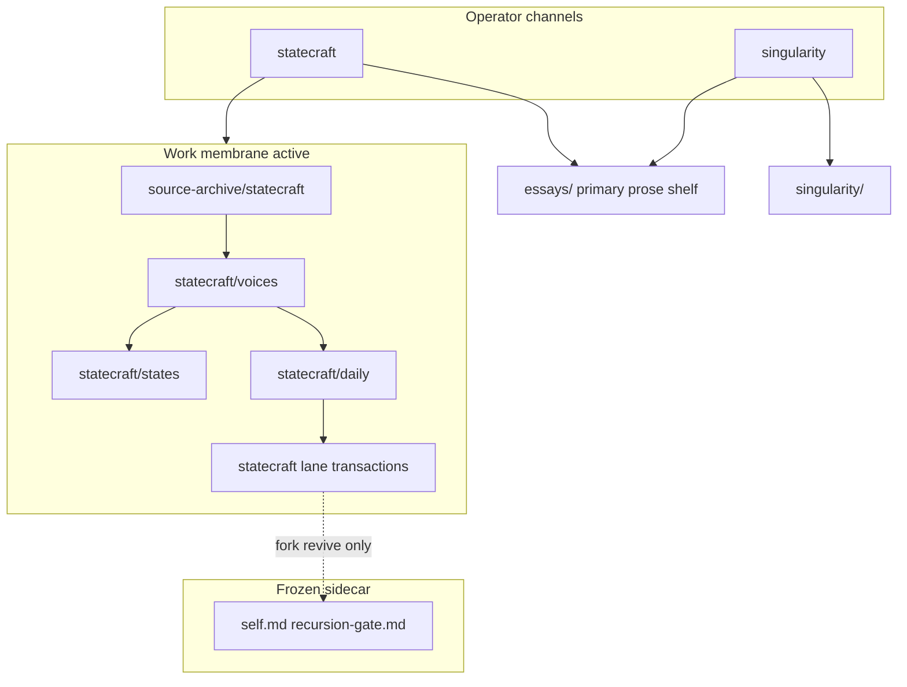

# START-HERE — strategy-codex

**Work only; not Record.** This page orients operators and assistants. Governance law remains in [AGENTS.md](../AGENTS.md).

**Finding analyst source indexes:** [LLM-ROUTING.md](../LLM-ROUTING.md) → [statecraft/voices/INDEX.md](../statecraft/voices/INDEX.md) (not SELF-LIBRARY or `artifacts/library-index.md`).

---

## What this repo is

**strategy-codex** is a **governed interpretive machine**: verbatim sources land in archive; bounded synthesis and transactions carry judgment under **statecraft** and **singularity**.

**External name:** an **intelligence harness** for the same system — [intelligence-harness.md](intelligence-harness.md).

Growing a personal cognitive fork is **not** a system objective. The Grace-Mar Record is **frozen** ([grace-mar-instance-boundary.md](grace-mar-instance-boundary.md)). Gate promotion applies only on explicit **`fork revive`**.

**SELF / library / memory:** [`self.md`](../self.md) (identity) is **frozen**; [`self-library.md`](../self-library.md) stays **active for reference** routing; [`self-memory.md`](../self-memory.md) is **session continuity** — not SELF, not Record. Split: [boundary-self-knowledge-self-library.md](boundary-self-knowledge-self-library.md).

## Namespace map (statecraft paths)

| Term | Path | Notes |
|---|---|---|
| voices | `statecraft/voices/` | Analyst registers (interview + written); was `civ-lens` |
| states | `statecraft/states/` | CIV-STATE pattern memory; volumes still `civ-state-*` |
| hosts | `statecraft/hosts/` | Guest-on-host continuity; not in `voices/` |

---

## Choose your path {#choose-your-path}

Pick **one letter** (same A–F as [README § Choose your path](../README.md#choose-your-path)). **Default:** **C** (operator). Seed-phase calibration: [seed-phase-survey § Calibrate](seed-phase-survey.md#calibrate-from-your-start-here-path).

| Pick | You are… | Start here |
|------|----------|------------|
| **A** | Companion (fork revive / seed) | [grace-mar-instance-boundary.md](grace-mar-instance-boundary.md) |
| **B** | Parent or guardian | [seed-phase-survey.md](seed-phase-survey.md) |
| **C** | **Operator (default)** | Promotion ladder below · [statecraft/README.md](../statecraft/README.md) |
| **D** | Technical contributor | [skill-work/work-dev/](skill-work/work-dev/) |
| **E** | Curious visitor | [intelligence-harness.md](intelligence-harness.md) · [product-identity.md](product-identity.md) · [from-accumulation essay](../essays/from-accumulation-to-governed-interpretive-machine.md) |
| **F** | Journalist / blogger | [Door F](#door-f) |

<a id="door-f"></a>

### Door F — public-safe orientation

Public-safe entry only — no seed intake, gate queues, or private operator material. Safe entry points: [intelligence-harness.md](intelligence-harness.md), [product-identity.md](product-identity.md), [from-accumulation essay](../essays/from-accumulation-to-governed-interpretive-machine.md), [README door F](../README.md#door-f).

**Cross-channel essays:** full index at [README § Essays index](../README.md#essays-index) · shelf law at [essays/README.md](../essays/README.md) · note vs essay routing at [prose-index.md](prose-index.md).

---

## System map {#system-map}



**Essays node:** cross-channel theses at [essays/README.md](../essays/README.md); channel `*/essays/` = compatibility stubs. Class law: [prose-index.md](prose-index.md). Voice law: [essay-voice.md](essay-voice.md).

**Membrane classes:** [work-membrane-v2.md](work-membrane-v2.md)  
**Two channels:** [operator-two-channel-architecture.md](operator-two-channel-architecture.md) — *what system is emerging* vs *what object must be judged*

---

## Promotion ladder (statecraft)

```
operator source
  → source-archive/statecraft/<pub_date>/<slug>.md   [verbatim SSOT]
  → generated day/month/year/thread indices
  → statecraft/daily/<YYYY-MM-DD>.md                 [daily synthesis]
  → statecraft/<lane>/transactions/<object>.md       [transaction object — default ceiling]
```

Fork revive only (frozen): `recursion-gate.md` → `process_approved_candidates.py --apply`

Full refactor map: [strategy-codex-redesign-brief.md](strategy-codex-redesign-brief.md)

---

## Operator ship loop

Bounded closeout after statecraft intake or daily work:

```text
intake → sync check → synthesis/companion → commit → ship receipt → push
```

| Step | Command / surface |
|------|-------------------|
| Land + indices | `refresh_statecraft_archive_indices.py` |
| Archive ↔ daily sync | `check_statecraft_intake_daily_sync.py --day YYYY-MM-DD` |
| Intake queue report | `statecraft_intake_queue.py --day YYYY-MM-DD` ([spec](statecraft-intake-queue.md)) |
| Daily synthesis | `statecraft/daily/YYYY-MM-DD.md` (manual or `statecraft daily synthesis`) |
| Commit | operator-directed; lane-scoped slices |
| Ship receipt | `operator_handoff_check.py` → `## Ship receipt` |
| Push | `git push origin <branch>` when ahead and clean |

Conventions: [work-menu-conventions — Ship receipt](skill-work/work-menu-conventions.md#6a-ship-receipt) · UX wedge detail: [strategy-codex-redesign-brief — UX wedges](strategy-codex-redesign-brief.md#ux-wedges-2026-06-09)

---

## Operator commands

### Archive indices (derived; regenerate after intake)

```bash
# Refresh all day/month/year/thread/stale-audit indices
python3 scripts/refresh_statecraft_archive_indices.py

# CI guard — exit 1 if any index is stale
python3 scripts/refresh_statecraft_archive_indices.py --check
```

### Gate review (fork revive only — Record frozen by default)

```bash
grace-mar gate board [-u USER]          # Kanban view → artifacts/gate-board.md
grace-mar gate list [-u USER]
grace-mar gate diff CANDIDATE-XXXX [-u USER]
grace-mar gate merge [-u USER]          # process_approved_candidates.py --apply
```

### Session warmup

```bash
python3 scripts/operator_coffee.py -u strategy-codex --compact
python3 scripts/harness_warmup.py -u strategy-codex --compact
```

### Daily synthesis structure (advisory in CI until shelf retrofit)

```bash
python3 scripts/validate_statecraft_daily_synthesis.py
```

Skips legacy daily notes; enforces five-volume contract on migrated `YYYY-MM-DD.md` files only.

### Archive vs daily sync (advisory in CI)

```bash
python3 scripts/check_statecraft_intake_daily_sync.py --day YYYY-MM-DD
python3 scripts/check_statecraft_intake_daily_sync.py --latest   # CI advisory default
python3 scripts/check_statecraft_intake_daily_sync.py --all                # backlog audit
python3 scripts/check_statecraft_intake_daily_sync.py --all --desync-only  # desync rows only
# Or after index refresh:
python3 scripts/refresh_statecraft_archive_indices.py --check-daily-sync YYYY-MM-DD
```

Exit `1` on desync; does not auto-edit daily synthesis. `--latest` picks the newest archive day with at least one source file.

---

## Where to go next

| Need | Path |
|------|------|
| Product identity | [product-identity.md](product-identity.md) |
| Intelligence harness (curious visitor) | [intelligence-harness.md](intelligence-harness.md) · [from-accumulation essay](../essays/from-accumulation-to-governed-interpretive-machine.md) |
| **Essays (primary shelf)** | [essays/README.md](../essays/README.md) · canonical product essay: [from-accumulation-to-governed-interpretive-machine.md](../essays/from-accumulation-to-governed-interpretive-machine.md) |
| Prose class chooser | [prose-index.md](prose-index.md) |
| Grace-Mar freeze / revive | [grace-mar-instance-boundary.md](grace-mar-instance-boundary.md) |
| Deprecated surfaces index | [deprecated-surfaces.md](deprecated-surfaces.md) |
| Statecraft front door | [statecraft/README.md](../statecraft/README.md) |
| Archive SSOT | [source-archive/statecraft/README.md](../source-archive/statecraft/README.md) |
| Daily method | [statecraft/daily/METHOD.md](../statecraft/daily/METHOD.md) |
| Record paths | [canonical-paths.md](canonical-paths.md) |
| Full architecture | [architecture.md](architecture.md) |
| Redesign wedge / phases | [strategy-codex-redesign-brief.md](strategy-codex-redesign-brief.md) |
