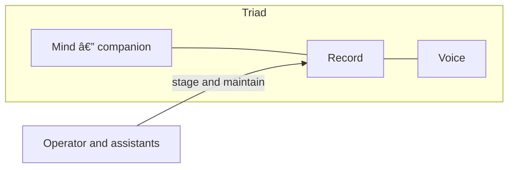

# Start here (Grace-Mar)

## Invocation contract

**Surface type:** helper  
**Primary purpose:** plain-language onboarding, audience routing, and links into doctrine vs procedure  
**When to use:** first open of the repo or when choosing a companion / operator / visitor path  
**Inputs:** reader role and intent (you pick a path); no CLI arguments  
**Outputs:** navigation and pointers only — not executable artifacts  
**Mutation scope:** none (documentation only; does not edit repo files)  
**Canonical Record access:** read-only pointers to canonical docs; does not read or write SELF, SKILLS, or EVIDENCE bodies  
**Typical next step:** chosen door section below, [bootstrap/grace-mar-bootstrap.md](../bootstrap/grace-mar-bootstrap.md), or [architecture.md](architecture.md)  
**Do not use for:** substituting [AGENTS.md](../AGENTS.md), companion approval at the gate, or Record merges  

Plain-language entry point. Precise terms and invariants live in [glossary.md](glossary.md), [conceptual-framework.md](conceptual-framework.md), and [architecture.md](architecture.md).

**Runtime vs durable Record** (what is canonical vs operator scratch): [runtime-vs-record.md](runtime-vs-record.md) · operator map: [operator-mental-model.md](operator-mental-model.md).

**Guarantees snapshot** (what the system aims to promise vs not): [architecture.md — Guarantees at a glance](architecture.md#guarantees-at-a-glance) · tooling nuance: [trust-layers.md](trust-layers.md).

**Portability** (what's already portable and what's next): [portable-record/current-capability-map.md](portable-record/current-capability-map.md) · doctrine: [portable-working-identity.md](portable-working-identity.md).

---

## Procedure vs doctrine (two spines)

| Spine | Role | Where to start |
|-------|------|----------------|
| **Procedure / current state** | What to run **this session**; orientation and weather — **not** a substitute for policy. | [bootstrap/grace-mar-bootstrap.md](../bootstrap/grace-mar-bootstrap.md), `harness_warmup`, `.cursor/skills/` |
| **Doctrine / architecture** | Rules, guarantees, Record governance. | [AGENTS.md](../AGENTS.md), [architecture.md](architecture.md), [instance doctrine](../instance-doctrine.md) |

Bootstrap + warmup **stack** with doctrine; they do not replace it.

---

## In one sentence

Grace-Mar is a **structured, versioned record of one person’s developing self**—with an optional chat interface that **speaks from that record when asked**, and a rule that **meaningful updates wait for the companion’s approval** before they become permanent.

### Coming from OB1-style systems?

If you already use **Open Brain / OB1**-flavored tooling (one dashboard, recipes, imports, pending approvals), use **[Coming from OB1? Start here](start-here-ob1-users.md)** for a translation table (Library, Skills, Evidence, Approval Inbox) and the same governance story in familiar words.

### Coming from Claude Code?

Start with the README section **Claude Code surfaces in Grace-Mar**, then read [runtime-vs-record.md](runtime-vs-record.md). For one end-to-end chain (runtime retrieval → prepared context → optional gate staging), see **[Memory Brief → Gate Candidate Demo](orchestration/memory-brief-to-gate-demo.md)**.

### See it as a dashboard

Grace-Mar is inspectable without trusting chat alone:
**[observability.md](observability.md)** (reports and scripts),
**`runtime/observability/`** JSONL feeds when present, and optional
**web / family hub** surfaces
([simple-user-interface.md](simple-user-interface.md)). For a link-only
map of workflows, see **[workflow-catalog.md](workflow-catalog.md)**.
For diagnostics and governance tooling, see
**[diagnostics-and-governance-tools.md](diagnostics-and-governance-tools.md)**.

---

## Choose your path

Pick **one** entry point (you can open a second door if you wear more than one hat). This choice is **for navigation**—it is **not** SELF or EVIDENCE. During **seed formation**, the operator *may* copy the letter into optional **`start_here_pick`** on `seed_intake.json` for reproducibility (see [seed-phase-survey.md](seed-phase-survey.md#calibrate-from-your-start-here-path)); omit if unknown.

| Pick | If this is you… | Jump to |
|------|------------------|---------|
| **A** | I am the person the Record is for (the **companion**). | [Companion door](#door-a) |
| **B** | I am a **parent or guardian** helping oversee this. | [Parent or guardian door](#door-b) |
| **C** | I am the **operator** (repo, bots, staging, procedure). | [Operator door](#door-c) |
| **D** | I am a **technical contributor** or future maintainer. | [Technical contributor door](#door-d) |
| **E** | I am a **curious visitor** (light context, no operational role). | [Curious visitor door](#door-e) |
| **F** | I am a **journalist, blogger, or explainer** for an audience. | [Journalist / blogger door](#door-f) |

**Combos:** **B → C** (guardian then operator) — read governance first, then procedure. **C + D** — follow operator ordering; use strict enum mapping on **work-dev** as in the [survey calibration](seed-phase-survey.md#calibrate-from-your-start-here-path) table.

If you are about to run the **seed phase survey**, pick a path here first, then use the matching row in [seed-phase-survey.md — Calibrate from your start-here path](seed-phase-survey.md#calibrate-from-your-start-here-path).

---

## What you actually interact with

- **Files and folders** (in this repository) that hold identity, skills, activity, and proposed changes—mostly under `` for the active instance.
- **An optional bot** (e.g. Telegram or WeChat) that acts as a **Voice**: it responds when engaged; it is not meant to push unprompted.
- **A staging step** (the “gate”): new material is proposed first; only after the companion agrees does it fully merge into the long-term profile and related files.

---

## The three-part model (plain language)

Many docs describe **triadic cognition**:

| Part | Plain language |
|------|----------------|
| **Mind** | The living person—the companion. |
| **Record** | The documented self: what the system is allowed to know and show, curated over time. |
| **Voice** | The queryable interface (often the bot) that answers in character from the Record. |

Assistants, scripts, and operators who edit the repo are **tooling around** this model. They help build and maintain the Record; they are **not** a third “digital person” in the triad.

---

## Companion, operator, and “Grace-Mar”

- **Companion** — The human whose Record this is. They hold **authority over what becomes canonical** (approval at the gate).
- **Operator** — The person (or people) who run technical workflow: Cursor, scripts, staging candidates, repository hygiene. The companion and the operator **can be the same person** or **different people** in a given setup.
- **Grace-Mar** — The **name of this system and instance** (this product/repo pattern), not a substitute for the companion.

**Instance vs template:** This repository is the **Grace-Mar** instance—built for **real use first**. The **companion-self** name names the **reusable template** shared freely so others can run their own fork. Success can be **deep private use** and **publicly visible adoption**; neither replaces the other. Full framing: [companion-self-doctrine-memo.md](companion-self-doctrine-memo.md) (section *Grace-Mar and the template*).

---

## Why changes wait for approval

Think of an **inbox of proposed updates**: conversations and tooling can suggest new knowledge, curiosity, or personality notes. Nothing is treated as **settled Record truth** until the companion **explicitly approves** (or the governed merge process runs on approved items). That keeps boundaries clear and reduces silent drift.

---

## Where the deeper docs live

| Need | Start here |
|------|------------|
| Full project picture, status, setup pointers | [README.md](../README.md) |
| Structure and modules | [architecture.md](architecture.md) |
| Guarantees vs non-guarantees (skimmable) | [architecture.md — Guarantees at a glance](architecture.md#guarantees-at-a-glance) |
| Tool reliability vs adversarial surfaces | [trust-layers.md](trust-layers.md) |
| Exact definitions of terms | [glossary.md](glossary.md) |
| Rules for AI assistants working in the repo | [AGENTS.md](../AGENTS.md) |
| Governance and ethics framing | [grace-mar-core.md](grace-mar-core.md) |
| Public copy / example tokens (contributors) | [contributing-public-copy.md](contributing-public-copy.md) |

---

## Audience doors

Prefer a quick pick? Use **[Choose your path](#choose-your-path)** (A–F) above. Below, each door stands alone; reading two in a row is normal.

### 1. Companion (the person the Record is for)

- The **Record** is your structured mirror: what you have chosen to document about yourself—not everything anyone ever typed near the project.
- **You decide** what crosses into the lasting profile. Proposals can wait in the gate until you are ready.
- The **Voice** (if you use the bot) should **answer when you ask**, from what the Record allows—not invent a whole separate life story.
- Day-to-day comfort matters: if something feels wrong, that is a signal to pause and talk with your operator or trusted adults, not to “fix it” silently in files you do not control.

**Next:** [The three-part model](#the-three-part-model-plain-language) above · [Why changes wait for approval](#why-changes-wait-for-approval) · [Choose your path](#choose-your-path)

---

### 2. Parent or guardian

- This is a **governed personal knowledge system** for one young person’s documented self, not a public social feed.
- **Permanent updates are meant to pass companion approval**; the design assumes an ethical line between suggestion and settled truth.
- **Technical access** (repo, bots, keys) is usually held by a trusted **operator**; your questions about what is stored and who can change it are appropriate.
- This documentation is **not medical, legal, or therapeutic advice**; it describes a technical and ethical design.

**Next:** [Companion](#door-a) (for talking with your child) · [README.md](../README.md) (setup and scope) · [Choose your path](#choose-your-path)

---

### 3. Operator

- You maintain **procedure and files**; **merge authority into the Record** stays with the **companion** unless your roles are explicitly combined.
- **Staging** (e.g. `recursion-gate.md`) is normal; **merging** into profile and evidence files follows the **scripted merge path** in AGENTS.md after approval—avoid ad-hoc edits to canonical Record files.
- **Warmup and handoff** skills in `.cursor/skills/` and `bootstrap/grace-mar-bootstrap.md` orient sessions; they are weather reports, not permission to bypass the gate.
- Keep **MEMORY** (`self-memory.md`) for continuity notes; treat **EVIDENCE** and **SELF** as heavier, gate-governed surfaces.

**Next:** [operator-mental-model.md](operator-mental-model.md) · [AGENTS.md](../AGENTS.md) · [bootstrap/grace-mar-bootstrap.md](../bootstrap/grace-mar-bootstrap.md) · [canonical-paths.md](canonical-paths.md) · **Seed formation:** [seed-phase-survey.md](seed-phase-survey.md) (survey prompts + [calibration](seed-phase-survey.md#calibrate-from-your-start-here-path)) · [seed-phase-wizard.md](seed-phase-wizard.md) (instance wizard) · [Choose your path](#choose-your-path)

---

### 4. Technical contributor or future maintainer

- Read [architecture.md](architecture.md) and [glossary.md](glossary.md) before renaming surfaces or paths; terminology is **load-bearing**.
- **AGENTS.md** is the contract for assistants: no leaking undocumented facts into the profile, no merging without approval, Lexile and boundary rules apply.
- Instance layout lives under ``; this repo is a **live instance**, not the generic template (see README for **companion-self** pointer if you want the blueprint).
- Prefer **small, reviewable changes**; gated Record edits belong in the **pipeline + merge script** story, not drive-by `self.md` edits.

**Next:** [AGENTS.md](../AGENTS.md) · [identity-fork-protocol.md](identity-fork-protocol.md) · [README.md](../README.md) · [Choose your path](#choose-your-path)

---

### 5. Curious visitor

- **Cognitive fork** (in project language) means a **versioned personal record that is allowed to diverge** from any initial snapshot—on purpose—not a “clone” that must match a real person forever.
- **Grace-Mar** names this **instance and product pattern**; the **companion** is the human at the center; the **Voice** is optional chat grounded in files.
- The unusual bit is **explicit approval** before deep identity files update—closer to **consentful memory** than to an autopilot profile.
- For philosophy and governance, see [grace-mar-core.md](grace-mar-core.md); for a one-repo map, see [README.md](../README.md).

**Next:** [conceptual-framework.md](conceptual-framework.md) · [grace-mar.com](https://grace-mar.com) (project domain) · [Choose your path](#choose-your-path)

---

### 6. Journalist, blogger, or “explain this to readers”

**Short accurate pitch:** Grace-Mar is a **structured, gated personal record** with an optional **query-driven bot** that speaks from what is documented—designed so **the person (companion) approves** what becomes part of the long-term profile.

**Avoid implying:**

- That the Voice is **autonomous** or should contact minors without design guardrails.
- **“Digital twin”** or perfect copy of a person—the project prefers **cognitive fork** and **divergence by design**.
- That **operators or tools** are the same seat as the **companion** in governance stories.

**Primary links for fact-checking:** [README.md](../README.md) · [grace-mar-core.md](grace-mar-core.md) · [grace-mar.com](https://grace-mar.com) · [Choose your path](#choose-your-path)

---

## Diagram

Triad (governance model) vs operator/tooling (instrumental). **Operator and assistants are not a fourth seat in the triad**—they help build and maintain the Record.

*If this diagram does not render in your viewer, rely on [The three-part model](#the-three-part-model-plain-language) above.*

