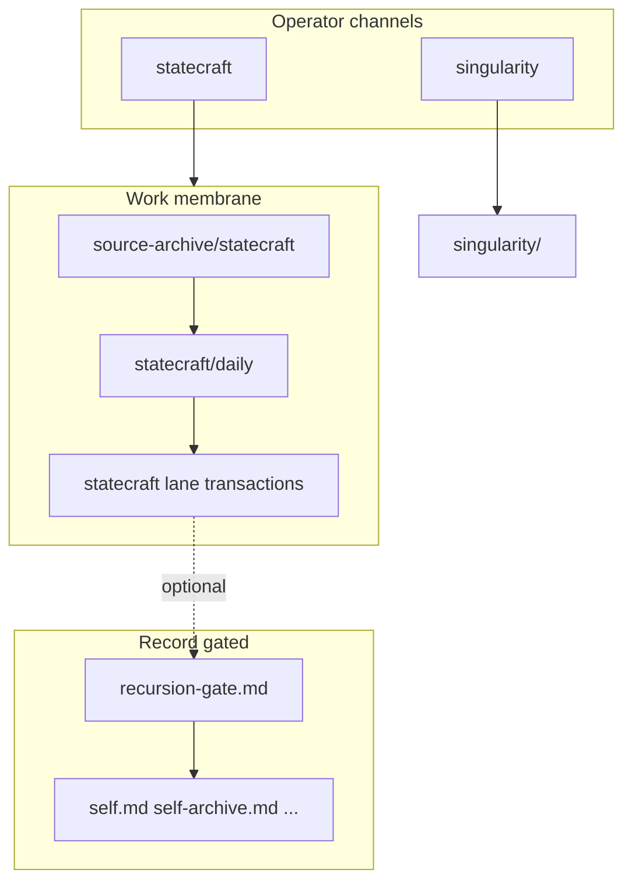

# START-HERE — strategy-codex

**Work only; not Record.** This page orients operators and assistants. Governance law remains in [AGENTS.md](../AGENTS.md).

---

## What this repo is

**strategy-codex** is a **governed interpretive machine**: verbatim sources land in archive; bounded synthesis and transactions carry judgment; optional gate promotion touches Record only with companion approval.

It is **not** a single notebook blob and **not** an auto-merge identity system.

---

## System map



**Membrane classes:** [work-membrane-v2.md](work-membrane-v2.md)  
**Two channels:** [operator-two-channel-architecture.md](operator-two-channel-architecture.md) — *what system is emerging* vs *what object must be judged*

---

## Promotion ladder (statecraft)

```
operator source
  → source-archive/statecraft/<pub_date>/<slug>.md   [verbatim SSOT]
  → generated day/month/year/thread indices
  → statecraft/daily/<YYYY-MM-DD>.md                 [daily synthesis]
  → statecraft/<lane>/transactions/<object>.md       [transaction object]
  → recursion-gate.md (optional)                     [companion-relevant only]
  → process_approved_candidates.py --apply           [Record — gated]
```

Full refactor map: [strategy-codex-redesign-brief.md](strategy-codex-redesign-brief.md)

---

## Operator commands

### Archive indices (derived; regenerate after intake)

```bash
# Refresh all day/month/year/thread/stale-audit indices
python3 scripts/refresh_statecraft_archive_indices.py

# CI guard — exit 1 if any index is stale
python3 scripts/refresh_statecraft_archive_indices.py --check
```

### Gate review (sovereign merge unchanged)

```bash
grace-mar gate board [-u USER]          # Kanban view → artifacts/gate-board.md
grace-mar gate list [-u USER]           # Pending candidates + impact summary
grace-mar gate diff CANDIDATE-XXXX [-u USER]
grace-mar gate merge [-u USER]          # Wraps process_approved_candidates.py --apply
```

### Session warmup

```bash
grace-mar warmup -u grace-mar --compact
```

### Daily synthesis structure (advisory in CI until shelf retrofit)

```bash
python3 scripts/validate_statecraft_daily_synthesis.py
```

Skips legacy daily notes; enforces five-volume contract on migrated `YYYY-MM-DD.md` files only.

---

## Where to go next

| Need | Path |
|------|------|
| Statecraft front door | [statecraft/README.md](../statecraft/README.md) |
| Archive SSOT | [source-archive/statecraft/README.md](../source-archive/statecraft/README.md) |
| Daily method | [statecraft/daily/METHOD.md](../statecraft/daily/METHOD.md) |
| Record paths | [canonical-paths.md](canonical-paths.md) |
| Full architecture | [architecture.md](architecture.md) |
| Redesign wedge / phases | [strategy-codex-redesign-brief.md](strategy-codex-redesign-brief.md) |
