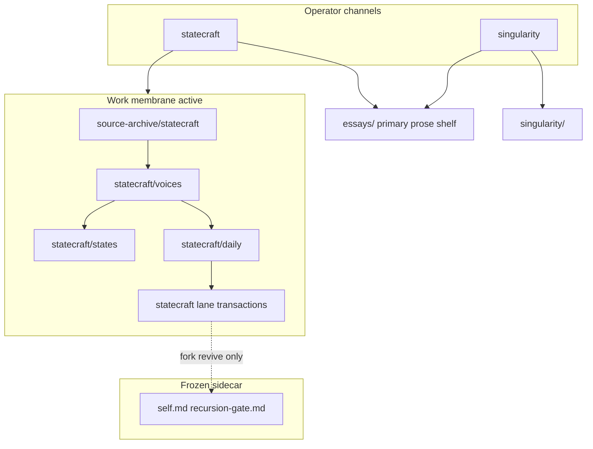

# START-HERE — strategy-codex

**Work only; not Record.** This page orients operators and assistants. Governance law remains in [AGENTS.md](../AGENTS.md).

**Finding analyst source indexes:** [LLM-ROUTING.md](../LLM-ROUTING.md) → [statecraft/voices/INDEX.md](../statecraft/voices/INDEX.md) (not SELF-LIBRARY or `runtime/artifacts/library-index.md`).

---

## What this repo is

Canonical product definition: [product-identity.md](product-identity.md). **Default path:** **C** (operator) — system map, promotion ladder, and ship loop below.

**SELF / library / memory:** Record identity under [`archive/grace-mar-instance/self.md`](../archive/grace-mar-instance/self.md) is **frozen**; [`self-library.md`](../self-library.md) stays **active for reference** routing; [`self-memory.md`](../self-memory.md) is **session continuity** — not SELF, not Record.

## Namespace map (statecraft paths)

| Term | Path | Notes |
|---|---|---|
| voices | `statecraft/voices/` | Analyst registers (interview + written); was `civ-lens` |
| states | `statecraft/states/` | CIV-STATE pattern memory; volumes still `civ-state-*` |
| hosts | `statecraft/hosts/` | Guest-on-host continuity; not in `voices/` |

---

## Choose your path {#choose-your-path}

Pick **one letter**. **Default:** **C** (operator). Seed-phase calibration: [seed-phase-survey § Calibrate](seed-phase-survey.md#calibrate-from-your-start-here-path).

| Pick | You are… | Start here |
|------|----------|------------|
| **A** | Companion (fork revive / seed) | [grace-mar-instance-boundary.md](grace-mar-instance-boundary.md) |
| **B** | Parent or guardian | [seed-phase-survey.md](seed-phase-survey.md) |
| **C** | **Operator (default)** | Promotion ladder below · [statecraft/README.md](../statecraft/README.md) · [Architecture map](harness-architecture-map.md) · [Root directory map](root-directory-map.md) |
| **D** | Technical contributor | [skill-work/work-dev/](skill-work/work-dev/) |
| **E** | Curious visitor | [harness-architecture-map.md](harness-architecture-map.md) · [intelligence-harness.md](intelligence-harness.md) · [product-identity.md](product-identity.md) · [from-accumulation essay](../essays/from-accumulation-to-governed-interpretive-machine.md) |
| **F** | Journalist / blogger | [Door F](#door-f) |

<a id="door-f"></a>

### Door F — public-safe orientation

Public-safe entry only — no seed intake, gate queues, or private operator material. Safe entry points: [harness-architecture-map.md](harness-architecture-map.md), [intelligence-harness.md](intelligence-harness.md), [product-identity.md](product-identity.md), [from-accumulation essay](../essays/from-accumulation-to-governed-interpretive-machine.md), public Predictive History ([ph-civ](https://github.com/rbtkhn/ph-civ)).

**Cross-channel essays:** [essays/README.md](../essays/README.md) · [prose-index.md](prose-index.md).

---

## System map {#system-map}



**Essays node:** cross-channel theses at [essays/README.md](../essays/README.md); channel `*/essays/` = compatibility stubs. Class law: [prose-index.md](prose-index.md). Voice law: [essay-voice.md](essay-voice.md).

**Membrane classes:** [work-membrane-v2.md](work-membrane-v2.md)  
**Two channels:** [operator-two-channel-architecture.md](operator-two-channel-architecture.md) — *what system is emerging* vs *what object must be judged*

---

## Promotion ladder (statecraft)

```
operator source
  → source-archive/statecraft/<pub_date>/<slug>.md   [verbatim SSOT]
  → generated day/month/year/thread indices
  → statecraft/daily/<YYYY-MM-DD>.md                 [daily synthesis]
  → statecraft/<lane>/transactions/<object>.md       [transaction object — default ceiling]
```

Fork revive only (frozen): `recursion-gate.md` → `process_approved_candidates.py --apply`

Full refactor map: [strategy-codex-redesign-brief.md](strategy-codex-redesign-brief.md)

---

## Operator ship loop

Bounded closeout after statecraft intake or daily work:

```text
intake → sync check → intake queue report → synthesis/companion → commit → ship receipt → push
```

| Step | Command / surface |
|------|-------------------|
| Land + indices | `refresh_statecraft_archive_indices.py` |
| Archive ↔ daily sync | `check_statecraft_intake_daily_sync.py --day YYYY-MM-DD` |
| Intake queue report | `statecraft_intake_queue.py --day YYYY-MM-DD` ([spec](statecraft-intake-queue.md)) |
| Daily synthesis | `statecraft/daily/YYYY-MM-DD.md` (manual or `state synthesis`) |
| Commit | operator-directed; lane-scoped slices |
| Ship receipt | `operator_handoff_check.py` → `## Ship receipt` |
| Push | `git push origin <branch>` when ahead and clean |

Conventions: [work-menu-conventions — Ship receipt](skill-work/work-menu-conventions.md#6a-ship-receipt) · UX wedge detail: [strategy-codex-redesign-brief — UX wedges](strategy-codex-redesign-brief.md#ux-wedges-2026-06-09)

---

## Operator commands

Lane scripts and preflight: [contributing.md](../contributing.md) · [skill-work/work-dev/](skill-work/work-dev/).

| Task | Entry |
|------|--------|
| Refresh archive indices | `python3 scripts/refresh_statecraft_archive_indices.py` (`--check` for CI) |
| Archive ↔ daily sync | `python3 scripts/check_statecraft_intake_daily_sync.py --day YYYY-MM-DD` or `--latest` |
| Intake queue report | `python3 scripts/statecraft_intake_queue.py --day YYYY-MM-DD` — [spec](statecraft-intake-queue.md) |
| Daily synthesis check | `python3 scripts/validate_statecraft_daily_synthesis.py` (advisory in CI) |
| Session warmup | `python3 scripts/harness_warmup.py -u strategy-codex --compact` |
| Gate review | **Fork revive only** — `grace-mar gate board` · [archive/grace-mar.md](archive/grace-mar.md) |

Flags and conductor cadence: [statecraft-intake-queue.md](statecraft-intake-queue.md) · [conductor SKILL](../.cursor/skills/conductor/SKILL.md)

---

## Where to go next

| Need | Path |
|------|------|
| **Operator default (C)** | [statecraft/README.md](../statecraft/README.md) · promotion ladder above |
| Archive SSOT | [source-archive/statecraft/README.md](../source-archive/statecraft/README.md) |
| Daily method | [statecraft/daily/METHOD.md](../statecraft/daily/METHOD.md) |
| Full architecture | [architecture.md](architecture.md) |
| Product identity | [product-identity.md](product-identity.md) |
| Essays shelf | [essays/README.md](../essays/README.md) |
| Grace-Mar freeze / revive | [grace-mar-instance-boundary.md](grace-mar-instance-boundary.md) |
| Route registry detail | [routing-reference.md](routing-reference.md) |

More indexes and doctrine: [LLM-ROUTING.md](../LLM-ROUTING.md) · [harness-architecture-map.md](harness-architecture-map.md) · [deprecated-surfaces.md](deprecated-surfaces.md)
