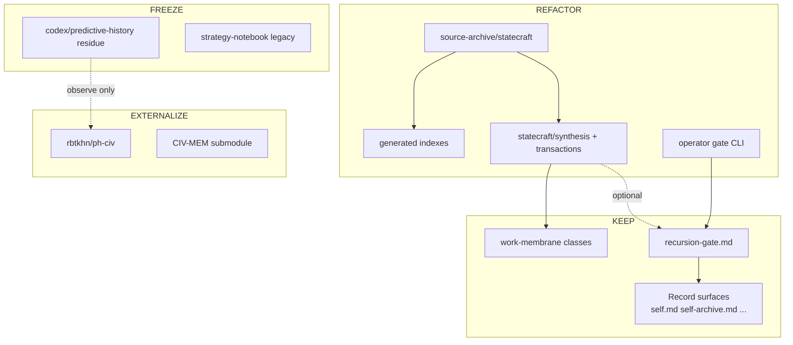

# Strategy-codex redesign brief

**Status:** operator planning artifact · **work only; not Record**  
**Purpose:** Merge two “from scratch” redesign memos into one ranked action map tied to **this repo’s paths** — not greenfield fantasy.  
**Companion essays:** [from-accumulation-to-governed-interpretive-machine.md](../essays/from-accumulation-to-governed-interpretive-machine.md) · [operator-two-channel-architecture.md](operator-two-channel-architecture.md) · [work-membrane-v2.md](work-membrane-v2.md)

---

## Executive summary

**Diagnosis:** The system’s philosophy is load-bearing and should survive any refactor. The pain is **accidental complexity**: parallel namespaces, hand-maintained indexes, migration residue, harness/rule weight, and gate operations without a single ergonomic surface.

**Do not trade away:** human-gated Record promotion, identity vs reference separation, verbatim SSOT separate from synthesis, disposable agents with continuity in artifacts, two-channel routing (`statecraft` / `singularity`), typed work membrane.

**Primary disproportion (felt daily):** reconciliation tax between parallel naming systems and parallel indexes — not lack of analytical power.

---

## Ranked priority stack

| P | Action | Verdict | Why now |
|---|--------|---------|---------|
| **P0** | Schema + CI + **generated** indexes | **Refactor** | Stops smart-archive drift; `source-archive/statecraft/stale-index-audit.md` shows 275 stale day indices |
| **P1** | Channel-first routing law in docs + tooling defaults | **Keep + enforce** | Already correct in doctrine; not yet default in all paths |
| **P1** | Single ingress + promotion ladder for statecraft | **Refactor** | Mature pattern exists; legacy notebook parallel remains |
| **P2** | Unified gate CLI (review → diff → merge) | **Refactor** | Scripts exist piecemeal; no one operator muscle memory |
| **P2** | Companion instance packaging (optional sidecar) | **Refactor** | Reduce Grace-Mar-at-root routing tax |
| **P2** | Skill primitives + portable registry (fewer, composable) | **Refactor** | `skills/` + manifest sync mid-flight |
| **P3** | Export-first packaging; import-always-stages | **Keep + extend** | `export_fork.py` already multi-format |
| **P3** | Voice render decoupled from prompt knowledge duplication | **Refactor** | Merge protocol still touches `archive/grace-mar-instance/bot/prompt.py` |
| **P4** | Monorepo folder discipline (`core` / `instances` / channels) | **Refactor (phased)** | High move cost; do after P0–P2 stabilize routes |
| **—** | Flatten EVIDENCE into a unified event log view | **Defer** | Only if schema replaces file-authority law |
| **—** | Tiered auto-merge gates | **Reject** | Conflicts with sovereign merge invariant |
| **—** | Bidirectional sync into Record from external editors | **Reject as default** | Import must always stage |

---

## Verdict matrix by surface

### KEEP (do not redesign away)

| Surface / law | Canonical paths | Rationale |
|---------------|-----------------|-----------|
| Gated pipeline | `recursion-gate.md`, `scripts/process_approved_candidates.py`, `scripts/stage_gate_candidate.py` | Sovereign merge is the killer feature |
| Record surface partition | `self.md`, `self-knowledge.md`, `self-skills.md`, `self-archive.md`, `self-library.md` — [canonical-paths.md](canonical-paths.md) | File authority prevents bleed (who / can do / did / reference) |
| Runtime ≠ Record | `self-memory.md`, `session-log.md`, `runtime/artifacts/context/`, [runtime-vs-record.md](runtime-vs-record.md) | Portable harness without vendor lock-in |
| Markdown + git audit trail | repo root, `.github/workflows/` | Institutional memory in diffs |
| Two operator channels | `statecraft/`, `singularity/`, [operator-two-channel-architecture.md](operator-two-channel-architecture.md) | “System emerging” vs “object to judge” |
| Work membrane typing | [work-membrane-v2.md](work-membrane-v2.md), `statecraft/work-membrane.md`, `singularity/work-membrane.md` | Stops “one vague non-Record blob” |
| Verbatim SSOT (statecraft) | `source-archive/statecraft/<pub_date>/` | Notebook ≠ mirror; synthesis cites receipts |
| PH observe-only boundary | [predictive-history-external-boundary.md](predictive-history-external-boundary.md), public `rbtkhn/ph-civ` | Mutation belongs external |
| Polyphonic codex continuity | `codex/`, `codex/years/`, `codex/profiles/` | Chronology beneath both channels |
| Portable skill cores | `skills/`, `skills/manifest.yaml`, `scripts/sync_portable_skills.py` | Host-neutral methodology; Cursor appendix split |

### REFACTOR (intentional strength, accidental friction)

| Target | Current paths | End state | First wedge |
|--------|---------------|-----------|-------------|
| **Generated navigation** | `source-archive/statecraft/*.md` indices, `source-archive/statecraft/stale-index-audit.md`, `source-archive/statecraft/thread-index.md`, `statecraft/data/month-routing-metadata.json` | Indexes are **derived only**; CI fails stale day/month rows | Extend `scripts/build_statecraft_archive_navigation.py`; add `validate_archive_indexes.py` to CI |
| **Promotion ladder** | `source-archive/statecraft/` → `statecraft/synthesis/daily/` → `statecraft/*/transactions/` (e.g. `statecraft/america/transactions/foreign-client-mesh-separation-and-command-review.md`) | One documented ladder; every synthesis cites archive paths | Document in `statecraft/README.md`; lint missing `source:` frontmatter |
| **Legacy notebook convergence** | `docs/skill-work/work-strategy/strategy-notebook/`, `codex/STRATEGY-NOTEBOOK-ARCHITECTURE.md`, dual `thread.md` + monthly thread files | Host-equivalent routes under `codex/`; notebook namespace read-only compatibility | Finish `scripts/migrate_thread_md_to_monthly.py` passes; stop new captures in deprecated `raw-input/` when `source-archive` applies |
| **Gate ergonomics** | `recursion-gate.md`, `scripts/preview_candidate_impact.py`, `scripts/build_gate_board.py`, `scripts/generate_gate_dashboard.py`, `platform/apps/gate-review-app.py` | Single CLI: `codex gate list \| review \| diff \| merge` wrapping existing scripts | Thin `scripts/codex_cli.py` or `scripts/operator_gate.py` facade; no new merge authority |
| **Schema-validated proposals** | `scripts/stage_gate_candidate.py`, `schemas/registry/`, `archive/queues/review-queue/boundary-classifications/` | Machine-first candidates; human-readable gate board renders from JSON | Promote gate blocks to validated JSON; keep markdown export view |
| **Context budgets declarative** | `platform/config/context_budgets/`, `scripts/compress_active_lane.py`, `scripts/build_skill_cards.py` | Config-driven prepared context; fewer one-off scripts | One manifest: lane → budget → builders |
| **Instance packaging** | repo-root `self.md`, `archive/grace-mar-instance/bot/`, `grace-mar-llm.txt` | **FROZEN** — operator backup; not growth objective | [`grace-mar-instance-boundary.md`](grace-mar-instance-boundary.md); optional future `instances/grace-mar/` move |
| **Voice render split** | `archive/grace-mar-instance/bot/prompt.py`, `scripts/generate_profile.py` | Prompt = policy + render; knowledge loaded from Record surfaces at query time | New candidates stop duplicating IX-A rows into prompt; render layer reads `self-knowledge.md` |
| **Skill consolidation** | `.cursor/skills/*` (50+), `skills/manifest.yaml` | ~8–12 primitives; recipes as thin manifests | Audit per [skills-portable-drift-audit-2026-05-22.md](../skills/skills-portable-drift-audit-2026-05-22.md); merge overlapping statecraft-* intake/synthesis skills |
| **Start-here map** | `docs/architecture.md`, `docs/layer-architecture.md`, scattered ADRs | One `docs/START-HERE.md` + system mermaid + links | This brief + membrane + two-channel as chapter 1 |
| **MEMORY contract enforcement** | `self-memory.md`, [memory-template.md](memory-template.md) | Explicit regenerable flag + prune checks in `validate-integrity.py` | Add horizon TTL hints in template; wire `scripts/validate-integrity.py` |

### FREEZE (read / cite; do not extend)

| Surface | Paths | Rule |
|---------|-------|------|
| Predictive History local corpus | `codex/predictive-history/`, `research/external/youtube-channels/predictive-history/` | Observe, critique, cite public IDs only — [predictive-history-external-boundary.md](predictive-history-external-boundary.md) |
| Legacy strategy-notebook namespace | `docs/skill-work/work-strategy/strategy-notebook/` | Compatibility reads; new work routes to `codex/` + `source-archive/statecraft/` |
| Deprecated operator beats | `.cursor/skills/thanks/SKILL.md` | Use `coffee` / `conductor` instead |
| Grace-Mar template reconciliation | `companion-self` sync paths in archived docs | strategy-codex-native routing unless operator invokes legacy lane |
| Dual thread layouts | legacy `experts/*/thread.md` alongside `codex/years/*/*-thread-YYYY-MM.md` | Union discovery until migration complete; no new legacy containers |

### EXTERNALIZE (submodule, sibling repo, or export-only)

| Surface | Current paths | Target |
|---------|---------------|--------|
| Public PH artifact | frozen local trees above | `rbtkhn/ph-civ` sole canonical corpus |
| Public Civilizational Statecraft book | `statecraft/states/` (workshop SSOT) | `rbtkhn/civ-state` sole canonical public book — export via [`scripts/export_civilizational_statecraft_public.py`](../scripts/export_civilizational_statecraft_public.py); see [civilizational-statecraft-external-boundary.md](civilizational-statecraft-external-boundary.md) |
| CIV-MEM bulk reference | `research/repos/civilization_memory/`, CIV-MEM indexes | Versioned submodule or sibling; strategy-codex holds routing + mirrors only |
| Academy mirrors | `statecraft/voices/jiang/ph-civ`, `scripts/check_academy_mirror_sync.py` | Gitlink discipline; parent repo does not own upstream manuscript |
| Record portable bundle | `scripts/export_fork.py`, `runtime/bundle/`, `fork-manifest.json` | Default export: Markdown + JSON (+ optional SQLite view); ZIP import **stages only** |
| Large speaker month corpora | per-speaker shelves under `codex/years/` | Sparse checkout / worktrees for operators who do not need full month depth |

---

## Single promotion ladder (target grammar)

Normative route for **statecraft** judgment work:

```
operator source
  → source-archive/statecraft/<pub_date>/<slug>.md     [verbatim SSOT]
  → source-archive/statecraft/YYYY-MM.md + day index   [generated]
  → statecraft/synthesis/daily/<YYYY-MM-DD>.md         [governed adjacent]
  → statecraft/<lane>/transactions/<object>.md         [governed adjacent]
  → statecraft/states/...                           [retrieval / volume]
  → (fork revive only) recursion-gate.md → process_approved_candidates.py
```

**Legacy parallel (freeze):** `strategy-notebook/raw-input/` + `days.md` compose — fold into `codex/` continuity without new verbatim mirrors.

---

## Gate redesign (ergonomic, still sovereign)

**Keep invariant:** Agents stage; humans approve; merge only via `scripts/process_approved_candidates.py --apply`.

**Build:**

| Step | Existing asset | Gap |
|------|----------------|-----|
| List pending | `grace-mar gate list`, `scripts/build_gate_board.py` | Unified entrypoint via [platform/src/grace_mar/cli.py](../platform/src/grace_mar/cli.py) |
| Preview impact | `grace-mar gate diff CANDIDATE-XXXX`, `scripts/preview_candidate_impact.py` | PR-like diff in terminal |
| Review UI | `platform/apps/gate-review-app.py` | Optional; CLI remains primary |
| Merge | `grace-mar gate merge`, `scripts/process_approved_candidates.py` | Single documented path |
| Telemetry | `pipeline-events.jsonl`, `merge-receipts.jsonl`, `scripts/report_governance_posture.py` | Surface in gate review, not scattered docs |

**Explicitly reject:** auto-merge tiers for identity-bearing surfaces. At most: auto-**stage** low-risk curiosity with notification — never canonical write without human act.

---

## Export / import asymmetry

| Direction | Tooling | Rule |
|-----------|---------|------|
| **Export** | `scripts/export_fork.py` (`json`, `json-ld`, `obsidian`, `coach-handoff`) | Encourage early and often |
| **Import** | `scripts/coding_agent_patch_intake.py`, gate staging | Always → proposed → gate |
| **Portable fork** | `fork-manifest.json`, `scripts/export_fork.py`, [instances-and-release.md](instances-and-release.md) | ZIP = surfaces + manifest + lineage; import never bypasses gate |

Bidirectional Obsidian/Notion/Logseq sync is **export-first**; inbound paths are staging adapters only.

---

## Phased execution (reality wedges)

### Phase A — Stop drift (4–6 sessions)

1. Run `python scripts/build_statecraft_archive_navigation.py`; commit regenerated indices.
2. Add CI check: stale day index count must not increase (`stale-index-audit.md` pattern).
3. Add synthesis linter: statecraft daily notes must link `source-archive/statecraft/` receipts.
4. Document promotion ladder in `statecraft/README.md` (link this brief).

### Phase B — Operator ergonomics (2–4 sessions)

1. `grace-mar gate` facade: `board`, `list`, `diff <id>`, `merge` (wraps existing scripts via [platform/src/grace_mar/cli.py](../platform/src/grace_mar/cli.py)).
2. Gate candidate JSON schema validation on stage (`validate_gate_comprehension_envelope.py` family).
3. `docs/START-HERE.md` with mermaid: Record / membrane / channels / archive ladder.

### Phase C — Namespace convergence (ongoing, slice-safe)

1. New statecraft captures **only** `source-archive/statecraft/`.
2. Monthly thread migration per `scripts/migrate_thread_md_to_monthly.py`.
3. Skill manifest audit: collapse duplicate intake/synthesis/cleanup skills into primitives.

### Phase D — Packaging (optional, high churn)

1. Scaffold `instances/grace-mar/` (or document sibling-repo layout) without breaking `assert_canonical_record_layout()`.
2. Voice: read knowledge from `self-knowledge.md` at render time; shrink prompt duplication.

---

## What we will not do (guardrails)

- Collapse SELF / SKILLS / EVIDENCE into one blob without schema-enforced views.
- Auto-merge gated surfaces for “trivial” identity changes.
- Treat external sync as a second merge authority.
- Resurrect local PH corpus editing.
- Big-bang directory rename before P0 validators land.

---

## System map (current → target)



---

## Cross-links for implementers

| Topic | SSOT |
|-------|------|
| Record paths | [canonical-paths.md](canonical-paths.md) |
| Membrane classes | [work-membrane-v2.md](work-membrane-v2.md) |
| Channel routing | [operator-two-channel-architecture.md](operator-two-channel-architecture.md) |
| PH boundary | [predictive-history-external-boundary.md](predictive-history-external-boundary.md) |
| Layer loading | [layer-architecture.md](layer-architecture.md) |
| Portable skills | [skills/README.md](../skills/README.md) |
| Archive stale audit | [source-archive/statecraft/stale-index-audit.md](../source-archive/statecraft/stale-index-audit.md) |
| Accumulation → machine essay | [essays/from-accumulation-to-governed-interpretive-machine.md](../essays/from-accumulation-to-governed-interpretive-machine.md) |

---

## UX wedges (2026-06-09)

Low-risk operator-UX improvements from session friction (archive vs daily desync, ship confusion, over-ritualized Kleiber on small objects):

| Wedge | SSOT |
|-------|------|
| Archive ↔ daily desync alarm | [`scripts/check_statecraft_intake_daily_sync.py`](../scripts/check_statecraft_intake_daily_sync.py) · wired in [`statecraft-source-intake`](../skills/statecraft-source-intake/SKILL.md) closeout |
| Ship receipt block | [`scripts/operator_handoff_check.py`](../scripts/operator_handoff_check.py) · [work-menu-conventions — Ship receipt](skill-work/work-menu-conventions.md#6a-ship-receipt) |
| Kleiber compact vs full | [conductor SKILL](../.cursor/skills/conductor/SKILL.md) · [kleiber-composition-benchmark](skill-work/work-dev/kleiber-composition-benchmark.md) |
| Tiered WORK menus | [work-menu-conventions — Tiered menus](skill-work/work-menu-conventions.md#6b-tiered-work-menus-ship-blockers-first) |
| Operator ship loop | [START-HERE — Operator ship loop](START-HERE.md#operator-ship-loop) |

Explicit non-goals: no auto daily rewrite; no auto-push; no coffee hub change.

---

## Source memos merged

1. **Assistant redesign memo** — classify before accumulate; two-channel routing; single capture ladder; membrane typing; skill primitives; prompt decoupling.
2. **External feedback memo** — CLI gate ergonomics; monorepo layout; export-first; submodule discipline; CI/schema; pushback on EVIDENCE flattening and tiered auto-merge.

**This document** is the operational merge: ranked priorities, path-tied verdicts, phased wedges, explicit rejections.
