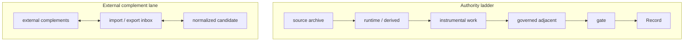

# work membrane v2

**Purpose:** Define the shared membrane model for non-Record work across `strategy-codex`, then let active lanes such as `statecraft` and `singularity` apply that model with lane-specific overlays.

This doc upgrades the old binary `Record vs work` framing into a typed membrane model. The old law remains true: `Record` stays gated and work may not silently mutate identity truth. The new contribution is legibility: non-Record surfaces now have named classes, route types, and durability expectations.

**Lane overlays:** [statecraft/work-membrane.md](../statecraft/work-membrane.md), [singularity/work-membrane.md](../singularity/work-membrane.md)
**Operator routing law:** [operator-two-channel-architecture.md](./operator-two-channel-architecture.md)

**Live examples companion:** [work-membrane-live-examples.md](work-membrane-live-examples.md)

---

## Membrane (definition)

**Membrane** = an authority boundary that defines what a surface may contain, cite, mutate, promote, export, or regenerate.

---

## Engineering translation

| Repo term | Standard engineering translation |
|-----------|-----------------------------------|
| Membrane | Trust boundary / authority boundary |
| Membrane class | Artifact authority class |
| Promotion | Controlled state transition |
| Gate | Human-approved canonical write path |
| Runtime / derived | Generated artifact / rebuildable cache |
| External complement | Import/export adapter with no authority transfer |

### Term discipline

Use **membrane** only when authority, durability, promotion, import/export, or mutation rights are at stake. Do not use it as a synonym for folder, module, topic, lane, or layer. See also [Anti-confusion law](#anti-confusion-law).

**Deprecated banner:** do not use the legacy standalone work-only / not-Record fence line. Enforced by `scripts/check_work_record_doctrine.py`.

---

## Core invariants

- `Record` stays gated.
- `work` may read, stage, synthesize, validate, export, and compare.
- `work` does not silently mutate identity truth.
- the `work execution layer` is instrumental, not a fourth seat in the triad.
- route discipline matters as much as content discipline: what a surface may do depends on its membrane class.

---

## Membrane classes

| Class | Public gloss | What it holds | Durability | Promotion right |
|-------|--------------|----------------|------------|-----------------|
| `Record` | Canonical truth | canonical identity-bearing truth | canonical | gated only |
| `governed adjacent` | Durable non-canonical doctrine | durable non-Record doctrine, synthesis, comparisons, benchmarks | durable | may stage governed promotion candidates, but is not itself Record |
| `instrumental work` | Active workspace | planning, drafts, execution lanes, notebooks, experiment surfaces | durable or disposable by lane | may stage or support promotion, never merge directly |
| `runtime / derived` | Generated helper artifacts | rebuildable summaries, payloads, indexes, receipts, convenience views | generated / rebuild-required | none by default |
| `external complements` | Boundary-crossing interop artifacts | explicit import/export bundles and interop surfaces for outside runtimes | freshness-sensitive / transport-oriented | import may stage candidates after normalization; export does not imply Record authority |

### Short reading rule

- `Record` answers: what is canonically true here?
- `governed adjacent` answers: what durable non-Record object should exist?
- `instrumental work` answers: what are we actively doing?
- `runtime / derived` answers: what can be regenerated to help?
- `external complements` answers: what may cross the repo boundary without collapsing authority?

**Agent handoff queue** ([`agent-handoff-queue.md`](agent-handoff-queue.md)) lives under `runtime/operator-queue/` as **instrumental work** — visible task handoffs between humans and agents; receipts do not promote authority.

**Context layer** ([`context-layer.md`](context-layer.md)) — the membrane **classifies** surfaces; the context layer **owns, moves, refreshes, exports, and audits** work context. Not the same as [prepared context layer](prepared-context-layer.md) (state-model evidence staging).

---

## Route grammar

### Ingress

The shared ingress types are:

- operator-pasted source
- human-authored note
- validator output
- runtime observation
- doctrine draft
- external complement import

Ingress names the route by which material enters the work membrane. It does not decide authority by itself.

### Egress

The shared egress types are:

- `work -> gate -> Record`
- `work -> governed adjacent artifact`
- `work -> runtime / derived surface`
- `work -> external complement bundle`
- `work -> doctrine / benchmark / validator support`

The same source material may support more than one egress, but each egress produces a different class of object.

### Promotion

**Promotion is governed, not ambient.** No artifact becomes more authoritative merely because it was summarized, reused, exported, or generated.

Common promotion shapes:

- `draft -> doctrine`
- `note -> benchmark`
- `synthesis -> companion note`
- `observation -> candidate`
- `external import -> inbox -> normalized -> candidate`

Promotion is not automatic graduation. It is a governed route from one class of work object to another.

---

## What can cross

Vertical promotion ladder (authority increases only through governed routes):

```text
source archive
   ↓
runtime / derived  ── no authority
   ↓
instrumental work ── drafts, plans, experiments
   ↓
governed adjacent ── durable doctrine / judgment
   ↓
gate
   ↓
Record ── canonical truth
```

Lateral external-complement lane (import/export without authority transfer):

```text
external complements ⇄ import/export inbox ⇄ normalized candidate
```



---

## Freshness and durability labels

Use these labels when a surface needs explicit status:

| Label | Meaning |
|-------|---------|
| `canonical` | authority-bearing and gate-governed |
| `durable` | intended to persist, but not Record |
| `generated` | produced from other sources |
| `advisory` | useful for continuity or judgment, not authority-bearing |
| `rebuild-required` | should be treated as stale until regenerated |
| `stale-tolerant` | may remain useful even when not freshly rebuilt |

Practical rule:

- a daily synthesis note may be `durable`
- a benchmark manifest may be `durable`
- a skill card or runtime payload is usually `generated`
- an export bundle is usually `advisory` plus freshness-sensitive

---

## Classification matrix

| Surface | Class |
|---------|-------|
| `self.md`, `self-archive.md`, `self-skills.md`, `self-library.md` | `Record` |
| `statecraft/notes/*.md`, `statecraft/notes/compacts/**` | `governed adjacent` |
| `statecraft/synthesis/day/*.md` | `governed adjacent` |
| `statecraft/bridges/*.md` | `governed adjacent` |
| `statecraft/synthesis/METHOD.md`, audit rubric, benchmark manifest | `governed adjacent` |
| `singularity/notes/*.md`, `singularity/essays/*.md`, architecture/protocol doctrine | `governed adjacent` |
| `docs/archive/skill-work-legacy/work-*` | `instrumental work` |
| `work-*.md` instance work contexts | `instrumental work` |
| `runtime/artifacts/*`, runtime payloads, generated indexes, skill cards | `runtime / derived` |
| `runtime/runtime-complements/*` | `external complements` |
| normalized external import inboxes and receipts | `external complements` until staged otherwise |

This is the main classification table for active doctrine. When in doubt, classify the surface before deciding what claims it may make.

---

## Lane comparison

| Lane | Primary question | Main output | Dominant evidence source |
|------|------------------|-------------|--------------------------|
| `statecraft` | `what is the object?` | bounded notes, synthesis, and comparison artifacts | transcript and archive truth |
| `singularity` | `what is the system?` | bounded doctrine and design artifacts | architecture, protocol, and runtime reasoning |

This table exists so the two lanes do not collapse into one generic idea of "workshop."

At the operator-routing layer, these are also the repo's two primary **channels**. Other `work-*` territories are usually overlays or execution surfaces nested beneath one of them rather than equal sovereign categories.

---

## Anti-confusion law

See also [Term discipline](#term-discipline).

- `governed adjacent` is durable without becoming Record.
- `instrumental work` may be rich, ambitious, and recursive without becoming identity truth.
- `runtime / derived` may improve operator speed without inheriting authority.
- `external complements` may transport context without gaining merge rights.

The membrane is stronger, not weaker, when these differences are explicit.

---

## How to use this doc

Use this shared base when you need to answer:

- what class of thing is this?
- what route brought it here?
- what may it feed next?
- does it need freshness language?
- can it ever become Record, and if so, through what gate?

Use the lane overlays when you need to answer:

- what kinds of artifacts does this lane mainly manufacture?
- what temperament governs that lane's work?
- what membrane classes dominate there in practice?
