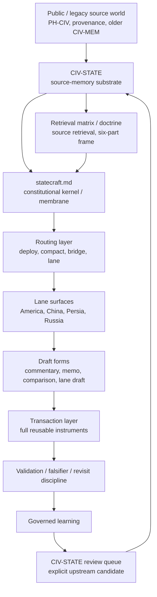

# Statecraft

This surface is non-authoritative and subject to revision.

This is the front-door orientation module for repo-root `statecraft/`.

`statecraft/` is the second of the repo's two primary operator **channels**. Use it when the unresolved question is no longer only what system is emerging, but what legitimacy-bearing, command-bearing, or settlement-bearing object now has to be judged. For the shared routing law, open [Two-Channel Operator Architecture](../docs/operator-two-channel-architecture.md).

`statecraft/` is now the **canonical operator judgment surface** for live geopolitical, civilizational, legitimacy-bearing, and mechanism-bearing analytical work in this repo. The older `docs/archive/skill-work-legacy/work-strategy/` surface remains on disk as a legacy compatibility namespace, but it is no longer the active public/operator-facing owner.

In the current topology:

- `archive/` is the preserved legacy snapshot and freeze layer for non-live holdings
- `source-archive/` is the canonical full-source capture layer for live top-level systems
- `statecraft/` is the interpretive, routing, drafting, recursive-learning, notes, and essays surface
- `/codex` is the chronological notebook, accumulation, and continuity layer beneath that broader statecraft surface
- `singularity/` remains the adjacent domain for acceleration, agency, substrate, and alignment questions until those objects mature into judgment, authority, or settlement problems

Read the split this way:

- `singularity` asks what system is emerging
- `statecraft` asks what object now has to be judged

That is the governing distinction for the two-channel model.

For the lane-specific membrane grammar, open [statecraft work membrane](work-membrane.md). For the shared base across active lanes, open [docs/work-membrane-v2.md](../docs/work-membrane-v2.md).

Open [statecraft.md](statecraft.md) first when you need the full continuity surface. Open this README when the continuity frame is already live and you just need to enter the right lane or next working surface.

For the migration-facing map from the old strategy surface, open [Legacy Successor Map](../docs/archive/skill-work-legacy/work-strategy/LEGACY-SUCCESSOR-MAP.md).

For the canonical source/synthesis stack, open [Statecraft Archive and Statecraft Synthesis](archive-synthesis-law.md).

**Promotion ladder + phased refactor:** [strategy-codex-redesign-brief.md](../docs/strategy-codex-redesign-brief.md) (source archive → synthesis → notes → essays → optional gate).

`voices` and `states` name the live statecraft stack: analyst continuity under `statecraft/voices/<speaker>/`, civilization pattern memory under `statecraft/states/`, while `speakers/` remains redirect-only compatibility residue.

## Namespace map

| Operator term | Path | Legacy tokens still valid |
|---|---|---|
| **voices** | `statecraft/voices/` | Statecraft Synthesis; `*-profile.md`; was `civ-lens` |
| **states** | `statecraft/states/` | CIV-STATE concept; `civ-state-america/` volumes; was `civ-state` path |
| **hosts** | `statecraft/channels/` | host-conditioned guests (not in `voices/`) |
| **synthesis** | `statecraft/synthesis/` | day/month cadence; legacy `daily/` redirect stub |
| **notes** | `statecraft/notes/` | bounded interpretive + operational subfolders (`wire/`, `watch/`, `reentry/`, `intake/`) |
| **epistemic audit** | `statecraft/epistemic/` | shadow Python package; prediction tracking migration target |

### Epistemic audit (shadow foundation)

`statecraft/epistemic/` is a non-invasive structural foundation for future epistemic tracking logic. It does not replace `predictions/`, operator-maintained `statecraft/data/`, or the canonical pipeline under `scripts/prediction/`. See [`epistemic/README.md`](epistemic/README.md).

## Namespace Note (2026-06)

What changed:
- synthesis folder **`civ-lens`** → **`statecraft/voices/`** (Statecraft Synthesis)
- substrate folder **`civ-state`** → **`statecraft/states/`** (source-memory substrate)
- canonical migrated shelf paths: `statecraft/voices/<speaker>/`

Why it matters:
- **voices** = whole-analyst continuity (any medium: interview, essay, social)
- **hosts** = host-conditioned guest transformation
- **states** = upstream CIV-STATE retrieval memory (not `state-*` lane skills)

What not to worry about:
- legacy `statecraft/speakers/` redirect stub removed 2026-06-26 — canonical path is `statecraft/voices/`
- inner volume folders still use `civ-state-america/` naming
- benchmark residue under `artifacts/benchmarks/` may still cite old paths

## Constitutional Linkage

`statecraft.md` governs how repo-root `statecraft/` may use `civ-state`. `civ-state` is the upstream source-memory substrate: it stores civilizational pattern, continuity, transformation, current carrier, failure mode, counterweight, and transaction hooks. `statecraft` is the downstream operating layer: it routes live objects, assigns lane ownership, selects output form, and converts remembered pattern into authority-, restraint-, and settlement-bearing drafts. `civ-state` gives `statecraft` depth; `statecraft.md` prevents that depth from becoming inert memory or undisciplined analogy by enforcing a governed membrane. Downstream drafts may consume source memory, but upstream correction must return through explicit review rather than silent dual mutation.

For source and speaker layering, use this vertical law:

`Statecraft Archive -> Statecraft Synthesis -> host law / bridge conditioning -> CIV-STATE retrieval -> lane drafting`

Read it as a governed stack, not a loose cluster of shelves:

- `Statecraft Archive` preserves source truth
- `Statecraft Synthesis` interprets that truth into reusable speaker-side objects
- host law and bridge conditioning transform retrieval posture without replacing the archive or the synthesis layer
- `civ-state` retrieves deep pattern memory for the live object
- lanes own drafting, instrument choice, and settlement-bearing output

## Front Door

`coffee -> C. Statecraft` now enters here through a router-first front door:

- `Deploy` - lane ownership unresolved
- `Compact` - cross-lane or objection-shaped object
- `Speaker-Bridge` - Persia speaker-heavy object after ownership is clear
- `Lane Direct` - ownership already clear, then open the owning lane's transcript-grounded intake menu before helix / state / bridge / transaction drafting

The first decision is which constitutional layer is actually carrying the next move. If ownership is unresolved, use `state-deploy`. If the object is already multi-actor and mechanism-shaped, use [compact](compact/README.md). If ownership is already clear and the object is Persia speaker-heavy, `statecraft-bridge` is the post-lane retrieval step when adapter choice is still the real uncertainty.

When ownership is already clear, do not jump straight to `helix`, `state`, `transactions`, or a polished bridge split. Open the lane's transcript-grounded intake first:

`Statecraft Archive -> Statecraft Synthesis -> host law -> bridge if needed -> lane drafting`

That means the first honest lane menu should ask which transcript-bearing intake family governs now, not which downstream lane note looks most elegant.

**`civ-state`** is the exact named fast path for the upstream CIV-STATE bench ([civ-state skill](../.cursor/skills/civ-state/SKILL.md)). Legacy alias: `statecraft civ-state`. The skill **retrieves through [`public/civ-state/`](../public/civ-state/)** (canonical ship-bound book tree); [`statecraft/states/`](states/README.md) is operator substrate, not public SSOT ([boundary](../docs/civilizational-statecraft-external-boundary.md)). Use it when the question is not yet lane ownership or drafting, but rather CIV-STATE frame judgment, retrieval, membrane promotion, or review. It is distinct from `state-deploy`, distinct from [compact](compact/README.md), and distinct from lane-direct statecraft work.

Speaker-state continuity that belongs to live statecraft now opens from [statecraft/voices/](voices/README.md), not from an external speaker shelf by default.

Host-native continuity that belongs to live statecraft now opens from [statecraft/channels/](channels/README.md), not from retired `continuity/speakers/<host>/...` paths.

One live bridge worth keeping in view across this stack is **high-skill labor compression**. When synthetic cognition starts compressing analytical, legal, diplomatic, intelligence, or policy-forming work, do not leave the object stranded as a generic singularity or labor-market note. It usually means judgment infrastructure is starting to thin. Route it as:

`singularity acceleration -> compact mechanism -> lane command problem -> civ-state legitimacy retrieval`

Use:

- [Sovereignty Under Acceleration](../essays/sovereignty-under-acceleration.md) — cross-channel bridge essay (workshop [sheet](../singularity/workshop/sheets/sovereignty-under-acceleration.md) for operating passes)
- [High-Skill Labor Compression and Sovereign Judgment](compact/high-skill-labor-compression-and-sovereign-judgment.md)
- [High-Skill Labor Compression and American Command](america/high-skill-labor-compression-and-american-command.md)
- [High-Skill Labor Compression and Civilizational Statecraft](states/essays/high-skill-labor-compression-and-civilizational-statecraft.md)

The active higher-order interpretive frame for this stack is now:

- **civilization / empire**
- **faith / science**
- **memory / desire**

Use it to decide what layer actually governs the live object before routing or drafting.

Named recent events no longer open a separate `current-event` function. Verify the unstable fact pattern briefly, then route through `state-deploy` if ownership is still unsettled or hand directly to the owning lane when the carrier is already obvious.

## Quick Routes

- Need the full machine back in your head? Open [statecraft.md](statecraft.md).
- Need first-class prose output shelves? Open [notes/](notes/README.md) for bounded interpretive outputs and [essays/](essays/README.md) for more synthesized stand-alone long-form outputs.
- Need to decide what kind of prose object you need before choosing a shelf? Open [shared prose index](../docs/prose-index.md), which is the canonical prose-class chooser.
- Need the fastest cold-open rule? `statecraft.md -> crisis object -> lane ownership -> output form`.
- Need the next-week operator roadmap? Open [statecraft-v1-upgrade-plan-2026-05-25.md](statecraft-v1-upgrade-plan-2026-05-25.md).
- Need lane ownership? Open `state-deploy`.
- Need the upstream CIV-STATE bench itself? Say **`civ-state`** (skill: [civ-state](../.cursor/skills/civ-state/SKILL.md)).
- Need to turn a named recent event into a statecraft object? Verify it, name the crisis object, then open `state-deploy`.
- Need a cross-lane mechanism or objection-shaped object? Open [compact](compact/README.md).
- Need a Persia retrieval profile after lane ownership is clear? Open `statecraft-bridge`.
- Need CIV-STATE frame / retrieval / promotion / review without starting book work? Say **`civ-state`**.
- Need the current default worked instrument? Open [Hormuz recognition transit note](notes/hormuz-recognition-transit-transaction.md) (legacy filename) or [Hormuz compact](../notes/compacts/hormuz-transit-sanctions-relief-compact/README.md).
- Need the shared crisis-object fit check? Open [Instrument Router](sheets/instrument-router.md).
- Need the shortest teaching path from a named recent event to a draftable instrument? Open [Verified live-event to instrument](sheets/verified-live-event-to-instrument.md).
- Need live host-law for `Davis` or `Napolitano`? Open [statecraft/channels/](../README.md).
- Need live speaker trust or track-record work? Open [statecraft/audits/](audits/README.md).
- Need durable receipts of how statecraft is learning from its own objects? Say **`recursive learn`** / **`recursive-learn`** / **`RLJ`** → [recursive-learn skill](../.cursor/skills/recursive-learn/SKILL.md); journal SSOT: [recursive-learning-journal.md](recursive-learning-journal.md).
- Need reusable laws extracted from those learning events? Open [patterns/](patterns/README.md).
- Need the compact operator rule for when a lane earns bounded hardening? Open [lane-hardening law](patterns/lane-hardening-law.md).
- Need the clearest note on how the operator is actually using this machine? Open [how the operator uses the statecraft machine](how-the-operator-uses-the-statecraft-machine.md).
- Need the shortest continuity route back into the recent phase-shift explanation stack? Open [governed interpretation re-entry route](../docs/governed-interpretation-reentry-route-2026-06-01.md).
- Need the exact protocol for boundary objects whose acceleration pressure may now be forming a legitimacy, command, or settlement problem? Open [singularity-statecraft handoff law](../docs/singularity-statecraft-handoff-law.md).
- Need a bounded synthesis of one archive-heavy day? Open [statecraft/synthesis/day/](synthesis/day/).
- Re-entering after absence mid-month? Open the active **week hinge** under [`notes/reentry/`](notes/reentry/) — [METHOD § Week Hinge](synthesis/METHOD.md#week-hinge-contract).
- Need the active daily/monthly synthesis contract, audit rubric, or proof fixtures? Open [statecraft/synthesis/METHOD.md](synthesis/METHOD.md).
- Need the month-level evolution rule for the synthesis shelf? Open [statecraft/synthesis/MONTHLY-METHOD-COMPANION.md](synthesis/MONTHLY-METHOD-COMPANION.md).
- Legacy redirect stub: [daily/](daily/README.md).
- Need to route the open archive-truth seam itself rather than a live geopolitical object? Open [archive-truth-floor-repair-routing-2026-06-01.md](notes/archive-truth-floor-repair-routing-2026-06-01.md).

## Era Schema

When a live object clearly depends on deep historical periodization, use the preferred background spine:

- `Ancient` -> `476`
- `Medieval` -> `1453`
- `Colonial` -> `1815`
- `Industrial` -> `1991`
- `Cybernetic` -> `post-1991`

This is a retrieval aid, not a mandatory first-router. Use it when order collapse, inherited period form, deterrence, computation, platform authority, signal management, or systems governance are doing real explanatory work. The distinction is form-historical rather than merely chronological:

- `Ancient` = durable founding form
- `Medieval` = transformed continuity
- `Colonial` = outward projection and pressure age
- `Industrial` = mass-state and industrial command
- `Cybernetic` = post-1991 network, sanctions, platform, deterrence, and system-administration age

Canonical theory lives on the ship-bound [theory shelf](../public/civ-state/theory/README.md) (six governing terms + rhythm/time law) and the bounded operator pass lives in [Civilization, Empire, Faith, Science, Memory, Entropy Retrieval Checklist](states/civilization-empire-faith-science-memory-entropy-retrieval-checklist.md).

Read the stack in this order:

1. [statecraft.md](statecraft.md) to restore the machine
2. `state-deploy` if ownership is unresolved
3. `compact` if the object is already cross-lane and mechanism-shaped
4. the owning lane once the carrier is real
5. the router or a known transaction when the object is already clearly mechanism-shaped

## Delegated Modules

- [statecraft.md](statecraft.md) owns invariants, canonical flow, ontology, routing, output law, and protocols.
- [METHOD.md](METHOD.md) owns drafting procedure only.
- [ARCHITECTURE.md](ARCHITECTURE.md) owns maturity and governance only.
- [artifact-registry.md](artifact-registry.md) owns the minimal metadata shape for new or touched outputs.

## Compatibility

The practical rule is simple: `civ-state` remembers, `statecraft` drafts, and repo-root `statecraft/` is where those two layers now meet in the open.

At the broader repo level, the aliasing rule is now:

- `archive/` preserves frozen legacy bundles and non-live holdings
- `source-archive/` preserves canonical full-source captures for active downstream use
- `/codex` accumulates chronology and continuity
- `statecraft/` turns that accumulation into judgment, mechanism, prose, and governed recursive learning
- `singularity/` owns acceleration-native interpretation until the object becomes a judgment, authority, or settlement problem
- `work-strategy` remains a compatibility label for older paths, historical links, and still-unmigrated notebook machinery

## Output Surfaces

`statecraft/` now recognizes channel-scoped notes alongside doctrine, journals, indexes, sheets, bridges, transactions, and source structures:

- [notes/](notes/README.md) for working, exploratory, bounded interpretive outputs (statecraft-scoped only)
- [essays/](essays/README.md) for **compatibility holdings** of pre-root statecraft-native essays — **new essays:** [../essays/README.md](../essays/README.md) at repo root

For prose-class routing across domains, use [shared prose index](../docs/prose-index.md) as the canonical chooser. The local shelf READMEs explain only the statecraft-specific version once that class decision is already made.

Do not move source-bearing archive material into these folders, and do not treat kernels, journals, indexes, sheets, bridges, or transactions as essay buckets.

## Broadened Statecraft Boundary

The broadened `statecraft/` surface now includes:

- judgment about states, civilizations, institutions, legitimacy, order, acceleration pressure, and strategic mechanism
- operator-facing analytical prose
- recursive learning about interpretive practice
- downstream use of singularity and CIV-STATE inputs when the object becomes a judgment, authority, or settlement problem

It does **not** automatically absorb:

- raw source archives
- generic technical implementation doctrine
- every operator-theory note regardless of domain
- Record-facing or identity-facing surfaces

Archive and synthesis law:

The canonical definition note for this pair lives at [Statecraft Archive and Statecraft Synthesis](archive-synthesis-law.md).

- **Statecraft Archive** is the canonical source-bearing layer for live statecraft work: transcript-bearing captures, provenance-bearing captures, raw-input bundles, and source-complete evidence. Its underlying path remains `source-archive/statecraft/`.
- **Statecraft Synthesis** is the first coherent interpretive layer above that archive: speaker arcs, routing notes, helixes / crossing surfaces, support spines, and bounded month-support synthesis shelves.
- `statecraft/` owns live routing, continuity, bridge conditioning, and drafting control
- `statecraft/audits/` owns live speaker trust and accuracy tracking without collapsing them into one score

Boundary law:

- Statecraft Archive preserves source truth.
- Statecraft Synthesis interprets that truth.
- Host law, bridges, CIV-STATE retrieval, and lanes remain downstream and should not be mistaken for the archive itself.

The former academy entrypoint remains at [continuity/academy/statecraft/README.md](../continuity/academy/statecraft/README.md) as a compatibility pointer during migration. The repo-root `statecraft/` tree is the canonical live system.
