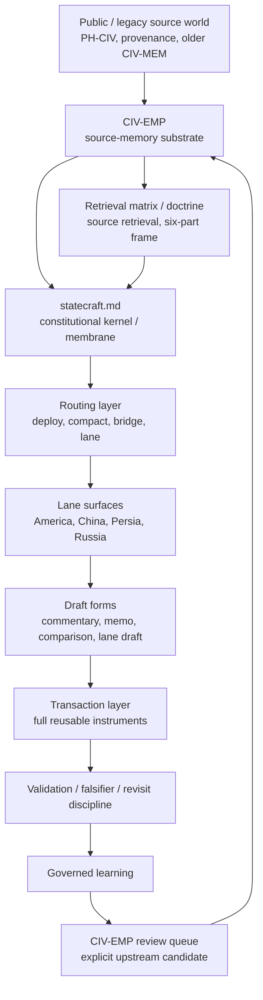

# CIV-EMP

WORK only; not Record.

**CIV-EMP = Civilization and Empire.**

CIV-EMP is the repo-root statecraft local working source base derived from the two-volume Civilization and Empire frame. It is not the public PH-CIV artifact and it is not the legacy CIV-MEM graph. It is the upstream source base consumed by downstream statecraft: compact enough to retrieve during drafting, structured enough to carry civilizational depth, and practical enough to support treaty, policy, negotiation, sanctions, and settlement design.

Short constitutional split:

`civ-emp remembers -> Civilizational Statecraft drafts`

`statecraft.md` is the constitutional kernel that governs how repo-root `statecraft/` may use `civ-emp`. `civ-emp` is the upstream source-memory substrate: it stores civilizational pattern, continuity, transformation, current carrier, failure mode, counterweight, and transaction hooks. `statecraft` is the downstream operating layer: it routes live objects, assigns lane ownership, selects output form, and converts remembered pattern into authority-, restraint-, and settlement-bearing drafts. `civ-emp` gives `statecraft` depth; `statecraft.md` prevents that depth from becoming inert memory or undisciplined analogy by enforcing a governed membrane. Downstream drafts may consume source memory, but upstream correction must return through explicit review rather than silent dual mutation.

## Boundary

- `ph-civ` is the public Predictive History / Civilization artifact and remains upstream public authority.
- `civ-emp` is the repo-root statecraft source base optimized for operational judgment.
- CIV-MEM references may remain as legacy provenance, but they are no longer the active statecraft dependency.

Do not edit PH-CIV, CIV-MEM, Record surfaces, raw-input, or speaker sources from this folder. CIV-EMP translates source memory into statecraft objects; it does not absorb upstream corpora.

## Source Hierarchy

Use three tiers:

1. **Public source artifact:** `ph-civ` preserves the public two-volume Civilization and Empire source world.
2. **Statecraft source base:** `civ-emp` distills that world into compact patterns, counterweights, and transaction hooks.
3. **Statecraft operating layer:** the repo-root `statecraft/` menus, deployers, lane READMEs, skills, and transactions convert CIV-EMP patterns into lane-local civilization, empire, state, helix, and instrument files.

The constitutional owner of the downstream/upstream exchange membrane is now [statecraft/statecraft.md](../statecraft.md). Upstream source-memory feedback from live drafting should be staged through [review-queue.md](review-queue.md), not silently patched into both layers.

The hierarchy is one-way. Civilizational Statecraft may stage reviewable improvements upstream, but it should not rewrite the public source artifact or upstream legacy memory graph through ambient drift.

## Civilization-State Function

The five CIV-EMP volumes are not a decorative civilizational shelf. They are an authoritative working illustration of the **civilization-state** as a comparative strategic category.

Here, a civilization-state means a political order in which:

- sovereignty is carried through a long continuity chain rather than only by one regime moment
- a deeper sacred or civilizational grammar legitimates that chain
- rupture mutates the chain without fully erasing it
- a present carrier still bears enough continuity for live statecraft use

The category is comparative, not flat. China, Persia, Rome, and Russia are the stronger core cases. America is retained as the deliberately contested edge case that clarifies the concept under modern strain rather than being silently excluded from it.

## Opener Doctrine

Each volume should be read through a three-layer opener doctrine:

- **Deep grammar** - the sacred, mythic, literary, or civilizational substrate beneath the chain
- **Sovereign opening** - the first figure or formation that opens the volume's political continuity chain
- **Current carrier** - the present institution, regime, church, or state form that bears the chain now

The five volumes use a common opener structure, but not all sovereign openings have the same historical status: some are documentary founders, some are traditional founders, and some open longer continuity chains whose present state appears later.

Use these opener types:

- **Foundational sovereign** - a historically legible political founder who opens the sovereignty chain
- **Traditional foundational sovereign** - a conventional or narrative sovereign opener whose historicity or administrative firmness is less secure
- **Foundational continuity sovereign** - a sovereign opener for a longer continuity chain that culminates in a later state rather than beginning that state directly

This opener doctrine should also guide retrieval:

- **Deep grammar** points toward sacred grammar, literature, and legitimacy surfaces
- **Sovereign opening** points toward state-memory, founding, and origin objects
- **Current carrier** points toward helix, state, and transaction surfaces

The canonical CIV-EMP deep-grammar shelf is now [Sacred Grammar Library](sacred-grammar/README.md). It is built from `civilization_memory` as evidence through seed MEM plus `MEM CONNECTIONS` traversal, then translated back into CIV-EMP doctrine.

## Volume Order

The front-door CIV-EMP order is now five volumes:

1. [Vol I - China](volumes/vol-i-china/README.md)
2. [Vol II - Persia](volumes/vol-ii-persia/README.md)
3. [Vol III - Rome](volumes/vol-iii-rome/README.md)
4. [Vol IV - Russia](volumes/vol-iv-russia/README.md)
5. [Vol V - America](volumes/vol-v-america/README.md)

Each volume is internally ordered by `Ancient / Medieval / Colonial / Industrial / Cybernetic`.

The order is chronological by **sovereignty-chain emergence**, not by the earliest possible mythic, sacred, or ethnocultural precursor. That is why China remains first, Persia second, Rome third, Russia fourth, and America fifth.

This volume layer organizes retrieval and source-memory entry. It does not replace the live lane-local storage under repo-root `statecraft/<lane>/`. Each volume should now be read as a chain-of-sovereignty argument nested through the five-era spine, not as a loose bibliography.

## Operating Thesis

History is pattern memory for strategic operators. Civilization stores inherited legitimacy, memory, geography, sacred grammar, artistic form, narrative, war experience, peace settlement, and successor-stable state interest. Empire amplifies that inheritance through control, security depth, finance, chokepoints, alliance, law, infrastructure, dependency, and coercive reach. Statecraft restores the balance when amplification degrades the civilization it claims to protect.

Short form:

`civilization beautifies -> empire amplifies -> entropy degrades -> statecraft restores`

The active higher-order CIV-EMP doctrine is now the **Civilizational Statecraft Framework**:

- **civilization / empire**
- **faith / science**
- **memory / desire**

Read these as three structural pairs rather than six floating topics. `civilization` and `empire` replace the old overloaded power frame; `faith` and `science` replace the old overly broad truth frame; `memory` and `desire` replace the old under-specified time frame. Faith and science are coequal truth-orders, and memory and desire must both be read if continuity is to remain honest.

## Source Flow

Statecraft lanes use this source chain:

1. CIV-EMP supplies the Civilization and Empire source pattern.
2. Lane-local `civilization/` and `empire/` files translate that pattern into inherited code and outward reach.
3. Lane-local `state/` files name the current authority carrier.
4. `helix.md` regulates the tension between inherited code and imperial instrument.
5. `transactions/` test whether the regulated pattern can become authority, restraint, and settlement.

## What CIV-EMP Optimizes For

CIV-EMP should mirror PH-CIV's pattern discipline and two-volume seriousness while differing in use. PH-CIV can carry public manuscript, lecture, commentary, and route structure. CIV-EMP should carry operational judgment:

- short source objects rather than full public chapters
- pattern plus mechanism rather than narrative alone
- empire as amplification and entropy, not only civilizational expression
- counterweights that prevent historical analogy from becoming propaganda
- transaction hooks that make the source usable in treaty, policy, sanctions, recognition, deterrence, and settlement design

## Object Contract

Each CIV-EMP source object should be short and usable. It should include:

- **Source basis:** the Civilization and Empire volume, chapter, PH-CIV surface, or legacy source pointer grounding the object.
- **Arc pattern:** origin, continuity, transformation, current carrier, and failure mode.
- **Statecraft use:** what the pattern helps draft, test, restrain, or settle.
- **Counterweight:** where the pattern becomes false, coercive, exhausted, or dangerous.
- **Transaction hooks:** likely use in treaty language, sanctions design, recognition, deterrence, guarantees, or institutional settlement.

## Indexes

- [Volume map](volumes/README.md) - preferred civilization-first opening order for CIV-EMP.
- [Sacred Grammar Library](sacred-grammar/README.md) - canonical deep-grammar retrieval shelf beneath the volume opener doctrine.
- [Source retrieval matrix](indexes/source-retrieval-matrix.md) - default retrieval contract for state-memory, god, lit, art, geo, war, peace, and empire-instrument work.
- [Arc-conditioned retrieval bridge](../bridges/README.md) - quiet adapter layer for routing speaker-arc claims into disciplined `civ-emp` retrieval.
- [Migration workspace](migration/README.md) - symmetric-first control plane for moving active statecraft lanes off direct legacy `civ-mem` dependency.

## Orientation Doctrine

- [Civilizational Statecraft Framework](civilization-empire-faith-science-memory-desire.md) - the active higher-order orientation frame for CIV-EMP.
- [Civilization, Empire, Faith, Science, Memory, Desire Retrieval Checklist](civilization-empire-faith-science-memory-desire-retrieval-checklist.md) - bounded operator pass for deciding which layer or pair actually governs a live object before lane translation or clause drafting.
- [Power, Truth, Time](power-truth-time-annex.md) - superseded active shorthand retained only as historical residue and genealogy.
- [Power, Truth, Time Retrieval Checklist](power-truth-time-retrieval-checklist.md) - superseded checklist retained only as historical residue.

The preferred era spine for these orientation surfaces is `Ancient / Medieval / Colonial / Industrial / Cybernetic`, with boundaries at `476 / 1453 / 1815 / 1945`. `Cybernetic` is preferred over `Digital` because the post-1945 order is organized by deterrence, computation, control systems, signal, and managed interdependence rather than by consumer technology alone.

## Proof Objects

- [Persia: Hormuz Recognition / Transit Restraint](persia/hormuz-recognition-transit-restraint.md) - first proof object showing how CIV-EMP converts Civilization and Empire into an operational source pattern for a live Persia-lane transaction.
