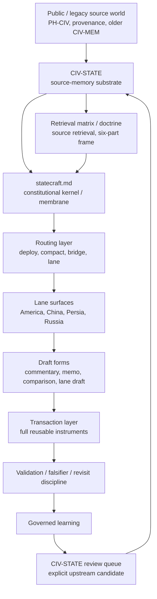

# CIV-STATE

WORK only; not Record.

**`civ-state` is the repo-root source-memory substrate for Civilizational Statecraft.**

`Civilizational Statecraft` is the governing discipline and public conceptual name. `Civilization and Empire` is the opening essay and governing conceptual helix. `civ-state` is the repo-root local working source base derived from that helix. It is not the public PH-CIV artifact and it is not the legacy CIV-MEM graph. It is the upstream source base consumed by downstream statecraft: compact enough to retrieve during drafting, structured enough to carry civilizational depth, and practical enough to support treaty, policy, negotiation, sanctions, and settlement design.

Migration note: older docs may still mention `civ-emp` as the retired path name. Treat that as legacy residue, not canonical live doctrine.

Short constitutional split:

`civ-state remembers -> statecraft drafts`

Civilizational Statecraft should now also be read as a two-volume whole-work book with five nested civilization-state volumes. The canonical whole-work apparatus lives in:

- [Table of Contents](table-of-contents.md)
- [Reader Guide](reader-guide.md)
- [Glossary](glossary.md)
- [Hybrid References](hybrid-references.md)
- [Index](index.md)

The first cross-civilizational comparison-sheet layer now begins with:

- [Continuity Mechanism](continuity-mechanism.md)

The first comparative pattern shelf now begins with:

- [Civilizational Pattern Library](pattern-library/README.md)

Each civilization-state volume should also carry its own bibliography with a primary-source center of gravity.

## Command Door

`statecraft civ-state` is the preferred exact command door for CIV-STATE as an analysis bench.

Use it when the real question is:

- frame
- retrieval
- membrane promotion
- review

One live retrieval family worth watching is **high-skill labor compression**: synthetic cognition compressing elite work until the real question becomes judgment infrastructure, legitimacy, and sovereign carrier rather than labor-market productivity alone. Use [High-Skill Labor Compression and Civilizational Statecraft](high-skill-labor-compression-and-civilizational-statecraft.md) when that bridge is the honest next retrieval move.

Its fixed action families are:

- `A. Frame`
- `B. Retrieve`
- `C. Promote`
- `D. Review`

The menu stays fixed; only the live recommendation changes.

This command is not default book-authoring mode. If the operator explicitly wants to work on the CIV-STATE books, route out into the volume-architecture or part-writer surfaces rather than hiding that shift inside the command.

`statecraft.md` is the constitutional kernel that governs how repo-root `statecraft/` may use `civ-state`. `civ-state` is the upstream source-memory substrate: it stores civilizational pattern, continuity, transformation, current carrier, failure mode, counterweight, and transaction hooks. `statecraft` is the downstream operating layer: it routes live objects, assigns lane ownership, selects output form, and converts remembered pattern into authority-, restraint-, and settlement-bearing drafts. `civ-state` gives `statecraft` depth; `statecraft.md` prevents that depth from becoming inert memory or undisciplined analogy by enforcing a governed membrane. Downstream drafts may consume source memory, but upstream correction must return through explicit review rather than silent dual mutation.

When the live question is still about source-bearing archive truth versus speaker-side interpretive continuity, open [Statecraft Archive and Statecraft Synthesis](../archive-synthesis-law.md) before treating `civ-state` retrieval as the next real layer.

## Boundary

- `ph-civ` is the public Predictive History / Civilization artifact and remains upstream public authority.
- `civ-state` is the repo-root statecraft source base optimized for operational judgment.
- CIV-MEM references may remain as legacy provenance, but they are no longer the active statecraft dependency.

Do not edit PH-CIV, CIV-MEM, Record surfaces, raw-input, or speaker sources from this folder. CIV-STATE translates source memory into statecraft objects; it does not absorb upstream corpora.

## Source Hierarchy

Use three tiers:

1. **Public source artifact:** `ph-civ` preserves the public two-volume Civilization and Empire source world.
2. **Statecraft source base:** `civ-state` distills that world into compact patterns, counterweights, and transaction hooks.
3. **Statecraft operating layer:** the repo-root `statecraft/` menus, deployers, lane READMEs, skills, and transactions convert CIV-STATE patterns into lane-local civilization, empire, state, helix, and instrument files.

The constitutional owner of the downstream/upstream exchange membrane is now [statecraft/statecraft.md](../statecraft.md). Upstream source-memory feedback from live drafting should be staged through [review-queue.md](review-queue.md), not silently patched into both layers.

The hierarchy is one-way. Civilizational Statecraft may stage reviewable improvements upstream, but it should not rewrite the public source artifact or upstream legacy memory graph through ambient drift.

## Civilization-State Function

The five CIV-STATE volumes are not a decorative civilizational shelf. They are an authoritative working illustration of the **civilization-state** as a comparative strategic category.

Here, a civilization-state means a political order in which:

- sovereignty is carried through a long continuity chain rather than only by one regime moment
- a deeper sacred or civilizational grammar legitimates that chain
- rupture mutates the chain without fully erasing it
- a present carrier still bears enough continuity for live statecraft use

The category is comparative, not flat. China, Persia, Rome, and Russia are the stronger core cases. America is retained as the deliberately contested edge case that clarifies the concept under modern strain rather than being silently excluded from it.

## Opener Doctrine

Each volume should be read through a three-layer opener doctrine:

- **Deep grammar** - the sacred, mythic, literary, or civilizational substrate beneath the chain
- **Sovereign opening** - the first figure or formation that opens the volume's political continuity chain
- **Current carrier** - the present institution, regime, church, or state form that bears the chain now

The five volumes use a common opener structure, but not all sovereign openings have the same historical status: some are documentary founders, some are traditional founders, and some open longer continuity chains whose present state appears later.

Use these opener types:

- **Foundational sovereign** - a historically legible political founder who opens the sovereignty chain
- **Traditional foundational sovereign** - a conventional or narrative sovereign opener whose historicity or administrative firmness is less secure
- **Foundational continuity sovereign** - a sovereign opener for a longer continuity chain that culminates in a later state rather than beginning that state directly

This opener doctrine should also guide retrieval:

- **Deep grammar** points toward sacred grammar, literature, and legitimacy surfaces
- **Sovereign opening** points toward state-memory, founding, and origin objects
- **Current carrier** points toward helix, state, and transaction surfaces

The canonical CIV-STATE deep-grammar shelf is now [Sacred Grammar Library](sacred-grammar/README.md). It is built from `civilization_memory` as evidence through seed MEM plus `MEM CONNECTIONS` traversal, then translated back into CIV-STATE doctrine.

## Volume Order

The front-door CIV-STATE order is now five volumes:

1. [CIV-STATE China](volumes/civ-state-china/README.md)
2. [CIV-STATE Persia](volumes/civ-state-persia/README.md)
3. [CIV-STATE Rome](volumes/civ-state-rome/README.md)
4. [CIV-STATE Russia](volumes/civ-state-russia/README.md)
5. [CIV-STATE America](volumes/civ-state-america/README.md)

Each volume is internally ordered by `Ancient / Medieval / Colonial / Industrial / Cybernetic`.

The order is chronological by **sovereignty-chain emergence**, not by the earliest possible mythic, sacred, or ethnocultural precursor. That is why China remains first, Persia second, Rome third, Russia fourth, and America fifth.

This volume layer organizes retrieval and source-memory entry. It does not replace the live lane-local storage under repo-root `statecraft/<lane>/`. Each volume should now be read as a constitutional book-form nested through the five-era spine rather than as a loose bibliography.

The apparatus for that book-form is whole-work first, then volume-local:

1. [Table of Contents](table-of-contents.md)
2. [Reader Guide](reader-guide.md)
3. [Volume map](volumes/README.md)
4. the relevant civilization volume
5. `Civilization -> Empire -> Statecraft`

## Volume Part Law

Each CIV-STATE volume now opens through a fixed three-part law:

1. `civilization-<civ>.md`
2. `empire-<civ>.md`
3. `statecraft-<civ>.md`

`README.md` is the front door, not a chapter.

The three parts do different work:

- `Civilization` legitimates the core, carries the continuity-bearing order, and orients the operator to what kind of civilization-state this is.
- `Empire` exposes the outward instrument: projection stack, coercive carriage, maintenance burden, and overreach risk.
- `Statecraft` converts the first two into a present-tense diplomatic read of pressure, room, legitimacy, equilibrium, and settlement possibility.

The named `geo-strategy-<civ>.md`, `secret-history-<civ>.md`, and `game-theory-<civ>.md` files remain substantive, but they now sit beneath Part 3 as **Statecraft sub-essays**, not as coequal volume-opening parts. Legacy `sovereign-continuity.md` files may remain on disk as support notes, but they are no longer the canonical Part 1 opening surface.

Use the three-part law operationally:

- open `Civilization` first when the problem is legitimacy, continuity, or category membership
- open `Empire` next when the problem is reach, burden, outward instrument, or overreach
- open `Statecraft` when the problem is a live diplomatic read rather than historical structure alone
- descend into `geo-strategy`, `secret-history`, and `game-theory` only after Part 3 makes the pressure geometry clearer

## Alias Doors

Use these top-level CIV-STATE entry notes when you want direct named access rather than entering through the volume map:

- [civ-state-china](civ-state-china.md)
- [civ-state-persia](civ-state-persia.md)
- [civ-state-rome](civ-state-rome.md)
- [civ-state-russia](civ-state-russia.md)
- [civ-state-america](civ-state-america.md)

## Operating Thesis

History is pattern memory for strategic operators. Civilization stores inherited legitimacy, memory, geography, sacred grammar, artistic form, narrative, war experience, peace settlement, and successor-stable state interest. Empire amplifies that inheritance through control, security depth, finance, chokepoints, alliance, law, infrastructure, dependency, and coercive reach. Statecraft restores the balance when amplification degrades the civilization it claims to protect.

Short form:

`civilization beautifies -> empire amplifies -> entropy degrades -> statecraft restores`

The active higher-order CIV-STATE doctrine is now the **Civilizational Statecraft Framework**:

- **civilization / empire**
- **faith / science**
- **memory / desire**

Read these as three structural pairs rather than six floating topics. `civilization` and `empire` replace the old overloaded power frame; `faith` and `science` replace the old overly broad truth frame; `memory` and `desire` replace the old under-specified time frame. Faith and science are coequal truth-orders, and memory and desire must both be read if continuity is to remain honest.

Terminology note:

- `civ-state` means the **civilization-state** object being interpreted and drafted for
- **Civilizational Statecraft Framework** is the doctrine that helps interpret that object
- `statecraft-framework` is the operational skill/interface for running that diagnosis
- `statecraft` remains the downstream operating layer

## Source Flow

Statecraft lanes use this source chain:

1. CIV-STATE supplies the Civilization and Empire source pattern.
2. Volume-local `civilization-<civ>.md`, `empire-<civ>.md`, and `statecraft-<civ>.md` convert that pattern into a stable book-form for operator retrieval.
3. Part 3 descends through `geo-strategy`, `secret-history`, and `game-theory` when a narrower pressure lens is required.
4. Lane-local `civilization/`, `empire/`, and `state/` files translate the volume read into inherited code, outward reach, and current authority carrier.
5. `helix.md` regulates the tension between inherited code and imperial instrument.
6. `transactions/` test whether the regulated pattern can become authority, restraint, and settlement.

## What CIV-STATE Optimizes For

CIV-STATE should mirror PH-CIV's pattern discipline and two-volume seriousness while differing in use. PH-CIV can carry public manuscript, lecture, commentary, and route structure. CIV-STATE should carry operational judgment:

- short source objects rather than full public chapters
- pattern plus mechanism rather than narrative alone
- empire as amplification and entropy, not only civilizational expression
- counterweights that prevent historical analogy from becoming propaganda
- transaction hooks that make the source usable in treaty, policy, sanctions, recognition, deterrence, and settlement design

## Object Contract

Each CIV-STATE source object should be short and usable. It should include:

- **Source basis:** the Civilization and Empire volume, chapter, PH-CIV surface, or legacy source pointer grounding the object.
- **Arc pattern:** origin, continuity, transformation, current carrier, and failure mode.
- **Statecraft use:** what the pattern helps draft, test, restrain, or settle.
- **Counterweight:** where the pattern becomes false, coercive, exhausted, or dangerous.
- **Transaction hooks:** likely use in treaty language, sanctions design, recognition, deterrence, guarantees, or institutional settlement.

## Indexes

- [Table of Contents](table-of-contents.md) - canonical whole-work reading order for the two-volume Civilizational Statecraft book.
- [Reader Guide](reader-guide.md) - operator-facing doctrine for how to open, read, and descend through the work.
- [Glossary](glossary.md) - whole-work vocabulary of concepts, names, peoples, polities, dynasties, churches, and transformed carriers.
- [Hybrid References](hybrid-references.md) - source basis plus bounded references layer; the strongest visible civ-mem evidence door in the book apparatus.
- [Index](index.md) - whole-work index for concepts, civilizations, routes, rulers, peoples, and retrieval doors.
- [Volume map](volumes/README.md) - preferred civilization-first opening order for CIV-STATE.
- [CIV-STATE volumes](volumes/README.md) - canonical three-part volume shelf with subordinate Statecraft sub-essays.
- [PH-CIV to CIV-STATE bridge](ph-civ-to-civ-state-bridge.md) - explicit method note for converting public Predictive History pattern into compact civilization-state source memory without collapsing the two layers.
- [PH-CIV promotion ledger](ph-civ-promotion-ledger.md) - compact intake surface for deciding when a public `ph-civ` insight deserves promotion into `civ-state` before any upstream mutation is staged.
- [Sovereign continuity of the CIV-states](sovereign-continuity-of-the-civ-states.md) - compact comparative note on how the five cases carry continuity-bearing sovereignty through rupture.
- [Current sovereign heads of the CIV-states](current-sovereign-heads-of-the-civ-states.md) - present-tense capstone note showing how each volume reaches the current world through a live sovereign apex.
- [Sacred Grammar Library](sacred-grammar/README.md) - canonical deep-grammar retrieval shelf beneath the volume opener doctrine.
- [Source retrieval matrix](indexes/source-retrieval-matrix.md) - default retrieval contract for state-memory, god, lit, art, geo, war, peace, and empire-instrument work.
- [Arc-conditioned retrieval bridge](../bridges/README.md) - quiet adapter layer for routing speaker-arc claims into disciplined `civ-state` retrieval.
- [Migration workspace](migration/README.md) - symmetric-first control plane for moving active statecraft lanes off direct legacy `civ-mem` dependency.

## Orientation Doctrine

- [Civilizational Statecraft Framework](civilization-empire-faith-science-memory-desire.md) - the active higher-order orientation frame for CIV-STATE.
- [Civilization, Empire, Faith, Science, Memory, Desire Retrieval Checklist](civilization-empire-faith-science-memory-desire-retrieval-checklist.md) - bounded operator pass for deciding which layer or pair actually governs a live object before lane translation or clause drafting.
- [Power, Truth, Time](power-truth-time-annex.md) - superseded active shorthand retained only as historical residue and genealogy.
- [Power, Truth, Time Retrieval Checklist](power-truth-time-retrieval-checklist.md) - superseded checklist retained only as historical residue.

## Open By Question

Use the front door that matches the actual operator question:

- `which civilization-state volume should I open first?`
  - open [Volume map](volumes/README.md)
- `I want the whole-book reading order first`
  - open [Table of Contents](table-of-contents.md)
- `I want the operator's reading doctrine for the books`
  - open [Reader Guide](reader-guide.md)
- `I want the CIV-STATE analysis bench itself`
  - open `statecraft civ-state`
- `which part of a CIV-STATE volume should I open first?`
  - open [Volume map](volumes/README.md) and follow `Civilization -> Empire -> Statecraft`
- `what does this term, dynasty, church, or transformed carrier mean here?`
  - open [Glossary](glossary.md)
- `what visibly grounds this apparatus in source basis and bounded ancestry?`
  - open [Hybrid References](hybrid-references.md)
- `I need quick whole-work recall by name, route, or concept`
  - open [Index](index.md)
- `which governing pair is really carrying this live object?`
  - open [Civilizational Statecraft Framework](civilization-empire-faith-science-memory-desire.md)
- `which deep legitimacy grammar is load-bearing here?`
  - open [Sacred Grammar Library](sacred-grammar/README.md)
- `should this public Predictive History insight be promoted into CIV-STATE?`
  - open [PH-CIV promotion ledger](ph-civ-promotion-ledger.md)
- `how do I translate PH-CIV source pattern into CIV-STATE working doctrine?`
  - open [PH-CIV to CIV-STATE bridge](ph-civ-to-civ-state-bridge.md)

Short rule:

`volume map = civilization-first entry and three-part volume law`

`whole-work apparatus = TOC, reader guide, glossary, hybrid references, and index`

`framework = governing-pair diagnosis`

`bridge / promotion ledger = intake and translation, not the main front door`

The preferred era spine for these orientation surfaces is `Ancient / Medieval / Colonial / Industrial / Cybernetic`, with boundaries at `476 / 1453 / 1815 / 1945`. `Cybernetic` is preferred over `Digital` because the post-1945 order is organized by deterrence, computation, control systems, signal, and managed interdependence rather than by consumer technology alone.

## Proof Objects

- [Persia: Hormuz Recognition / Transit Restraint](persia/hormuz-recognition-transit-restraint.md) - first proof object showing how CIV-STATE converts Civilization and Empire into an operational source pattern for a live Persia-lane transaction.
