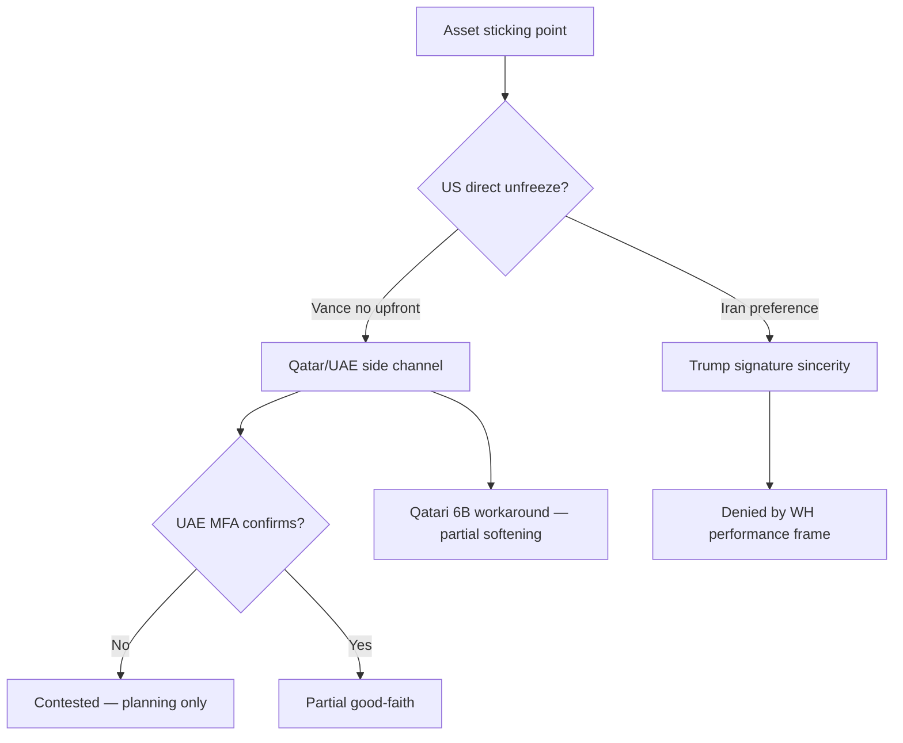

WORK only; not Record.

# Parsi Quiet-Lane + Asset-Path Deepener — 2026-06-12

**Parent:** [2026-06-12 daily](../synthesis/day/2026-06-12.md) · [news-verify matrix](wire/2026-06-12-news-verify-matrix.md) · [Nawfal × Parsi source](../../source-archive/statecraft/2026-06-12/source-mario-nawfal-parsi-breaking-iran-deal-leaked-2026-06-12.md)

**Bounded question:** In the **final-mile MOU** seam, what does **negotiation-quiet discipline** buy — and which **asset paths** are load-bearing vs workaround theater?

---

## Quiet-lane thesis (Parsi)

### What is different this cycle

| Signal | Parsi read | Wire grade |
|--------|------------|------------|
| Coordinated pushback (Iran + Pakistan + US) | Media exaggeration scuttling deal | **Partial** — Vance tweet + Trump retweet FM ([J12-5](wire/2026-06-12-news-verify-matrix.md)) |
| Relative silence after pushback | Discipline — "throw phone in toilet" | **Partial** — pattern not duration proof |
| Performative strikes below max | Both sides held escalation short of knockout | **Analyst tier-4** — plausible, not wire |
| Trump kept Israelis dark | Spying surge → critical-threat label | **Partial** — JCPOA-history analogy + recent reporting theme |

### Sabotage geometry

**Three knives-out vectors** (Parsi):

1. **Iranian hardline media** — raise expectations to ensure deal fails expectations test.
2. **Trump-admin leaks** — unlikely terms to poison well.
3. **Israeli sabotage track record** — JCPOA/APAC; needs **watertight persistent** Trump restraint.

**Lebanon ticking bomb:** Regional ceasefire likely includes Israel–Lebanon **in principle**; **withdrawal vs presence** unspecified → workable only if Hezbollah disarmament (won't happen) or **ticking bomb** accepted.

**MOU invention critique:** Six weeks ago simpler trade — open Hormuz / lift blockade — ruined when Trump kept blockade; MOU now **bigger than needed** to return to pre-war baseline.

---

## Asset-path table

| Path | Amount cited | Mechanism | Parsi / wire read | Verdict |
|------|--------------|-----------|-------------------|---------|
| **Fars / Mehr MOU leak** | $24B total; half upfront | MOU sign triggers release | Trump/Vance deny upfront cash; Araghchi warns speculation | **Partial** — draft scaffold, not mutual final |
| **Reuters UAE package** | $10–20B; **$3B+ delivered** | UAE unlocks frozen/IR-linked funds; halt UAE attacks | UAE MFA **categorically denies** any transfer | **Contested** ([J12-4](wire/2026-06-12-news-verify-matrix.md)) |
| **Qatari ~$6B workaround** | ~$6B sensitive | Qatar pays separately; not US direct release; OFAC-cleared spend (Biden-era food/medicine list) | Iran resisted; **softening** per Parsi — workaround not ideal | **Partial** — historical precedent real; current deal **unclear** |
| **Trump direct release** | Unspecified | US unfreeze as sincerity signal | Vance: **no funds for signing/meeting**; performance-based only | **Supported** (US posture) vs Iran preference |
| **South Korea → Qatar (2022)** | Part of $6B | Moved then backtracked after Mahsa Amini protests | Explains Iranian distrust of Qatari custodial release | **Supported** (historical) |
| **Phase-2 $300B reconstruction** | $300B (leak) | Post-MOU 60-day nuclear/sanctions work | Parsi: MOU fluff; real work **after** MOU | **Unclear** — aspirational leak tier |
| **Administrative Hormuz fees** | N/A (non-toll) | Regionalized fee with Oman/GCC face-saving | US wants regionalization; UAE/Saudi resistant | **Partial** — structure plausible, GCC split likely |

---

## Workaround vs sincerity (decision tree)

---

## Lebanon + assets coupling

Parsi separates **asset path** from **Lebanon withdrawal clarity**:

- **Assets:** Movement on workaround may explain "positive movement" even when Trump won't sign a direct check.
- **Lebanon:** 50/50 on withdrawal language; **ticking bomb** if presence continues; Trump Gaza record → kick to next president.

**Coupling risk:** If UAE path is **contested** and Lebanon **fractured** ([J12-6](wire/2026-06-12-news-verify-matrix.md)), quiet lane buys **time** not **gate green**.

---

## Hormuz fee regionalization

| Actor | Parsi read |
|-------|------------|
| **Iran** | Won't fully back off; admin/env fees not tolls |
| **US** | Wants regionalization (not Iran-only) for face-saving |
| **UAE** | Resistant |
| **Saudi** | Not enthusiastic |
| **Qatar** | Opening slightly |

**Function:** Move issue sideways — "not resolving, moving away" — consistent with MOU as **outline** not settlement.

---

## Post-MOU phase (60-day fluff zone)

Parsi: MOU meaningless without final deal; **real work begins after** — Israelis get **sabotage opportunities** in technical nuclear/sanctions phase.

| MOU surface | Parsi weight |
|-------------|--------------|
| Ceasefire all fronts | Load-bearing if enforced |
| Asset unfreeze path | Load-bearing if delivered |
| Hormuz admin fee | Face-saving move-aside |
| 60-day nuclear / $300B | **Fluff zone** — sabotage-rich |

---

## Comparison hooks (same batch)

| Speaker | Complements Parsi on |
|---------|---------------------|
| **Johnson×Wilkerson** | MOU reversible; false-flag; pinprick stand-down |
| **Aguilar** | Enforcement lever; bottom lines unchanged |
| **Davis** | Walk-away; zero-trust; Iran unplayed cards |
| **Freeman** | Impunity era over; policy inertia vs deal |

**Compression:** Parsi owns **final-mile quiet + asset workaround geometry**; Johnson×Wilkerson own **enforceability**; Aguilar owns **lever**.

---

## Falsifiers (72h)

| Observation | Impact on quiet-lane |
|-------------|---------------------|
| Mutual published MOU both languages | Quiet lane **succeeded** → upgrade to supported scaffold |
| New strike night + Truth Social threats | Quiet lane **failed** → performative-read downgraded |
| UAE official confirms tranche | Asset path **partial** → good-faith row lights |
| Geneva signing without Lebanon clause | Lebanon **ticking bomb** confirmed |
| Israeli briefing restored to Witkoff team | Sabotage vector **reactivated** |

---

## Best next moves

1. Track **Vance vs Trump vs Araghchi** tweet discipline — quiet lane metric.
2. **Wire fork:** UAE MFA vs Reuters — do not promote **delivered $3B** without official receipt.
3. Pair with [Johnson×Wilkerson×Aguilar gate comparison](2026-06-12-johnson-wilkerson-aguilar-mou-gate-comparison.md) for enforcement vs workaround.
4. If operator promotes: add **asset-path row** to Persia off-ramp transaction (not in this pass).
