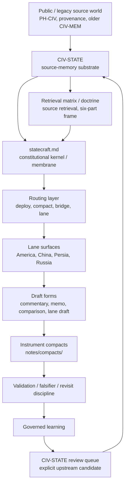

# Statecraft

WORK only; not Record.

This file is the **human-AI cognitive continuity interface** for repo-root `statecraft/`. It is also the constitutional kernel, but its first job is more basic: when you open it cold, it should restore the machine in your head quickly enough that you do not have to re-derive statecraft from scattered notes.

Statecraft exists to convert strategic, historical, civilizational, and speaker-state input into bounded operational artifacts that can carry authority, restraint, and settlement.

`statecraft.md` is the constitutional kernel that governs how repo-root `statecraft/` may use `civ-state`. `civ-state` is the upstream source-memory substrate: it stores civilizational pattern, continuity, transformation, current carrier, failure mode, counterweight, and transaction hooks. `statecraft` is the downstream operating layer: it routes live objects, assigns lane ownership, selects output form, and converts remembered pattern into authority-, restraint-, and settlement-bearing drafts. The linkage is therefore neither ornamental nor merely bibliographic. `civ-state` gives `statecraft` depth; this kernel prevents that depth from becoming inert memory or undisciplined analogy by enforcing a governed membrane: downstream drafts may consume source memory, but upstream correction must return through explicit review rather than silent dual mutation.

It is not:

- a country encyclopedia
- a speaker shelf
- a public PH-CIV surface
- a generic commentary bench
- a silent source-memory mutation path

## Reopen This System

Restore these invariants first:

- `civ-state remembers -> statecraft drafts`
- `source-archive remembers source text -> statecraft classifies and drafts`
- `pattern / narrative -> authority / restraint / settlement`
- lane orthogonality matters more than elegant synthesis
- mature lanes need membrane thickness, not only doctrinal elegance
- braid keeps the live coupled object real; helix tracks long-run recurrence and transformation
- leverage is not yet statecraft
- promotion must be earned

Restore this higher-order frame too:

- **civilization / empire**
- **faith / science**
- **memory / desire**

Use it to distinguish inheritance from instrument, sacred or moral authorization from technical or procedural authorization, and continuity from appetite before drafting a mechanism.

Restore this canonical sequence next:

`source memory -> routing -> lane judgment -> output selection -> mechanism draft -> validation -> governed recursive learning`

Restore this lane-hardening sequence too when the lane is already mature enough to need it:

`helix -> current state carriers -> instrument note drafting`

Support material should strengthen that route, not compete with it.

Reopen with these questions:

1. What is the real crisis object?
2. Which constitutional layer owns the next move?
3. Which lane owns the settlement logic if ownership is already clear?
4. What is the narrowest honest output form?
5. What belongs downstream in statecraft, and what belongs back upstream to `civ-state`?

On first contact, force these calls early:

- **crisis object**: what is actually being contested?
- **constitutional layer**: is the next move deploy, compact, speaker-bridge, or lane-direct?
- **lane ownership**: who has to carry the settlement logic once routing narrows?
- **output form**: is this still commentary, already a lane note, or near an instrument-use brief?

When reopening from one live object, take the first valid move in this order:

1. decide whether the object is still braided or already classifiable
2. decide whether lane ownership is unresolved or already clear
3. decide whether the remaining uncertainty is lane judgment or retrieval conditioning
4. choose the narrowest honest output form before drafting mechanism

Use this quick instrument-fit instinct before you draft:

- if the object is still mostly naming and framing pressure, stop at commentary or lane note
- if the lane is clear but the mechanism is still thin, stop at memo, comparison, or router candidate
- if the object already sounds like a known corridor, guarantee, transit, or sanctions bargain, check [instrument router](sheets/instrument-router.md) fit before inventing a fresh framework

Named recent events do not open a separate function anymore. Verify the unstable fact pattern, classify the crisis object, then route through `state-deploy` or directly into the owning lane once ownership is honestly clear.

Use these fast recognizers when the object family is already obvious:

- **transit / recognition / chokepoint pressure**
  - usually opens Persia first
  - if the object is speaker-heavy after lane ownership is clear, use `statecraft-bridge`
  - check existing Hormuz-style instrument fit in [notes/compacts/](notes/compacts/) before inventing a new framework
- **alliance command / maritime access / quarantine pressure**
  - usually opens America first when the live problem is guarantee design, burden-sharing, or bounded command
  - compare China only when continuity, trade rhythm, or anti-chaos order is the real pressure
- **sanctions relief / guarantees / sequenced settlement pressure**
  - open the lane that must carry the guarantee architecture
  - test instrument fit and objection structure before promoting to full framework in `notes/compacts/`

If none of those recognizers settle ownership, return to `state-deploy` rather than forcing an elegant synthesis.

Once a lane already owns the object, check one more thing before drafting: is the remaining uncertainty still a posture split inside the lane? If yes, use the lane's bridge doctrine before clause design.

Do not linger in the kernel longer than needed:

- if ownership is unresolved, go to `state-deploy`
- if ownership is clear, open the lane
- if the object is already clearly instrument-shaped, check the [instrument router](sheets/instrument-router.md) or the nearest existing compact note before widening the analysis

When the machine gets fooled, it usually gets fooled in one of these ways:

- it mistakes salience for settlement and drafts too early
- it mistakes speaker force for lane ownership and skips the deployer
- it mistakes one state's leverage for another state's legitimacy grammar
- it mistakes a sharp analogy for a mature transaction
- it prefers elegant synthesis over honest orthogonality

The felt warning sign is false elegance: the draft starts sounding coherent before the crisis object, carrier, and classification are actually stable.

The second warning sign is false maturity: the lane sounds well-shaped in doctrine but still has no native proof anchor and depends entirely on shared bundles.

Mini reclassification example:

- first read: `Taiwan quarantine` sounds like convoy or blockade theater
- better read: first classify whether the object is quarantine, customs inspection, exclusion, insurance panic, or invasion preparation
- statecraft gain: the legal and political classification changes which lane opens first, what instrument is honest, and whether the first move is guarantee design, routing comparison, or de-escalation language

When in doubt, prefer one reclassification step over one premature clause.

## Continuity Manifesto

Statecraft begins when pattern, memory, and pressure stop being only interpretation and become an authority problem, a restraint problem, and a settlement problem.

The machine works only if a few distinctions stay alive:

- **source memory vs drafting**
  - `civ-state` stores recurrence, memory, counterweight, and retrieval depth
  - `statecraft` converts that memory into bounded operational judgment
- **braid vs helix**
  - `braid` keeps a live coupled object together long enough to draft it honestly
  - `helix` names long-run recurrence, deformation, and restoration across time
- **lane ownership vs retrieval conditioning**
  - `state-deploy` decides who owns the object
  - the lane decides what that owner can carry
  - bridge doctrine intervenes when the unresolved question is posture or retrieval profile rather than ownership
- **leverage vs settlement**
  - pressure, position, or coercive salience do not yet count as statecraft
  - statecraft begins when the object can be converted into authority, restraint, and settlement
- **importance vs maturity**
  - an important event does not automatically deserve a framework
  - a sharp note does not automatically deserve transaction form
- **doctrine vs membrane**
  - a lane can sound correct before it can prove itself
  - native proof anchors and local transaction families are part of lane maturity, not optional polish

The system stays healthy when it preserves orthogonality long enough to draft something real:

- America is not China with different preferences
- China is not Iran with a larger economy
- Iran is not Russia with less depth
- Russia is not America without liberal language

Each lane must keep its own legitimacy grammar, fear structure, leverage profile, carrier burden, and settlement logic long enough for a real instrument to emerge.

At the current frontier, each mature lane should also keep:

- one canonical route
- one support ring that does not displace that route
- one lane-native bridge ambiguity
- at least one local proof anchor that is not merely borrowed from a shared crisis object

## Core Ontology

- **source base**: `civ-state` as the upstream source-memory and retrieval substrate
- **lane**: America, China, Persia, Russia as state-perspective drafting benches
- **speaker-state intake**: speaker arcs, thread atlases, host-local arcs, routing notes, and bridge adapters as governed input classes
- **crisis object**: the contested object whose classification drives leverage, escalation, or settlement
- **braid**: a live coupled bundle that must stay together long enough to become one real draftable object
- **helix**: long-run recurrence and transformation across time
- **output class**: the terminal form a given pass honestly deserves
- **instrument compact**: a mature reusable multi-lane note package in `notes/compacts/` with instrument form and revisit discipline
- **recursive update candidate**: governed learning proposed for later review rather than silent doctrine mutation
- **native proof anchor**: a lane-local instrument note or equivalent proof object that shows the lane can carry its own doctrine without default dependence on shared bundles
- **membrane thickness**: the degree to which a lane's doctrine, bridge logic, and proof inventory are locally coherent rather than borrowed cosmetically

## Output Taxonomy

Valid terminal forms are:

- **commentary** - descriptive or interpretive read that should not pretend to be an instrument
- **braid** - keep coupled lines together before lane spending is honest
- **lane note** - one-state interpretation without full instrument form
- **memo** - compact advisory or bounded recommendation surface
- **objection matrix** - actor-resistance and patch analysis for a fragile but plausible instrument
- **comparison** - structured cross-lane or cross-arc contrast
- **router candidate / instrument-fit note** - threshold surface before compact promotion
- **instrument-use brief** - spend an existing instrument compact without inventing a new framework
- **lane draft** - lane-local draft instrument or clause package
- **full instrument compact** - reusable compact in `notes/compacts/` only after crisis object, settlement spine, named carriers, instrument form, and revisit discipline are present
- **recursive update candidate** - learning surface for later review, not direct doctrine mutation

Use [artifact-registry.md](artifact-registry.md) to classify new or touched outputs by class and maturity.
Use [shared prose index](../docs/prose-index.md) when the unresolved question is whether the prose object should stay note-class or mature into essay-class.

## Promotion And Terminal-Form Law

Do not promote because an event is important, the prose is strong, or the analogy is sharp.

Promotion to lane draft or full instrument compact usually requires:

- a named crisis object
- a real settlement spine
- explicit authority carriers
- plausible mechanism or clause form
- bounded aim
- review, falsifier, or revisit discipline

If those are missing, stop earlier. Early stopping is healthy architecture, not underperformance.

Promotion of a lane's second-order interface usually requires:

- front doors dense enough to need bounded-entry logic
- one actual canonical route rather than several equally-plausible openings
- one recurring posture ambiguity that routing alone does not resolve
- one native proof anchor once shared bundles are carrying too much of the lane's proof burden

If those are missing, the lane is not yet ready for full hardening.

## Precedence Rules

1. `coffee -> C. Statecraft` opens the router-first front door.
2. `state-deploy` answers `who owns this object now?` and absorbs verified named recent events when ownership is not yet clear.
3. `compact` owns cross-lane or objection-shaped objects after ownership is understood.
4. `state-*` skills answer `what can this owner legitimately draft, carry, accept, reject, and institutionalize?`
5. lane bridge doctrine answers `which posture or retrieval split still governs this already-owned object?`
6. the [instrument router](sheets/instrument-router.md) answers `does this belong to an existing instrument plateau object?`
7. review queues and pending files capture learning without silent rewrite

## CIV-STATE Protocol

Downstream from `civ-state` into statecraft:

- source pattern
- origin / continuity / transformation
- current carrier
- failure mode
- counterweight
- transaction hooks
- stabilized retrieval logic

Upstream from statecraft back into `civ-state`, only as reviewable candidates:

- source-pattern correction
- retrieval-logic refinement
- missing counterweight
- object-schema improvement
- historical-comparative correction exposed by drafting
- transaction-hook refinement discovered through repeated use

Transport rule:

- use [civ-state/review-queue.md](states/review-queue.md)
- do not silently patch both layers from one live drafting pass

## Speaker-Arc Input Protocol

Speaker arcs are first-class input classes, not statecraft authority.

Recognized classes include:

- person arc
- speaker month-support surface
- segment-maturity ladder
- helix
- thread atlas
- host-local arc
- routing note
- bridge adapter
- speaker-state intake mapping

When a speaker-conditioned crisis sequence or thread needs bounded continuity before lane descent, statecraft-governed speaker month pages, thread atlases, routing notes, and other speaker-state continuity surfaces belong in the live [statecraft/voices/](voices/README.md) tree rather than outside statecraft by default.

The migration target is the whole live speaker corpus under `statecraft/voices/` and `statecraft/channels/`. Legacy `codex/speakers/` is terminated — [codex-speakers-deprecated.md](../docs/archive/codex-speakers-deprecated.md).

Speaker arcs may feed:

- commentary
- comparison
- braid
- lane note
- bridge step
- mature transaction-use work
- recursive update candidates

Speaker arcs may not:

- own lane judgment
- substitute for `civ-state`
- become transaction authority by proximity
- silently define a lane's state interest
- bypass deployer / lane / bridge precedence

Bridge rule:

If the unresolved question is not lane ownership but how a speaker-conditioned claim should be read against source memory, route through a bridge surface before descending into substantive drafting.

This now happens in two main forms:

- **retrieval bridge**
  - used when a speaker-heavy object needs the right source-memory reading posture before the lane can spend it honestly
- **lane posture bridge**
  - used when lane ownership is already clear but the real split is still command vs settlement, stabilization vs architecture, recognition vs settlement, or brokerage vs overbinding

Do not confuse those two forms. Both are bridges, but they solve different errors.

## Lane-Hardening And Measured Maturity

Statecraft now knows enough to state one compact lane-hardening law:

- orientation-card logic belongs once cold-entry confusion is recurring
- spine and support ring belong once one route is real and side openings are competing with it
- bridge doctrine belongs once one posture threshold keeps producing wrong next moves
- a native proof anchor becomes mandatory once a lane risks proving itself only through shared cross-lane bundles

Measured lane maturity now includes:

- bounded-entry coverage on the four sub-benches
- presence of an explicit spine and support ring
- presence of a lane-native bridge ambiguity
- presence of at least one local native proof anchor
- membrane risk where doctrine still outpaces local proof inventory

This is not cosmetic scaffolding. It is how the machine avoids mistaking elegant lane prose for real drafting readiness.

## Operator Use At The Frontier

The most advanced use of this machine now goes beyond ordinary routing and commentary.

At the frontier, the operator is using `statecraft/` to:

- convert memory into mechanism
- identify lane-native ambiguities
- test membrane thickness
- transfer reusable patterns across unlike lanes
- falsify those patterns rather than merely expand them
- extract architecture from source corpora and feed it back into statecraft doctrine

That use-pattern is now part of the machine's real operating truth, even when a given session stays at a simpler level.

## Delegated Modules

- [README.md](README.md) owns front-door orientation only.
- [METHOD.md](METHOD.md) owns drafting procedure only.
- [ARCHITECTURE.md](ARCHITECTURE.md) owns maturity, anti-sprawl, and lifecycle governance only.
- [artifact-registry.md](artifact-registry.md) owns the minimal metadata law for output classification.
- [notes/README.md](notes/README.md) owns the bounded statecraft prose shelf.
- [essays/README.md](essays/README.md) owns the stand-alone statecraft prose shelf.
- [../docs/prose-index.md](../docs/prose-index.md) owns cross-domain prose-class routing.
- [civ-state/review-queue.md](states/review-queue.md) owns the upstream source-candidate staging surface.

## Compatibility

The previous academy namespace remains temporarily available through compatibility pointers under [codex/academy/statecraft/](../codex/academy/statecraft). The repo-root `statecraft/` tree is the live operational system.
